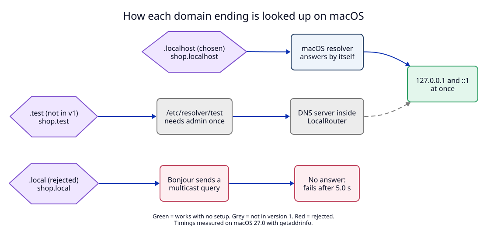

# 1. Domain ending: `.localhost`, not `.local`

**Context.** The first idea was names like `projectx.local`. A name only works if
the operating system can turn it into an IP address. The last part of the name
(the top-level domain, TLD) decides who answers that question on macOS.

## What we measured

Measured on macOS 27.0 with Python `socket.getaddrinfo` (the same system call a
browser or `curl` uses):

| Name | Result | Time |
|---|---|---|
| `projectx.localhost` | `127.0.0.1` | at once |
| `feat.shop.localhost` | `127.0.0.1` and `::1` | at once |
| `projectx.test` | not found (no resolver set up) | at once |
| `projectx.local` | not found | **5.0 s** |

## Why `.local` is wrong

`.local` is reserved for multicast DNS (mDNS, RFC 6762). mDNS is the protocol
Bonjour uses to find printers and other Macs on the local network. macOS does not
send `.local` names to a normal DNS server. It sends a multicast question to the
network and waits for about 5 seconds. A browser would wait this long on every
new connection. We could publish the names over mDNS, but then:

1. Other machines on the same Wi-Fi could see the names unless we limit the
   records to this Mac.
2. Two-level names like `feat.shop.local` depend on how each client handles mDNS.

## Decision

1. **Version 1 supports only `.localhost`.** macOS resolves every
   `*.localhost` name to the loopback address by itself. LocalRouter needs no
   DNS server, no `/etc/resolver` file and no admin password for names.
2. **`.test` is deferred.** It needs `/etc/resolver/test` (admin once) and a DNS
   server inside the daemon. It gets its own ADR if we need it.
3. **`.local` is rejected.**

Extra benefits of `.localhost`:

- Vite allows `localhost`, every `*.localhost` name and all IP addresses by
  default (`server.allowedHosts`, per the Vite docs). So Vite dev servers accept
  the forwarded `Host` header with no config change.
- Chrome and Firefox treat `http://*.localhost` as a secure context.

Trade-off: `.localhost` names are longer, and the resolution rule is an OS
behaviour we measured on one macOS version only. Tools with their own DNS code
may not follow it (see the manifest, Risks).

## Tests

- `M1` checks real names in Safari, Chrome, Firefox, `curl` and Node.
- `E1` cannot use the macOS resolver in CI. It overrides name lookup in the HTTP
  client, and says so in the test plan.
