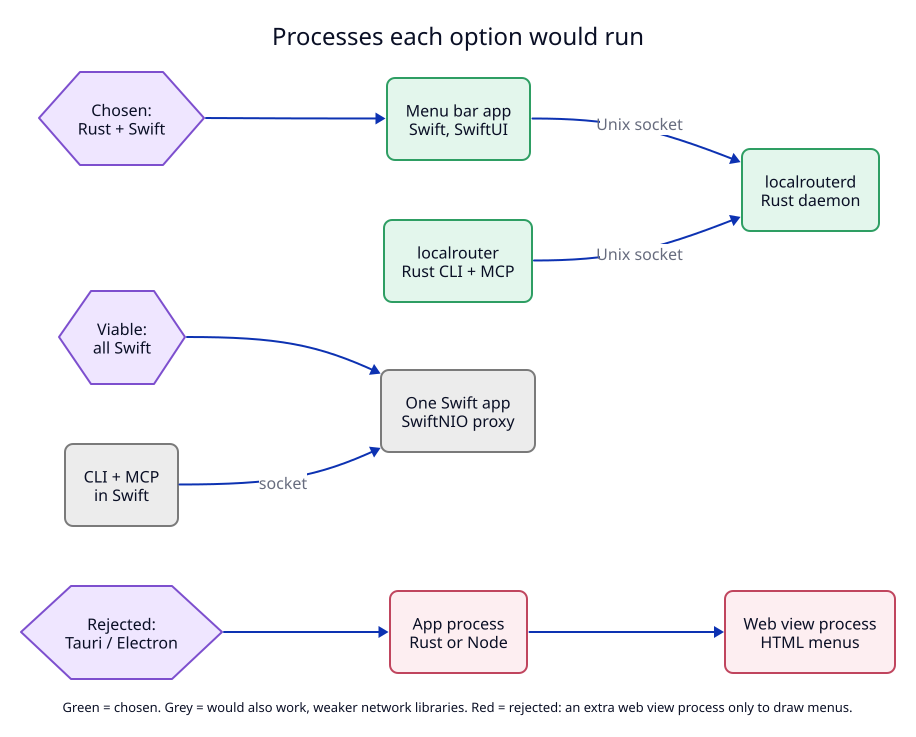

# 2. Rust daemon and CLI, Swift menu bar app

**Context.** The app must be very light and look native. It has two very
different parts:

- **Network code:** a reverse proxy for HTTP/1.1, HTTP/2 and WebSocket, TLS with
  certificates made on demand, and a Unix socket API.
- **User interface:** one icon next to the clock with four small screens
  (Domains, Logs, Settings, Help).

## Options

| Option | Network code | UI | Extra processes | Verdict |
|---|---|---|---|---|
| Rust daemon + Swift app | `hyper`, `rustls`, `rcgen`, `rmcp` | SwiftUI `MenuBarExtra` | none | **chosen** |
| All Swift | SwiftNIO, swift-certificates | SwiftUI | none | viable |
| Tauri | Rust | HTML in a web view | one WebKit process | rejected |
| Electron | Node | HTML in Chromium | several | rejected |

Why not all Swift: it would work, and it is one language. But the Rust
libraries for this exact job are more mature: `hyper` (HTTP server and client),
`rustls` (TLS), `rcgen` (certificate generation) and `rmcp` (the official Rust
MCP SDK). A Rust daemon is also easy to test without any UI.

Why not Tauri or Electron: they start a web view process only to draw a few
menus. That is the opposite of "very light".

## Decision

Three programs, one language per side:

| Program | Language | Job |
|---|---|---|
| `localrouterd` | Rust | The daemon. Listens on ports 80 and 443, holds the route table, writes all state files, serves the socket API. One per user. |
| `localrouter` | Rust | Command-line tool. `localrouter mcp` is the MCP server for agents. Holds no state. |
| `LocalRouter.app` | Swift | Menu bar UI. Starts the daemon at login with `SMAppService`. Holds no state. |

The Swift app does **not** link Rust code. It talks to the daemon over the same
JSON socket API as the CLI (see [05](05-one-daemon-api.md)). This avoids a
Rust-to-Swift FFI layer (foreign function interface, calling Rust from Swift
directly), at the cost of keeping two copies of the JSON types. A contract test
keeps the copies equal.

The daemon keeps running when the menu bar app quits. Routes keep working.

The full folder layout, in the repository and on the user's Mac, is in
[08-components.md](08-components.md#project-structure-on-disk).

## Tests

- `T9` is the contract test. Rust and Swift both decode every file in
  `api/examples/`.
- `M5` measures the idle memory of the daemon and the app.
