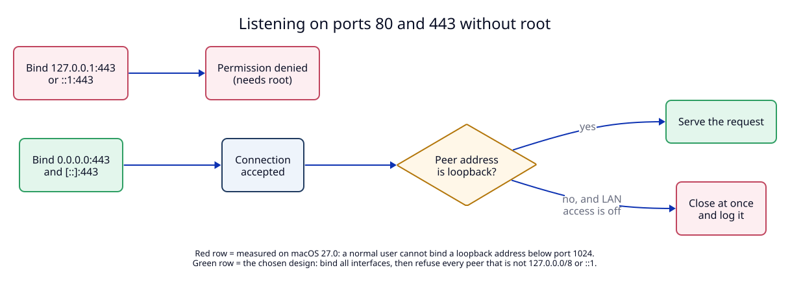

# 3. Ports 80 and 443 without root: bind all, refuse non-loopback peers

**Context.** A URL without a port (`https://shop.localhost`) uses port 443, or
port 80 for `http://`. On Unix, ports below 1024 are "privileged" and often need
root. We do not want a root process.

## What we measured

On macOS 27.0, as a normal user:

| Bind address | Port 80 | Port 443 |
|---|---|---|
| `0.0.0.0` (all IPv4 interfaces) | ✓ | ✓ |
| `[::]` (all IPv6 interfaces) | not tested | ✓ |
| `127.0.0.1` (IPv4 loopback) | ✗ permission denied | not tested |
| `::1` (IPv6 loopback) | not tested | ✗ permission denied |

So macOS lets a normal user bind a low port only on the "all interfaces"
address. Binding only to loopback, which would be the safe choice, needs root.

`*.localhost` resolves to **both** `127.0.0.1` and `::1`. So we must listen on
IPv4 and IPv6.

## Decision

1. The daemon binds four sockets: `0.0.0.0:80`, `0.0.0.0:443`, `[::]:80`,
   `[::]:443`. The IPv6 sockets set `IPV6_V6ONLY`, so the two families do not
   overlap.
2. On each accepted connection, the daemon checks the peer address **before it
   reads any byte**. It accepts `127.0.0.0/8`, `::1` and the IPv4-mapped form
   `::ffff:127.x.x.x`. It closes every other connection and logs one line.
3. The setting "Allow LAN access" (off by default) turns the check off.
4. If a port is already taken (for example by Docker or nginx), the daemon does
   **not** pick another port. It reports the error in `status`, in the menu bar
   and in `localrouter status`. It keeps serving the ports it could bind.

This applies to the four shared HTTP sockets only. TCP routes use ports above
1023, which a normal user **can** bind on `127.0.0.1` and `::1` (measured with
port 15432). So TCP route listeners are loopback-only and need no peer check
(see [07](07-protocols.md)).

Trade-off: the shared HTTP sockets are reachable from the network at the TCP level. The
security of dev servers now depends on the peer check being correct. It is
a small, testable function (`T4`), and `M4` checks it from a second device.

Alternatives we did not take:

| Alternative | Why not in version 1 |
|---|---|
| Privileged helper (root launchd daemon) that binds loopback and passes the socket | More moving parts, a root process, and an install prompt. |
| `pf` firewall rule that redirects 80 to 8080 | Changes system firewall config; hard to undo cleanly. |
| Use high ports (`https://shop.localhost:8443`) | Defeats the point of short URLs. Still available for tests. |

The macOS application firewall may ask once whether `localrouterd` may accept
incoming connections. Answering "Deny" does not affect loopback traffic (to be
confirmed in `M4`).

## Tests

- `T4`: peer filter unit tests, including IPv4-mapped IPv6 addresses.
- `M4`: request from a second device on the LAN is refused. Port already in use
  shows a clear error.
