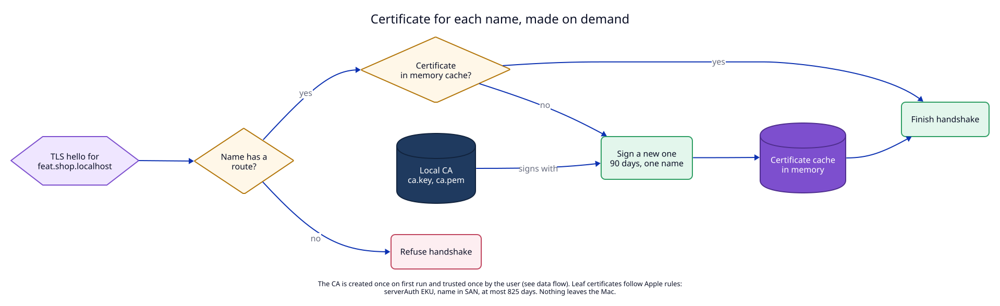

# 4. HTTPS with a local certificate authority

**Context.** Many apps need HTTPS in development: secure cookies, OAuth
callbacks, service workers, and HTTP/2. A browser trusts a certificate only if
it is signed by a certificate authority (CA) that the system trusts.

## Decision

1. **One local CA per user.** On first start the daemon creates an ECDSA P-256
   key pair and a self-signed root certificate (10 years) in
   `~/Library/Application Support/LocalRouter/ca/`. The key file has mode
   `0600`. It never leaves this folder, is never sent over the socket API, and
   is never logged. The daemon **never replaces an existing CA by itself**: if
   the CA files are damaged, HTTPS stays off and `status` says why. Only
   `localrouter ca reset` (a user command, not an MCP tool) makes a new CA,
   because a new CA breaks the trust the user already gave.
2. **Trust is a separate, explicit step.** `localrouter trust` or the "Trust"
   button in Settings adds the root to the **login** keychain as a trusted root.
   macOS asks for the user's password. The daemon itself never touches the
   keychain. `localrouter untrust` removes the trust setting again.
3. **One leaf certificate per name, made on demand.** When a TLS connection
   arrives, the daemon reads the requested name from the TLS hello (SNI, Server
   Name Indication). It makes a certificate only if:
   - the name ends in `.localhost`, and
   - the name has a route (after subdomain fallback, see [06](06-route-model.md)).

   Otherwise it refuses the handshake. Leaf certificates are cached in memory
   and are made again after a restart (a few milliseconds each).
4. **Apple's rules for TLS server certificates** (Apple support note 103769):
   name in the Subject Alternative Name, `serverAuth` in Extended Key Usage,
   validity of at most 825 days. We use **90 days** and one exact name per
   certificate. No wildcard certificates.
5. **ALPN** offers `h2` and `http/1.1`, so browsers can use HTTP/2 to the
   daemon. The daemon talks HTTP/1.1 to dev servers.

Why no wildcard certificate (`*.shop.localhost`): browsers treat very wide
wildcards with care, and each wildcard would only cover one level. Exact names
made on demand avoid the whole question.

Clients that do not use the macOS keychain:

| Client | Setting |
|---|---|
| Firefox | `security.enterprise_roots.enabled = true` |
| Node.js | `NODE_EXTRA_CA_CERTS` pointing to `ca.pem` |
| Python `requests` | `REQUESTS_CA_BUNDLE` pointing to `ca.pem` |

**Open point:** we want the root to carry X.509 *name constraints* (it may sign
only `localhost` names). Then a stolen `ca.key` could not sign `google.com`. We
have not checked that macOS, Chrome, Firefox and Node all accept a constrained
root. This is an unresolved effect in the manifest (`U1`), checked by `M7`.

## Tests

- `T2`: CA creation, key file mode, leaf certificate fields, refusal of names
  outside `.localhost` and names without a route.
- `M1`: real browsers with the trusted root. `M6`: `untrust` removes the trust
  setting. `M7`: name constraints.
