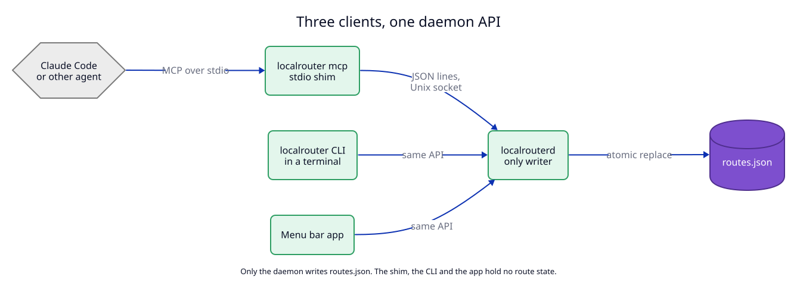

# 5. One daemon API for the MCP server, the CLI and the app

**Context.** Three clients change routes: coding agents (through MCP), a person
in a terminal (the CLI) and a person in the menu bar (the app). If each one wrote
the route file directly, two clients could overwrite each other.

## Decision

1. **The daemon is the only writer** of `routes.json` and `config.json`. The
   file-writing code lives in `apps/daemon`, so the CLI crate cannot even
   link it.
2. **One API:** newline-delimited JSON over a Unix socket at
   `~/Library/Application Support/LocalRouter/daemon.sock` (mode `0600`). The
   message shape follows JSON-RPC 2.0: `{"id", "method", "params"}` in,
   `{"id", "result" | "error"}` out. One extra method, `subscribe_logs`, streams
   log entries until the client disconnects.
3. **Version check.** The first call of every client is `hello`, which returns
   `api_version` (for example `1.0`). A client refuses to continue when the major
   number differs, and says which side to update.
4. **MCP runs as a stdio shim.** Claude Code starts `localrouter mcp` as a child
   process (`claude mcp add localrouter -- localrouter mcp`). The shim turns
   each MCP tool call into one socket call. It holds no state. If the daemon is
   not running, every tool returns the error "LocalRouter is not running. Open
   LocalRouter.app or run localrouterd." The shim does **not** start a daemon, so
   there is never a second one.

MCP tools (the socket methods have the same names):

| Tool | Input | Result |
|---|---|---|
| `register_route` | `host`, `protocol?`, `target`, `listen_port?`, `https_only?`, `note?`, `owner_pid?`, `persistent?` | the route, its URLs (or `host:port` for TCP, with the real listen port), `replaced` (true if it overwrote a route) and the old target |
| `unregister_route` | `host` | `removed: true/false` |
| `list_routes` | none | all routes, each with `upstream_up` (TCP connect within 200 ms) |
| `find_free_port` | `near?` | a free TCP port on `127.0.0.1` |
| `get_logs` | `host?`, `limit?` | last requests: time, method, host, path without query, status, duration |
| `status` | none | version, ports bound or failed, CA created, CA trusted |

Why a stdio shim and not an HTTP MCP endpoint in the daemon: stdio needs no port
and no auth token, and Claude Code supports it directly. Any local process of
the same user can already use the socket, so the shim adds no new access.

## Tests

- `T6`: socket API integration tests against a real daemon in a temp folder.
- `T7`: MCP tests with a real MCP client over stdio.
- `T9`: contract test for the JSON shapes.
- `M2`: acceptance test with Claude Code.
