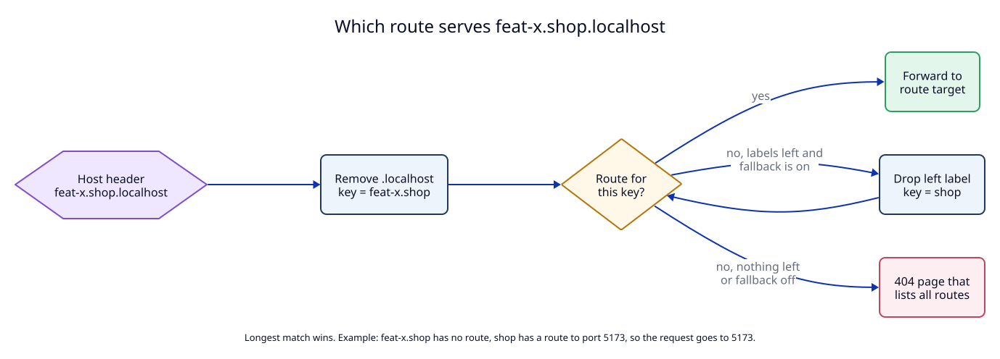

# 6. Route model: names, subdomain fallback and lifetime

**Context.** Branches and worktrees need their own names under a project
(`feat-login.shop.localhost`). Agents start and stop dev servers often, so
routes must also go away by themselves.

## Decision

### Fields

| Field | Rule |
|---|---|
| `host` | Name without `.localhost`. One or more labels. Each label is `a-z`, `0-9`, `-`, 1 to 63 characters, no `-` at the start or end. Stored in lower case. Unique across all routes. |
| `protocol` | `http` (default) or `tcp`. See [07](07-protocols.md). |
| `target` | A scheme, a **loopback** host (`127.0.0.1`, `localhost`, `[::1]`) and a port. HTTP routes: `http://` or `https://`. TCP routes: `tcp://`. Other hosts are refused, so the daemon cannot become a proxy to the network. |
| `listen_port` | TCP routes only, required. 1024 to 65535, or `0` for "pick a free port". |
| `https_only` | HTTP routes only, default `false`. Port 80 redirects to HTTPS. |
| `note` | Free text, up to 500 characters. Agents write why the route exists. |
| `owner_pid` | Optional. The process must be alive when the route is registered. |
| `persistent` | Optional, default `false`. |

A branch name like `feat/login` is not a valid label. `register_route` refuses
it and the error message proposes `feat-login`.

### Lookup (longest match, HTTP routes only)

TCP routes are found by their listen port, not by name (see
[07](07-protocols.md)). For HTTP routes:

1. Take the `Host` header and remove `.localhost` and any port.
2. Look for a route with exactly this key.
3. If there is none and fallback is on, remove the left label and try again.
4. If nothing matches, return a 404 page that lists all routes.

Example: routes `shop → :5173` and `feat-login.shop → :5174`.

| Request host | Route used |
|---|---|
| `shop.localhost` | `shop` → 5173 |
| `feat-login.shop.localhost` | `feat-login.shop` → 5174 |
| `feat-other.shop.localhost` | `shop` → 5173 (fallback) |
| `blog.localhost` | none → 404 |

### Lifetime

Three kinds of route. A route cannot be both `persistent` and have an
`owner_pid`: the daemon refuses that combination.

| Kind | Set by | Written to `routes.json` | Removed when |
|---|---|---|---|
| persistent | `persistent: true` | yes | `unregister_route` |
| owned | `owner_pid` | **no** | that process exits (kqueue `EVFILT_PROC`, `NOTE_EXIT`), or `unregister_route` |
| session | neither | no | the daemon stops, or `unregister_route` |

Why owned routes are never saved: after a daemon restart, the old process ID may
belong to a different process. A saved owned route would stay alive forever.

### Same host registered twice

The second call replaces the first. This is the simple rule, and it lets an
agent update the port of its own route. The reply says `replaced: true` and
gives the old target, so the agent can notice. Silent replacement between two
agents is a known risk (see the manifest).

### Forwarding

The daemon forwards the `Host` header unchanged and adds `X-Forwarded-For`,
`X-Forwarded-Proto` and `X-Forwarded-Host`. If the target does not answer
within 2 seconds, it returns a 502 page with the route's target and note.

For a TCP route the daemon copies bytes both ways and adds nothing. If the
target does not answer within 2 seconds, it closes the client connection. When
a TCP route is removed, its listener and all its open connections are closed
(see [07](07-protocols.md)).

## Tests

- `T1`: validation, lookup, fallback on and off, 404.
- `T3`: owned routes are never saved; `persistent` plus `owner_pid` is refused.
- `T5`: `Host` unchanged, `X-Forwarded-*` added, 502 when the target is down.
- `T6`: an owned route disappears within 1 second after its process is killed.
