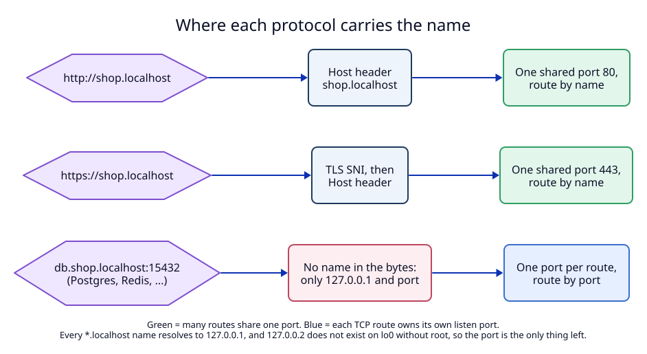

# 7. Protocols: HTTP, HTTPS and TCP

**Context.** Dev servers speak HTTP. But a project also runs a database, a
cache or a queue: Postgres on 5432, Redis on 6379. The user wants names for
those too. So LocalRouter must support three protocols on the client side:
HTTP, HTTPS and plain TCP.

## How each protocol can carry a name

A router can only route by what arrives in the connection.

| Protocol | What the daemon sees | Can many routes share one port? |
|---|---|---|
| HTTP | the `Host` header: `shop.localhost` | ✓ yes, route by name |
| HTTPS | the TLS SNI name, then the `Host` header | ✓ yes, route by name |
| plain TCP | only the destination address and port. The bytes are Postgres or Redis protocol and hold no host name. | ✗ no |

For TCP, the destination address does not help either:

1. macOS resolves **every** `*.localhost` name to `127.0.0.1` (measured, see
   [01](01-domain-tld.md)). So `db.shop.localhost` and `db.blog.localhost` give
   the same address.
2. Other loopback addresses do not exist without root. Measured on macOS 27.0:
   `lo0` has only `127.0.0.1` and `::1`, and binding `127.0.0.2` fails with
   "Can't assign requested address". Adding it needs `ifconfig lo0 alias`, which
   needs root, and a DNS server to hand out the addresses.

So the **port is the only thing that tells two TCP routes apart**.

## Decision

A route gets a `protocol` field: `http` (default) or `tcp`.

### HTTP routes (`protocol: "http"`)

1. Served on the shared ports 80 (HTTP) and 443 (HTTPS), routed by name, as in
   [03](03-listen-ports.md), [04](04-https-local-ca.md) and [06](06-route-model.md).
2. Both HTTP and HTTPS work by default. With `https_only: true`, port 80 answers
   `308 Permanent Redirect` to the `https://` URL.
3. The target may be `http://` **or `https://`** on a loopback address. Some dev
   servers serve HTTPS themselves (for example Vite with a self-signed
   certificate). For an `https://` target the daemon opens TLS to the dev server
   and **does not verify the dev server's certificate**. This is safe only
   because the target must be loopback (no other machine can be in the middle).

### TCP routes (`protocol: "tcp"`)

1. Each TCP route has its own **listen port** (`listen_port`), from 1024 to
   65535. `listen_port: 0` asks the daemon to pick a free port; the reply says
   which one.
2. The daemon binds that port on `127.0.0.1` **and** `::1` only. Measured: a
   normal user can bind ports above 1023 on loopback. Because these sockets are
   loopback-only, no other machine can connect, and no peer check is needed.
   `allow_lan` does not apply to TCP routes in version 1.
3. The daemon copies bytes both ways without reading them: no TLS, no parsing.
   The target is `tcp://` plus a loopback address and port.
4. The `host` of a TCP route is for people: it is shown in the app, in logs and
   in `list_routes` as `db.shop.localhost:15432`. The daemon **does not check**
   the name a client used. `anything.localhost:15432` reaches the same route.
5. Subdomain fallback does not apply to TCP routes.
6. Registration binds the port first. If the port is taken, the call fails and
   nothing is stored. A persistent TCP route whose port is taken at daemon
   start stays in the table, marked `listen_failed` in `status` and the app.
7. When a TCP route is removed (by `unregister_route` or because its owner
   process exited), the daemon closes the listener **and** all open connections
   of that route.
8. Rules for `listen_port`: not one of the HTTP ports, not used by another
   route, and not equal to the target port.

### Example

Two worktrees each run Postgres in Docker, on random ports 55001 and 55002.

| Route | Protocol | Listen | Target |
|---|---|---|---|
| `shop` | http | 80, 443 | `http://127.0.0.1:5173` |
| `db.shop` | tcp | 15432 | `tcp://127.0.0.1:55001` |
| `db.feat-login.shop` | tcp | 15433 | `tcp://127.0.0.1:55002` |

The app uses `DATABASE_URL=postgres://db.shop.localhost:15432/app`. When the
Docker container restarts on a new port, the agent calls `register_route` again
with the new target. The app config does not change.

### Why a TCP route is still worth having

It is fair to ask why not connect to `127.0.0.1:55001` directly. A TCP route
gives three things, and no more:

1. a **stable address** while the real port changes,
2. **visibility**: the app and `list_routes` show every database and cache,
   with a note and an "upstream up" dot,
3. **cleanup**: an owned TCP route closes when its process exits.

## Not in version 1

| Feature | Why not |
|---|---|
| TCP routing by TLS SNI on one shared port | Works only when the client starts TLS with SNI at once. Many database clients do not (Postgres negotiates TLS inside its own protocol, except with direct TLS in newer versions). Unresolved effect U5. |
| TLS termination for TCP routes | The daemon would need to know the protocol to be useful. |
| UDP | No use case yet. |
| TCP routes reachable from the LAN | Keeps the no-peer-check design simple. |

## Tests

- `T1`: validation of `protocol`, `listen_port`, target schemes per protocol.
- `T5`: HTTP route with an `https://` target; `https_only` redirect.
- `T12`: TCP forwarding: bytes both ways, half-close, loopback-only bind, port
  taken, removal closes open connections.
- `E1`: one TCP route in the end-to-end journey.
- `M1`: `psql` and `redis-cli` through a TCP route.
