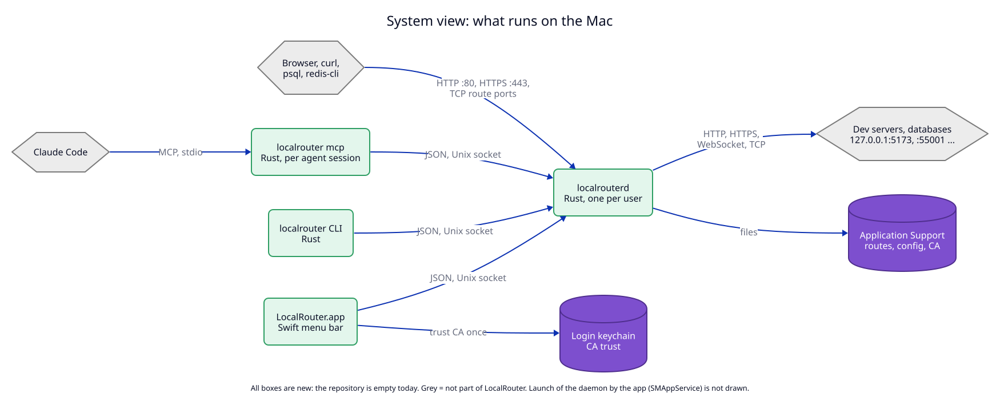
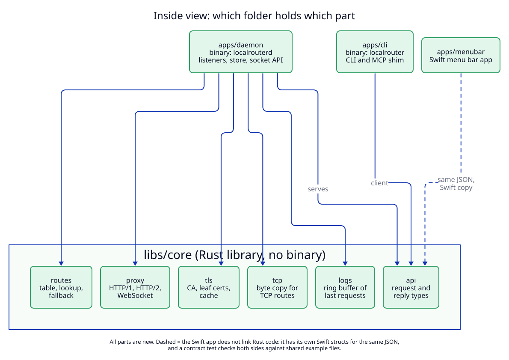

# 8. Components and project structure on disk

> **As built (2026-09-26):** two differences from the trees below, both in the
> Swift app: `apps/menubar` is a Swift package (`Package.swift`,
> `Sources/LocalRouter`, `Sources/LocalRouterKit`, `Tests/LocalRouterKitTests`)
> instead of an Xcode project, and the CLI is `Contents/Helpers/localrouter` in
> the bundle. See the manifest's drift D1 and D2.

This file answers two questions: what runs on the Mac, and which file holds
which part. The repository is empty today, so every component here is **new**.

## System view

**Status:** Proposed (not built).



| Component | State | Note |
|---|---|---|
| `localrouterd` | new | One per user. Started at login by the app through `SMAppService` (a LaunchAgent, runs as the user, not root). For development it can run in a terminal. |
| `localrouter` (CLI) | new | Short-lived. One process per command. |
| `localrouter mcp` | new | Same binary as the CLI. One process per agent session, started by the agent. |
| `LocalRouter.app` | new | Menu bar only (`LSUIElement`), no Dock icon. |
| Application Support folder | new | All state files. Written only by the daemon. |
| Login keychain trust setting | new | Written only by the app or the CLI, only on "Trust". |
| Dev servers | not ours | Any HTTP server on a loopback port. |

Protocols between the parts:

| From | To | Protocol |
|---|---|---|
| Agent | `localrouter mcp` | MCP over stdio |
| CLI, MCP shim, app | daemon | JSON lines over the Unix socket `daemon.sock` |
| Browser, `curl` | daemon | HTTP on port 80, HTTPS on port 443 (all interfaces, peer-checked) |
| `psql`, `redis-cli`, any TCP client | daemon | plain TCP on each TCP route's listen port (loopback only) |
| Daemon | dev server | HTTP/1.1 or HTTPS, WebSocket, or plain TCP, on a loopback port |

The socket is the only contract between the daemon and its clients. The only
arrow that bypasses it is "app → keychain": the trust step needs the user's
password in a system dialog, which a background daemon cannot show. The app
and the CLI read `ca.pem` to do this. They never write any file in the
Application Support folder.

**What this view leaves out:** how the app starts the daemon (`SMAppService`),
the macOS firewall prompt, and the name lookup by macOS (see [01](01-domain-tld.md)).

## Inside view

**Status:** Proposed (not built).



| Component | State | Note |
|---|---|---|
| `libs/core` | new | Library with no I/O at startup. Routes, HTTP proxy, TCP byte copy, TLS, request log, API types. Everything here is tested without a daemon. |
| `apps/daemon` | new | Binary `localrouterd`. Shared HTTP listeners with peer check, one loopback listener per TCP route, file store, socket server, pid watch, single-instance lock. |
| `apps/cli` | new | Binary `localrouter`. Commands and the MCP shim (`rmcp`). |
| `apps/menubar` | new | Swift app. Has its own Swift structs for the API JSON. |
| `api/examples` | new | Example JSON messages. Both Rust and Swift tests decode every file here. |

## Project structure on disk

### Source repository

```
localrouter/
├── Cargo.toml                      Rust workspace; members listed one by one:
│                                   apps/daemon, apps/cli, libs/core
├── Cargo.lock
├── rust-toolchain.toml             pinned stable Rust
├── .gitignore                      target/, apps/menubar/build/, *.xcuserstate
├── README.md
│
├── apps/                           every program the user runs
│   ├── daemon/                     Rust, binary: localrouterd
│   │   ├── Cargo.toml
│   │   ├── src/
│   │   │   ├── main.rs
│   │   │   ├── listen.rs           bind 80/443 on IPv4 and IPv6, peer check
│   │   │   ├── tcp_listen.rs       one loopback listener per TCP route: open, close
│   │   │   ├── store.rs            routes.json and config.json: load, atomic save
│   │   │   ├── socket.rs           Unix socket JSON server
│   │   │   ├── pidwatch.rs         kqueue NOTE_EXIT for owned routes
│   │   │   └── lock.rs             single instance: flock on daemon.lock
│   │   └── tests/
│   │       └── api.rs              starts the real binary in a temp folder
│   │
│   ├── cli/                        Rust, binary: localrouter (CLI and MCP shim)
│   │   ├── Cargo.toml
│   │   ├── src/
│   │   │   ├── main.rs             clap commands
│   │   │   ├── client.rs           socket client
│   │   │   ├── mcp.rs              MCP stdio server (rmcp)
│   │   │   └── trust.rs            trust / untrust via the security tool
│   │   └── tests/
│   │       ├── cli.rs
│   │       ├── mcp.rs              real MCP client over stdio
│   │       └── e2e.rs              E1: full journey
│   │
│   └── menubar/                    Swift, LocalRouter.app
│       ├── LocalRouter.xcodeproj
│       ├── LocalRouter/
│       │   ├── LocalRouterApp.swift    MenuBarExtra, SMAppService registration
│       │   ├── DaemonClient.swift      socket client, log subscription
│       │   ├── Api.swift               Swift copy of the API types
│       │   ├── Views/
│       │   │   ├── DomainsView.swift
│       │   │   ├── LogsView.swift
│       │   │   ├── SettingsView.swift
│       │   │   └── HelpView.swift
│       │   ├── Info.plist              LSUIElement = YES
│       │   └── LaunchAgents/
│       │       └── <bundle-id>.daemon.plist    runs Contents/MacOS/localrouterd
│       └── LocalRouterTests/
│           └── ApiContractTests.swift  decodes every file in api/examples
│
├── libs/                           shared code, no binaries
│   └── core/                       Rust library: localrouter-core
│       ├── Cargo.toml
│       ├── src/
│       │   ├── lib.rs
│       │   ├── routes.rs           Route, validation, longest-match lookup
│       │   ├── proxy.rs            forward HTTP/1.1, HTTP/2, WebSocket; http and https targets;
│       │   │                       https_only redirect; 404 and 502 pages
│       │   ├── tcp.rs              copy bytes both ways for TCP routes; close on route removal
│       │   ├── tls.rs              CA create/load, leaf certs, SNI resolver, cache
│       │   ├── logs.rs             request log ring buffer
│       │   ├── api.rs              request and reply types (serde)
│       │   ├── config.rs           Config with defaults
│       │   └── paths.rs            data folder; LOCALROUTER_HOME overrides it
│       └── tests/
│           ├── proxy.rs            real upstream server on a random port
│           ├── tcp.rs              real TCP echo server on a random port
│           └── api_examples.rs     decodes every file in api/examples
│
├── api/
│   └── examples/                   one JSON file per request and reply type
│       ├── hello.reply.json
│       ├── register_route.request.json
│       ├── register_route.reply.json
│       └── ...
│
├── scripts/
│   └── build-app.sh                cargo build --release, copy both binaries into the app bundle
│
└── docs/
    ├── dictionary.md
    └── adr/
```

Why the workspace lists its members one by one: a Cargo glob such as
`apps/*` would also match `apps/menubar`, which has no `Cargo.toml`, and Cargo
stops with an error. Each new Rust app is added to the list by hand.

Folders are split by role (`apps/` for programs, `libs/` for shared code), not
by platform. All three apps are macOS-only today. A split by platform can come
later if a second platform is added.

### Built app bundle

```
LocalRouter.app/Contents/
├── Info.plist
├── MacOS/
│   ├── LocalRouter                 Swift app
│   ├── localrouterd                Rust daemon
│   └── localrouter                 Rust CLI and MCP shim
├── Library/LaunchAgents/
│   └── <bundle-id>.daemon.plist    registered with SMAppService.agent(plistName:)
└── Resources/
```

The bundle id is not chosen yet (manifest, `U2`). Where the CLI gets linked for
the terminal is not decided yet (manifest, `U4`).

### Files on the user's Mac at run time

```
~/Library/Application Support/LocalRouter/     (or $LOCALROUTER_HOME)
├── config.json          settings; written by the daemon only
├── routes.json          persistent routes only; written by the daemon only
├── routes.json.bad-<time>   a routes.json that failed to load, kept for the user
├── daemon.sock          Unix socket, mode 0600
├── daemon.lock          flock; a second daemon exits at once
└── ca/
    ├── ca.key           root private key, mode 0600
    └── ca.pem           root certificate, safe to share with Node, Firefox, curl

~/Library/Logs/LocalRouter/
├── daemon.log           daemon events (not requests), up to 5 MB
└── daemon.log.1         one older copy

Login keychain           trust setting for ca.pem, after "Trust" only
```

Not on disk: the route table for owned and session routes, leaf certificates
and the request log. They live in the daemon's memory only.
