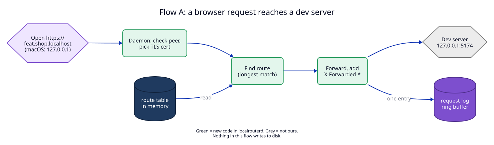
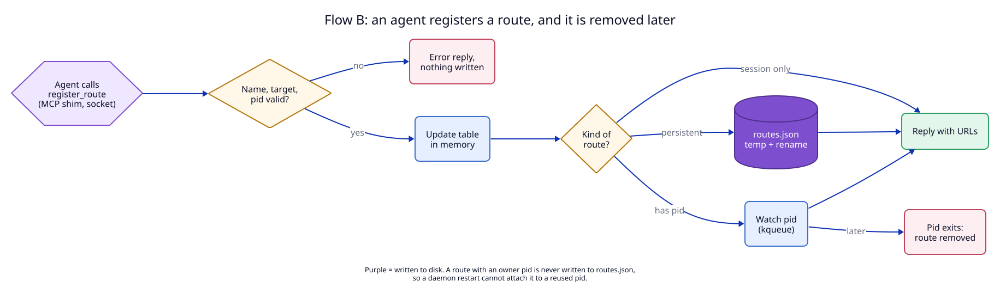
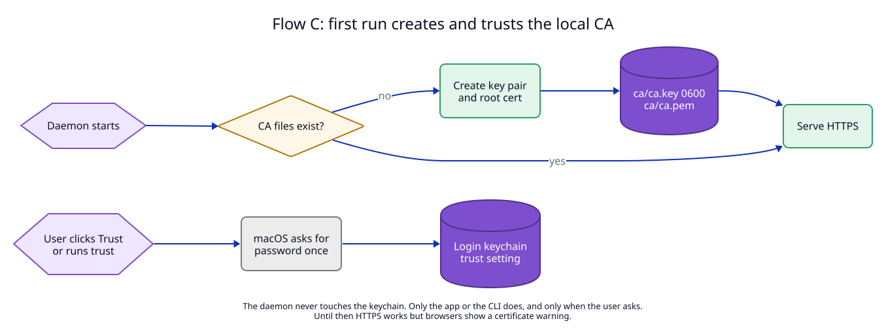
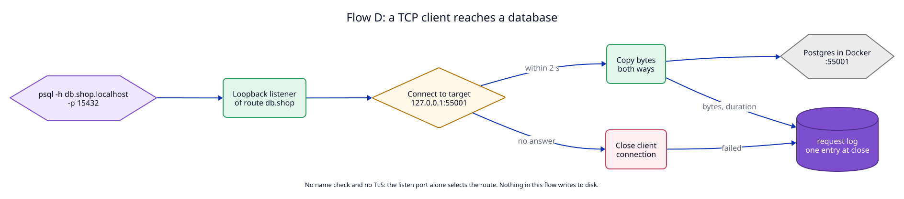

# 9. Data flow

This ADR is proposed, and the repository is empty. So every flow below is one
the design **will** create, and every flow is `new`.

| Flow | new/changed/removed | Trigger | Writes | Reads |
|---|---|---|---|---|
| A. Browser request | new | A client opens `http(s)://<name>.localhost` (HTTP routes) | request log (memory), leaf cert cache (memory) | route table (memory), `ca/ca.key` (loaded at start) |
| B. Register and remove a route | new | `register_route` from MCP, CLI or app; later the owner process exits | route table (memory), `routes.json` (persistent routes only) | route table |
| C. First run and trust | new | Daemon starts with no CA; later the user clicks "Trust" | `ca/ca.key`, `ca/ca.pem`, login keychain trust setting | `ca/ca.pem` |
| D. TCP connection | new | A TCP client connects to a TCP route's listen port | request log (memory) | route table (memory) |

## Flow A. A browser request reaches a dev server

Decided in [03](03-listen-ports.md) (peer check), [04](04-https-local-ca.md)
(certificate) and [06](06-route-model.md) (lookup and forwarding).

Write path: the only writes are in memory. The request log is a ring buffer
with a fixed size (default 1,000 entries). An entry is added after the response
headers are sent. It holds method, host, path **without the query string**,
status, duration and bytes. There is no transaction: a lost entry is harmless.

## Flow B. An agent registers a route, and it is removed later

Decided in [05](05-one-daemon-api.md) (API) and [06](06-route-model.md)
(lifetime).

Write path, step by step:

1. The daemon validates the whole request first. On any error nothing changes.
2. It updates the in-memory table under one lock.
3. For a persistent route it writes the whole table of persistent routes to
   `routes.json.tmp`, calls `fsync`, then `rename`s it over `routes.json`. The
   rename is atomic on APFS, so a crash leaves either the old file or the new
   file, never half a file.
4. If step 3 fails (disk full, permissions), the daemon puts the in-memory table
   back as it was and replies with an error. Memory and disk never disagree
   about persistent routes.
5. Only then does it reply.

For a **TCP route**, one step comes before step 2: the daemon binds the listen
port on `127.0.0.1` and `::1`. If the bind fails, the call fails and nothing
changes. If a later step fails, the daemon closes the new listener again, so a
failed call never leaves a port open.

For an owned route, step 3 is replaced by "register the pid with kqueue". If the
process is already gone at that moment, the route is removed and the call fails.

On startup the daemon reads `routes.json`. If the file does not parse, the
daemon renames it to `routes.json.bad-<time>`, starts with no persistent routes,
and reports this in `status`. It does not stop.

## Flow C. First run creates and trusts the local CA

Decided in [04](04-https-local-ca.md).

Write path: the daemon writes `ca.key` (mode `0600`, set when the file is
created, not after) and `ca.pem` into a new folder `ca.tmp-<pid>/`, calls
`fsync`, then renames the folder to `ca/`. One rename is atomic, so `ca/` either
holds both files or does not exist. A leftover `ca.tmp-*` folder from a crash is
deleted on the next start.

If `ca/` exists but a file inside is missing or does not parse, the daemon does
**not** make a new CA. A new CA would silently break the trust the user already
gave to the old one. HTTPS stays off, `status` reports the problem, and
`localrouter ca reset` (untrust, delete, create again) fixes it on purpose.

The trust step runs in the app or the CLI, never in the daemon. It calls
`security add-trusted-cert` for the login keychain. macOS shows the password
dialog. `localrouter untrust` calls `security remove-trusted-cert`.

## Flow D. A TCP client reaches a database

Decided in [07](07-protocols.md).

Write path: only memory. The request log gets one entry when the connection
closes: time, route host, listen port, bytes in each direction, duration, and
`failed` if the target did not answer within 2 seconds. When the route is
removed, the daemon closes the listener and every open connection of that
route, and each of those connections gets its log entry.
