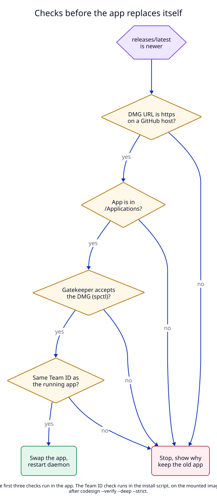

# 2. Self-update from GitHub Releases

**Status:** As built (2026-09-26).

**Context.** A user installs version 0.1.0 from the GitHub releases page. Every
later version must reach that user without another manual download.

## Decision

A custom updater in the Swift app, like VibeViewer's (no Sparkle, no appcast,
no extra signing key). Code: `apps/menubar/Sources/LocalRouterKit/Updater.swift`.

1. **Check.** 30 seconds after start and then every 6 hours (setting "Check
   for updates automatically", on by default), and from **⋯ → Check for
   Updates…**. It reads
   `https://api.github.com/repos/shchahrykovich/localrouter/releases/latest`
   and takes the first `.dmg` asset. `v0.1.10` is newer than `v0.1.9`; any
   `-beta` suffix is ignored.
2. **Offer.** The footer shows "Update to X.Y.Z". Installing needs one click;
   the check never installs by itself.
3. **Checks before install** (all must pass):

   | Check | Where | Why |
   |---|---|---|
   | The DMG URL is `https` on `github.com`, `api.github.com` or `*.githubusercontent.com`, without user info or a port | app | A tampered API answer cannot point the download elsewhere. |
   | The app runs from `/Applications` or `~/Applications` and that folder is writable | app | Never ask for a password; never replace a copy in Downloads. |
   | `spctl --assess --type open` accepts the DMG | app | Gatekeeper: Developer ID signed and notarized. |
   | `codesign --verify --deep --strict` accepts the new app, and its Team ID equals the running app's | install script | A notarized image from another developer is still refused. |

4. **Install.** The app writes a script to the temp folder and quits. The
   script waits for the app to exit, mounts the DMG, copies the new app next to
   the old one with `ditto`, swaps them with two renames (and restores the old
   one if the second fails), removes the quarantine flag, restarts the daemon
   with `launchctl kickstart -k gui/<uid>/dev.localrouter.app.daemon`, and
   opens the new app. It logs to `~/Library/Logs/LocalRouter/update-<time>.log`.

Routes, settings and the CA are in `~/Library/Application Support/LocalRouter`,
outside the bundle, so an update keeps them.

Trade-off: an ad-hoc build (from `scripts/install.sh`) never passes step 3, so
it never updates itself. That is on purpose: only notarized images from GitHub
may replace the app.

## Tests

`apps/menubar/Tests/LocalRouterKitTests/UpdaterTests.swift`: version order,
trusted hosts, release parsing, refusal of a release with no DMG or a foreign
URL, location obstacles, script quoting (a path with `'`), the Team ID and
kickstart lines, and `bash -n` on the generated script. The real update from
one release to the next is manual test M10.
