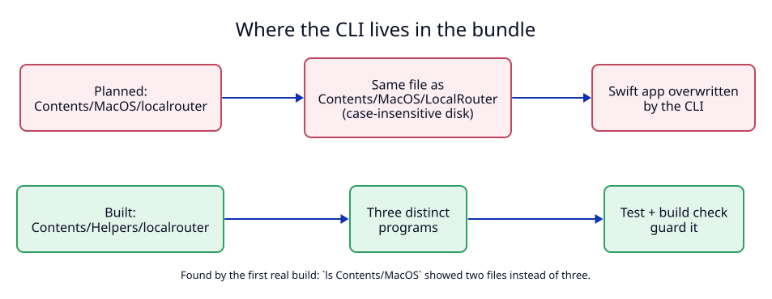

# 3. Bundle layout: the CLI lives in `Contents/Helpers`

**Status:** As built (2026-09-26). Drift from ADR 01, which planned
`Contents/MacOS/localrouter` and an Xcode project.

**Context.** The first real build produced a bundle with two programs instead
of three.

## Why it was wrong

APFS on macOS is case-insensitive by default. `localrouter` (the Rust CLI) and
`LocalRouter` (the Swift app's executable) are the same name there:

| Step in `build-app.sh` (old) | Result |
|---|---|
| `cp .../LocalRouter Contents/MacOS/LocalRouter` | Swift app copied |
| `cp .../localrouter Contents/MacOS/` | **overwrites** `Contents/MacOS/LocalRouter` with the CLI |
| `ls Contents/MacOS` | `LocalRouter`, `localrouterd`: two files |

The bundle would have started the CLI instead of the app.

## Decision

1. The CLI goes to `Contents/Helpers/localrouter` (Apple's folder for helper
   programs). The daemon stays at `Contents/MacOS/localrouterd`, where the
   LaunchAgent's `BundleProgram` points.
2. The paths live in one place, `BundleLayout` in
   `apps/menubar/Sources/LocalRouterKit/CLIInstaller.swift`, used by the CLI
   installer, the Trust button and Uninstall.
3. The Swift app is a Swift package built with `swift build`, and
   `scripts/build-app.sh` assembles the bundle (user decision on 2026-09-26: a
   hand-written `.xcodeproj` is hard to review).

## Tests

- `BundleLayoutTests.testBundledProgramsNeverCollideWhenCaseIsIgnored` failed
  before the fix ("2 is not equal to 3") and passes after it.
- `build-app.sh` stops when a program is missing or when
  `Contents/MacOS/LocalRouter` differs from the Swift binary.
