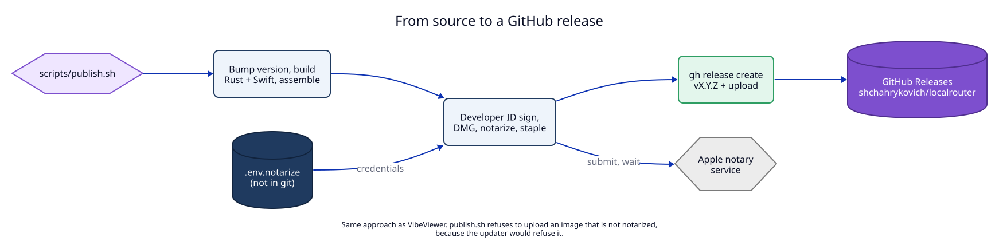
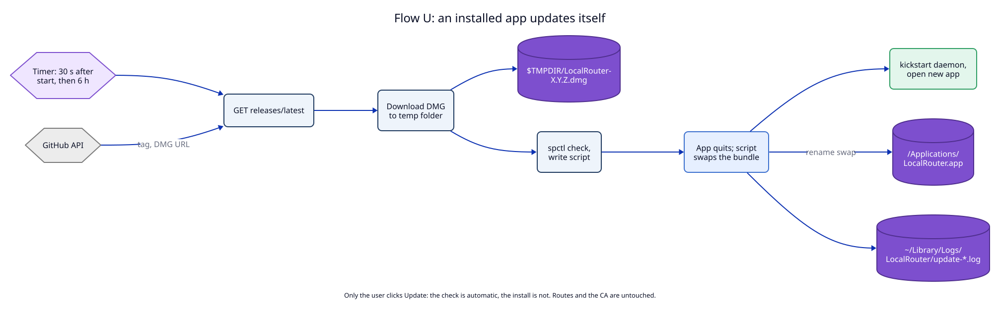

# 4. Data flow

As built. Both flows are `new`; no flow of ADR 01 changes.

| Flow | new/changed/removed | Trigger | Writes | Reads |
|---|---|---|---|---|
| P. Publish a release | new | Maintainer runs `scripts/publish.sh` | `Cargo.toml` version, `build/`, `dist/*.dmg`, GitHub release and asset | `.env.notarize`, keychain identity |
| U. Update an installed app | new | Timer or "Check for Updates…", then a click on "Update" | temp DMG, `/Applications/LocalRouter.app`, update log | GitHub API, the DMG |

## Flow P. Publish a release

Decided in [01](01-release-pipeline.md).

Write path: the version bump in `Cargo.toml` is rolled back by `release.sh`
when any later step fails (an `ERR` trap). The GitHub release is created
before the upload; if the upload fails, running `publish.sh --no-bump` again
reuses the release and replaces the asset (`--clobber`). The version bump is
not committed by the script; the maintainer commits it.

## Flow U. An installed app updates itself

Decided in [02](02-self-update.md).

Write path: the new bundle is copied to `LocalRouter.app.update-<pid>` first,
then two renames swap it in. Between the two renames `LocalRouter.app` does not
exist for a moment; if the second rename fails, the script moves the old app
back. The daemon keeps running from the old files until `kickstart -k`
restarts it from the new ones, so routes stay up except for that restart.
Persistent routes, config and the CA are outside the bundle and are not
touched.
