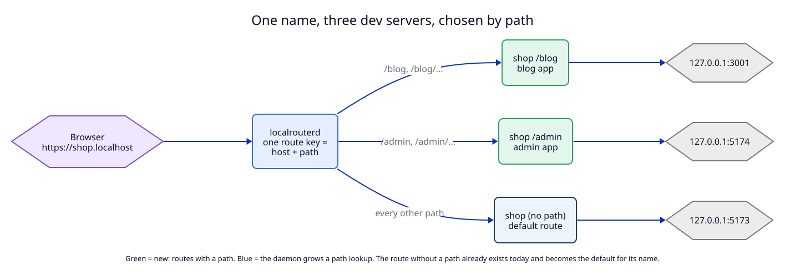

# 1. The route key becomes host plus path

**Context.** Many sites are built as several apps behind one reverse proxy. In
production the proxy owns one domain, reads the path, and sends `/blog/...` to
the blog app, `/admin/...` to the admin app and every other path to the main
app. On one origin the apps share cookies, sign-in and links without CORS. Today
LocalRouter can give each app its own name (`blog.shop.localhost`), but it
cannot put them on one name. A developer who wants the production shape locally
must run their own proxy in front of LocalRouter.

The reason is in the route model. `RouteTable` is a
`BTreeMap<String, Route>` keyed by the host key
(`libs/core/src/routes.rs:229`), so one host key has at most one route, and ADR
01 change 6 says the host is "unique across all routes".



## Decision

A route gets two optional fields, and the route key becomes host plus path.

| Field | Type | Rule |
|---|---|---|
| `path` | string, optional | HTTP routes only. A path prefix: the route answers this path and every path under it. Absent means "every path": this is the **default route** of the host, the only kind of route that exists today. |
| `strip_path` | boolean, default `false` | Only with `path`. Remove the prefix before the request reaches the dev server. See [03](03-forwarding.md). |

**Route key.** The pair `(host, path)`. It is written as the two strings joined:
`shop` is the default route, `shop/blog` is the route for path `/blog`. The key
is unique; a second `register_route` with the same key replaces the first, with
`replaced: true` and the old target in the reply, as today.

**Path rules.** `register_route` normalizes the path, then refuses anything that
does not fit these rules, with error code `invalid_route` and a message that
says which rule failed:

| Rule | Example accepted | Example refused |
|---|---|---|
| Starts with `/` | `/blog` | `blog` |
| `/` alone means "no path" and is stored as absent | `/` → default route | |
| A trailing `/` is removed | `/blog/` → `/blog` | |
| Segments are separated by one `/` and are not empty, `.` or `..` | `/docs/v2` | `/a//b`, `/a/../b` |
| Characters: `A-Z a-z 0-9 - . _ ~` (RFC 3986 "unreserved") | `/api_v2`, `/~me` | `/a%20b`, `/a?b`, `/a#b`, `/a*` |
| At most 200 characters | | |

Case is kept, and matching is case-sensitive, because URL paths are
case-sensitive: `/Blog` is not `/blog`.

**Protocol rules.** A path is an HTTP idea. So:

1. A TCP route cannot have `path` or `strip_path`.
2. A host key that has a TCP route has no other route, and a host key that has a
   path route cannot get a TCP route. Without this rule, `stop_tcp(&route.host)`
   in `register_route` (`apps/daemon/src/daemon.rs:462`) would close a TCP
   listener when an HTTP path route is added to the same host.
3. `https_only` stays a per-route field. A host can redirect some paths to HTTPS
   and not others. This is allowed but unusual; the help page recommends the
   same value on every route of a host.

**Lifetime is per route.** `owner_pid` and `persistent` belong to each route, not
to the host. The default route of `shop` can be persistent while
`feat-x.shop/blog` is owned by a worktree's dev server. When that process exits,
only that one route is removed: `RouteTable::owned_by` returns route keys
instead of hosts.

**Removal is exact.** `unregister_route` takes the key: `host` and an optional
`path`. Without `path` it removes only the default route. It never removes path
routes as a side effect. Removing every route of a host at once is not in this
ADR (open point U7 in the [manifest](07-semantic-change-manifest.md)).

### One app with several paths: one route per path

Some apps own more than one path prefix. For example, one app serves
`/products` and `/brands`, and moves its files under `/shop-assets`. Such an
app needs one route per prefix, all with the same target:

```
localrouter add shop 3001 --path /products
localrouter add shop 3001 --path /brands
localrouter add shop 3001 --path /shop-assets --strip-path
```

A route does **not** get a list of paths. A list would make the key a set, and
then two routes could claim the same path from two lists, which the key rule
forbids today by construction. Three commands are the cost. An agent that
starts the app with `owner_pid` gives all three routes the same owner, so they
also disappear together. The help page shows this pattern (see
[03](03-forwarding.md) and [04](04-clients-and-agent-texts.md)). If users ask
for fewer commands, a CLI shortcut that sends several `register_route` calls
(`--path /products --path /brands`) is possible without any change to the key.

### Why a flat key and not a list of paths inside one route

The other shape is one route per host that holds a list of `path → target`
rules. It was rejected for three reasons:

1. Each app of the site is started and stopped on its own, often by a different
   agent in a different worktree. Each needs its own `owner_pid`, `note` and
   `persistent`. A nested list would need all three per entry, which is a route
   again.
2. Every existing method (`register_route`, `unregister_route`, `list_routes`,
   the owner-pid watch) already works on one route. With a flat key they keep
   their shape and gain one optional field.
3. Old clients keep working. A client that never sends `path` only ever touches
   default routes, which behave exactly as before.

## Tests

- `T1`: path rules, accepted and refused, with the messages.
- `T2`: protocol rules: TCP plus path refused, TCP route on a host with path
  routes refused, path route on a host with a TCP route refused.
- `T6`: key replace, exact removal, owned path route removed alone.
