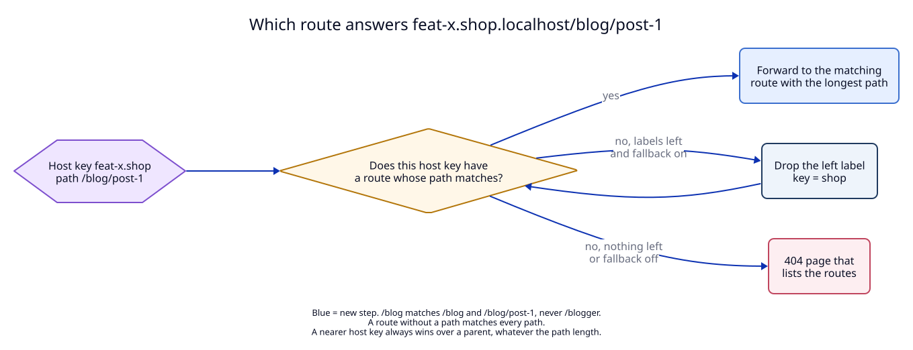

# 2. Lookup: nearest host key first, then the longest path

**Context.** Today the proxy calls `RouteSource::lookup(host)`
(`libs/core/src/proxy.rs:34`) and the table walks the host key from the full
name to its parents (`libs/core/src/routes.rs:332`). The path of the request is
never read. With path routes the lookup needs the path, and it has to combine
two kinds of "more specific": a longer host key and a longer path.

## Decision

### The match rule

A route path `P` matches a request path `R` when `R == P` or `R` starts with
`P + "/"`. A route without a path matches every request path.

| Route path | `/blog` | `/blog/post-1` | `/blogger` | `/Blog` | `/` |
|---|---|---|---|---|---|
| `/blog` | ✓ | ✓ | ✗ | ✗ | ✗ |
| none (default) | ✓ | ✓ | ✓ | ✓ | ✓ |

`R` is the path of the request URI as it arrived, without the query string, and
without percent-decoding. Browsers remove `.` and `..` segments before they send
a request, so no normalization is done here. `/blog%2Fx` does not match
`/blog`, because the route path cannot contain `%` and `%2F` is not `/`.

### The lookup order

1. Take the host key from the `Host` header or `:authority`, as today.
2. Collect the HTTP routes of that exact host key whose path matches.
3. If there is one or more, pick the one with the **longest path** and stop.
   `/blog/admin` beats `/blog`, and `/blog` beats the default route.
4. If there is none and fallback is on, drop the left label and go to step 2.
5. If nothing is left, or fallback is off, answer the 404 page.

**A nearer host key always wins.** If `feat-x.shop` has a default route, every
path of `feat-x.shop.localhost` goes there, even `/blog`, although `shop/blog`
exists. The host key is the stronger signal: it is the name the developer typed.

**A host key with routes can still fall back.** This is new. Today a host key
either has its route or falls back as a whole. Now a host key can have routes
that do not match the request path, and then the lookup continues with the
parent. This gives a useful pattern for branches:

Scenario A - a branch of one app, the rest from the main project:

1. Routes: `shop` → 5173 (main app), `shop/blog` → 3001 (blog app, main
   checkout), `feat-x.shop/blog` → 3002 (blog app in the `feat-x` worktree,
   owned by its dev server).
2. The browser opens `https://feat-x.shop.localhost/blog/post-1`.
3. `feat-x.shop` has `/blog`, which matches. The request goes to 3002.
4. The page links to `/products`. The browser asks
   `https://feat-x.shop.localhost/products`.
5. `feat-x.shop` has no route for `/products`. Fallback drops `feat-x`; `shop`
   has a default route. The request goes to 5173.
6. The developer tests the branch of the blog inside the whole site, and only
   one extra dev server runs.

Scenario B - the same with fallback off:

1. Same routes, `fallback: false` in the settings.
2. `https://feat-x.shop.localhost/products` finds no route on `feat-x.shop` and
   may not fall back. The answer is the 404 page, which lists the routes.
3. The developer sees at once that the branch name serves only `/blog`.

**A table without path routes gives the same answers as before.** Every host key
then has zero routes or one default route, and a default route matches every
path, so steps 2 to 4 are the old loop. This is invariant I24 and has its own
regression test.

### The TLS certificate does not depend on the path

The TLS handshake comes before the HTTP request, so the path is not known when
the certificate is chosen. Today `CertStore` asks
`lookup.lookup(name).is_some()` (`apps/daemon/src/daemon.rs:109`). A host that
has only path routes (no default route) must still get a certificate, or
`https://shop.localhost/blog` fails before any request is read.

The table gets a second method, `serves(name, fallback) -> bool`: true when some
host key on the fallback chain has any HTTP route, with or without a path. The
certificate hook uses `serves`; the proxy uses the path lookup.

### What the daemon does when the chosen route fails

If the target of the chosen route does not answer, the reply is the 502 page of
that route. The daemon **never** sends the request to another route, not to the
default route and not to the parent host. A 502 that names the blog app is the
fast answer to "why is `/blog` broken"; the main app's 404 page in its place
would look almost right and hide the cause.

### Explaining a lookup without a request

A user or an agent often needs to know which route answers a URL, and why,
before they make the request. For example: "why does
`feat-x.shop.localhost/blog` show the branch's main app?" (the nearer host key
has a default route).

The table gets `explain(name, path, fallback) -> Explanation`. It runs the same
steps as `lookup` and records each one: the host key tried, the routes on it,
which path matched or that none did, and whether it fell back. `lookup` is
`explain` without the record, so the two can never disagree (invariant I33).
The CLI command `localrouter which` prints it (see
[04](04-clients-and-agent-texts.md)).

### Data structure

The map becomes `BTreeMap<RouteKey, Route>` with
`RouteKey { host: String, path: String }` and `""` for the default route. The
map is sorted by host first, so all routes of one host key are one contiguous
range, and step 2 is a range scan. With the few routes a Mac has, a scan of the
range is enough; no trie is planned.

## Tests

- `T3`: the match table above, longest path, nearest host key, Scenario A and B,
  and the regression test that a table without paths answers as before.
- `T4`: a host with only a path route gets a certificate; 502 from a path route
  does not fall back.
- `T3`, `E1b`: `explain` gives the same route as `lookup` for every case above,
  and `localrouter which` names the same route as the log entry of a real
  request.
