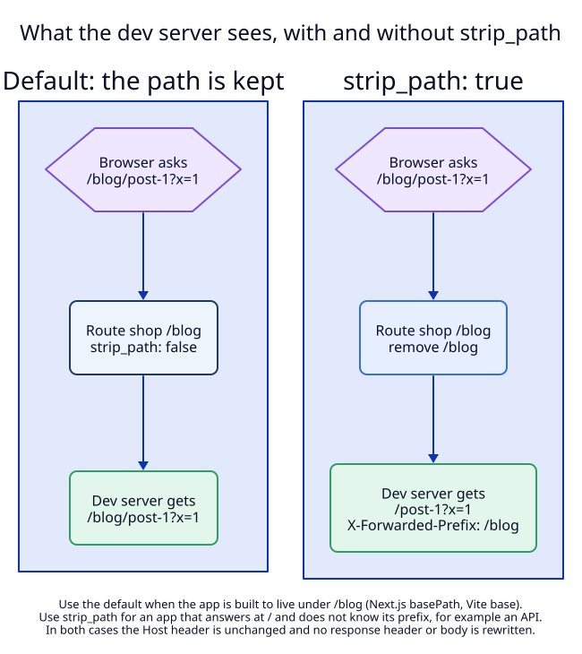
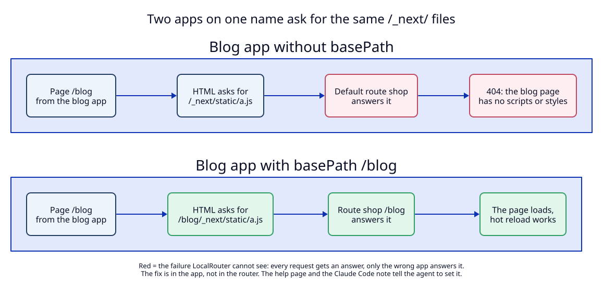

# 3. Forwarding: the path is kept unless `strip_path` is set

**Context.** Once a route is chosen, the proxy sends the request to the target
with the `Host` header unchanged and three `X-Forwarded-*` headers added
(`outgoing_request`, `libs/core/src/proxy.rs:189`). A path route adds one
question: does the dev server see `/blog/post-1` or `/post-1`?

## Decision

### Default: the path is kept

The request path and query reach the dev server byte for byte. This is right for
an app that is built to live under its path, which is how the production proxy
of such a site works too:

| Framework | Setting | What it changes |
|---|---|---|
| Next.js | `basePath: "/blog"` in `next.config` | pages, links, `/_next/` files and the hot reload socket all move under `/blog` |
| Vite | `base: "/admin/"` in `vite.config` | built file URLs, the dev client and the hot reload socket move under `/admin/` |
| Astro | `base: "/docs"` | the same for Astro pages and files |

The exact paths of each framework's hot reload socket under a base path are to
be checked in manual test M1, not assumed.

A base path moves only what the framework builds. A plain
`` in a Next.js app with `basePath: "/blog"` still asks for
`/logo.png`, which the default route answers. `next/link` and `next/image` add
the base path; a plain tag does not. This is the same in production, so the fix
is in the app. The help page says it in Step 6.

### The two patterns a production proxy uses

Production sites split by path in one of two ways. Both can be expressed with
path routes; they differ in what the app knows about its path.

| | Pattern A: base path | Pattern B: own pages, stripped file prefix |
|---|---|---|
| The app's pages | all under one prefix: `/blog/...` | at their normal paths: `/products/...`, `/brands/...` |
| The app's files | under the same prefix: `/blog/_next/...` | under a prefix only for files: `/shop-assets/_next/...` |
| App setting (Next.js) | `basePath: "/blog"` | `assetPrefix: "/shop-assets"` |
| What the proxy strips | nothing | the file prefix |
| LocalRouter routes | `shop/blog` | `shop/products`, `shop/brands`, and `shop/shop-assets` with `strip_path` |

Pattern B is why `strip_path` exists for web apps and not only for APIs: the
page HTML asks for `/shop-assets/_next/static/a.js`, the route strips
`/shop-assets`, and the app's dev server answers `/_next/static/a.js`. The
help page shows both patterns. Whether Next.js's dev server and its hot reload
socket follow `assetPrefix` the same way the production build does is checked
in M1, not assumed.

**Both settings change the production build.** `basePath`, `base` and
`assetPrefix` are not development settings. An agent that adds one to make a
path route work changes what the app's production deploy serves. So the texts
tell the agent to **ask the user first** (see
[04](04-clients-and-agent-texts.md)), and to prefer the pattern the production
proxy already uses.

### `strip_path: true`: the prefix is removed

For a dev server that answers at `/` and does not know its prefix, for example an
API server mounted at `/api`:

1. The route path is removed from the front of the request path:
   `/api/users?x=1` becomes `/users?x=1`, and `/api` becomes `/`.
2. The query string is kept.
3. `X-Forwarded-Prefix: /api` is set. A value sent by the client is removed
   first, so the dev server can trust it. FastAPI's `root_path`, Spring and
   others read this header to build correct links.
4. The `Host` header is still unchanged (invariant I12 of ADR 01).

### What is never rewritten

The proxy does not rewrite response headers or bodies, with or without
`strip_path`. That means:

- A `Location: /login` redirect from a stripped app sends the browser to
  `/login`, outside the app's prefix.
- A `Set-Cookie` with `Path=/` from any app is sent to all apps of the host,
  because they share one origin. This is the same as in production, and it is
  usually the reason to use one name.

Rewriting either would make the local setup differ from production in a way no
test in the app can see. So `strip_path` is recommended for three cases only:
servers that answer data (APIs), servers that read `X-Forwarded-Prefix`, and
file prefixes (pattern B above), which never redirect. For the pages of a web
app, use the base path in the app.

### The problem LocalRouter cannot fix: shared framework paths

Two Next.js apps without a base path both put their scripts at
`/_next/static/...`. On one name, those requests match no path route, so they
go to the default route. The main app answers 404 for the blog app's chunk
names, and the blog page renders without scripts and styles. No error names the
cause: every request got an answer, only from the wrong app. Vite apps have the
same problem with `/@vite/client` and `/src/...`.

A router cannot solve this, because the request for `/_next/static/a.js`
carries nothing that says which app's page asked for it. (The `Referer` header
could, but it is missing for some requests and not sent by every client, so a
guess from it would work most of the time and fail without a message the rest.)
The fix is in the app: a base path, as in the table above.

LocalRouter helps in three places:

1. **The request log names the route that answered.** HTTP log entries get a
   `route` field with the route key, for example `shop` or `shop/blog`.
   `localrouter logs shop` then shows `/_next/static/a.js 404 route shop`, which
   points at the cause.
2. **`localrouter which <url>` explains one URL** without a request: which
   route answers it and why (see [02](02-path-lookup.md), "Explaining a
   lookup"). `localrouter which https://shop.localhost/_next/static/a.js`
   prints `shop` (default route), which is the same cause seen before the page
   is opened.
3. **The texts that agents read say it.** The help page and the Claude Code
   note name the base path and file prefix settings when they describe path
   routes, and tell the agent to ask before it changes them (see
   [04](04-clients-and-agent-texts.md)).

A warning in the daemon itself (for example "a 404 from the default route for
`/_next/` while the host has path routes") is open point U6.

### WebSocket upgrades

Upgrades use the same lookup and the same path rule. A hot reload socket at
`/blog/_next/webpack-hmr` goes to the blog route; one at `/_next/webpack-hmr`
goes to the default route, which is the same failure as above and has the same
fix.

## Tests

- `T4`: path kept byte for byte; `strip_path` removes exactly the prefix, keeps
  the query, maps `/api` to `/`; `X-Forwarded-Prefix` set and a client value
  replaced; `Host` unchanged; WebSocket upgrade under a path route.
- `T5`: the log entry carries `route`.
- `M1`, `M2`: real Next.js and Vite apps, with and without a base path, and a
  Next.js app with `assetPrefix` behind a stripped file prefix (pattern B).

## As built: what manual tests M1 and M2 found

Run on 2026-09-26 with Next.js 16.3.5 (`next dev --webpack`; Turbopack refused
the test setup's symlinked `node_modules`, so Turbopack is not tested), three
small apps, and the new daemon on random ports. The planned text above is kept;
these results correct it.

| Planned | Found | Change made |
|---|---|---|
| Pattern B routes the file prefix with `strip_path` | `next dev` serves files both with and without the prefix, but its hot reload socket answers only at `/shop-assets/_next/hmr`, with the prefix. With `strip_path` the socket never opens. | Pattern B for `next dev` uses plain path routes, no strip. Help page Step 4b says so. `strip_path` stays for servers that answer at `/`. |
| Next.js hot reload socket at `/blog/_next/webpack-hmr` | Next.js 16 uses `/_next/hmr`, under the base path: `/blog/_next/hmr`. Through the daemon: `101`, route `shop/blog`. | None needed: the route matches any path under `/blog`. |
| Without a base path the page has no scripts or styles (404) | Every file answers `200` from the main app, because dev file names (`webpack.js`, `main-app.js`, `layout.css`) are the same in every Next.js app. The blog page gets the main app's CSS. | Help page Step 6 describes the real symptom. The log's `route shop` and `localrouter which` found the cause at once. |
| A plain `` is missing under a base path | The main app answered `/hello.txt` with `200` and its own file. | Help page Step 6 says "wrong or missing image". |
