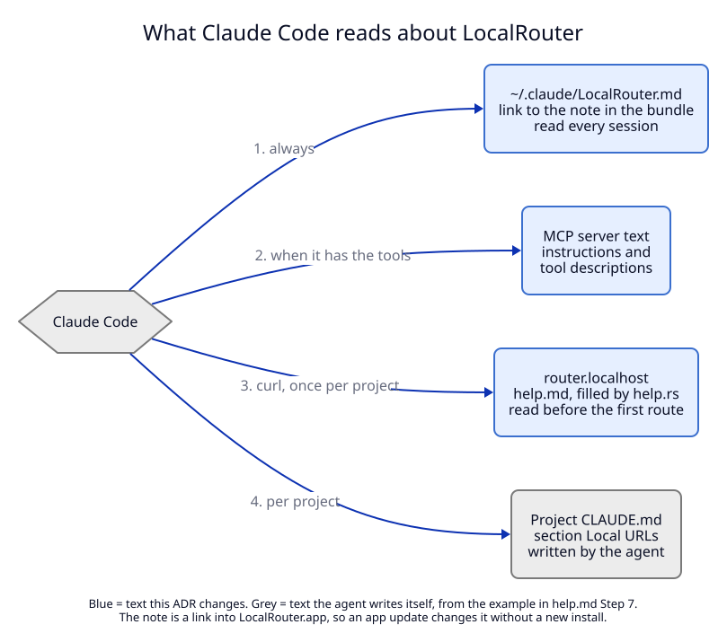

# 4. Clients and agent texts: socket API, MCP, CLI, app, Claude Code docs

**Context.** Path routes change the route shape, so every copy of that shape
changes with it: the Rust API types, the Swift copy, the MCP tool arguments, the
CLI flags, and the four texts that tell a coding agent how to use LocalRouter.
The project's rule "change the socket API in all places together" (see
`CLAUDE.md`, "Changing the socket API") applies in full.

## Decision

### Socket API: version 1.1, additive only

`API_VERSION` goes from `1.0` to `1.1` (`libs/core/src/api.rs:19`). Clients
compare only the major number, so no client refuses the new daemon. No method is
added; `METHODS` keeps its 11 entries.

| Type in `api.rs` | Change | Old client sends / reads | New daemon does | Works |
|---|---|---|---|---|
| `Route` (= `RegisterRouteParams`) | adds `path` (omitted when absent) and `strip_path` (omitted when false) | a route without `path` | registers or replaces the default route | ✓ |
| `HostParams` (used by `unregister_route`) | adds optional `path` | `{host}` | removes only the default route | ✓ |
| `RouteView` in `list_routes` | carries `path`; `urls` include the path | reads entries | may see two entries with the same `host` | see the app below |
| `LogEntry::Http` | adds optional `route`, the route key that answered | reads entries | sends `route` | ✓ (serde ignores it) |
| `ErrorCode` | no new code; path errors use `invalid_route` | | | ✓ |

New files in `api/examples/`, so that both contract tests
(`libs/core/tests/api_examples.rs`, `ApiContractTests.swift`) decode and
re-encode the new fields:

- `register_route_path.request.json` and `.reply.json`: `shop` + `/blog`,
  `strip_path: false`.
- `unregister_route_path.request.json`: `{host: "shop", path: "/blog"}`.
- `list_routes.reply.json` (changed): one route with a path and `strip_path`.
- `get_logs.reply.json` and `log.event.json` (changed): an entry with `route`.

The Swift round trip compares the JSON it encodes with the file, so a Swift type
that forgets `path` fails the test. That only holds while an example contains a
path. Invariant I30 makes the examples required.

### MCP server: still six tools, new arguments

The tool list does not change, so invariant I13 of ADR 01 ("exactly six tools")
still holds and `apps/cli/tests/mcp.rs` keeps its list.

| Tool | Change in `apps/cli/src/mcp.rs` |
|---|---|
| `register_route` | new arguments `path` ("Path prefix on this name, for example /blog. Requests for /blog and /blog/... go to this server; other paths go to the route without a path") and `strip_path` ("Remove the path before the request reaches the server; for servers that answer at /"). Description gains one sentence: "Give path to send only that part of the name to this server." |
| `unregister_route` | new optional argument `path`. Description: "Remove a route by name, and by path for a path route. Without path it removes only the route without a path." |
| `list_routes`, `get_logs` | no argument change; replies carry `path`, `strip_path` and `route` from the daemon |
| `find_free_port`, `status` | no change |

Two more changes in the same file:

1. **`INSTRUCTIONS` gains one paragraph:** "Several apps of one site can share a
   name. register_route with path "/blog" sends /blog and /blog/... to that
   server; the route without a path gets every other path. The app must serve
   under that path (Next.js basePath, Vite base), or set strip_path for a server
   that answers at /."
2. **Unknown arguments are refused.** `RegisterArgs`, `HostArgs`, `LogsArgs` and
   the others get `#[serde(deny_unknown_fields)]`. Today an unknown argument is
   dropped without a word. This matters for the next change of this kind, not for
   this one: an MCP server started before the update still drops `path` (see the
   manifest, blast radius, entry B2).

### Command line

| Command | Change in `apps/cli/src/main.rs` |
|---|---|
| `localrouter add` | `--path /blog` and `--strip-path`. `--strip-path` without `--path`, or `--path` with `--tcp`, is an error before any socket call. |
| `localrouter rm` | `--path /blog`. Without it, only the default route is removed; if the host still has path routes, the output says so: `removed shop; shop/blog and shop/admin remain`. |
| `localrouter list` | the name column shows `shop.localhost/blog`; `strip_path` shows as `strip` in the kind column. Rows of one host are printed together, default route first. |
| `localrouter logs` | a `route` column with the route key. |

**A path typed into the host.** `localrouter add shop/blog 3001` today fails with
the label hint `Try "shop-blog"` (`normalize_host`, `libs/core/src/routes.rs`).
That hint is wrong for someone who meant a path. When the `/` is inside the last
label, the message gains a second option: `Try "shop-blog", or host "shop" with
--path /blog`. The CLI does **not** accept `shop/blog` as a shortcut, because
`feat/login` is a valid branch name and would silently become host `feat` with
path `/login`.

### Menu bar app

Two places in the app assume one route per host. Both must change in the same
task as the daemon, or the app removes the wrong route (manifest, blast radius,
entry B1).

| Place | Today | After |
|---|---|---|
| `RouteView.id` and `Route.id` (`apps/menubar/Sources/LocalRouterKit/Api.swift:54`, `:107`) | `host` | `host + (path ?? "")`, the route key |
| Remove action (`apps/menubar/Sources/LocalRouter/AppModel.swift:140`) | `client.unregister(host: route.route.host)` | `client.unregister(route.route)`, which sends `host` and `path` |
| `HostParams` (`Api.swift:176`) | `host` | `host`, optional `path` |
| `Route` coding (`Api.swift`, hand-written `init(from:)` and `encode(to:)`) | no `path` | `path`, `strip_path` |
| Domains list | one row per host | path routes under their host, shown as `shop.localhost/blog` |
| Logs list | host, path, status | adds the route key |

The app has no form to add routes, so no input field is needed.

### Claude Code texts

Claude Code learns about LocalRouter from four texts. Three belong to this
repository and change; the fourth is written by the agent in each project, from
the example in the help page.

| # | Text | Where it lives | Read when |
|---|---|---|---|
| 1 | The Claude Code note | `scripts/LocalRouter.md`, copied into the bundle as `Contents/Resources/LocalRouter.md`, linked as `~/.claude/LocalRouter.md` | every session, through `@LocalRouter.md` in `~/.claude/CLAUDE.md` |
| 2 | The MCP server text | `INSTRUCTIONS` and the `#[tool(description = ...)]` strings in `apps/cli/src/mcp.rs` | every session that has the MCP tools |
| 3 | The help page | `libs/core/src/help.md`, filled by `libs/core/src/help.rs`, served at `router.localhost` | before the first route in a project |
| 4 | The project's "Local URLs (LocalRouter)" section | the project's `CLAUDE.md` or README | every session in that project |

Nothing changes in `~/.claude/CLAUDE.md` and nothing changes in the installer
(`ClaudeInstaller`): the note is a link into the bundle, so an app update brings
the new text without a new install.

**Text 1, `scripts/LocalRouter.md`.** It is short on purpose and points to the
help page. It changes in four lines:

1. The opening list gains a third item: "HTTP by path:
   `https://shop.localhost/blog` goes to one dev server and the rest of
   `shop.localhost` to another."
2. "When to use it" gains: "The project is one site made of several apps split
   by path (`/blog`, `/admin`): one name, one route per path."
3. "Names in short" gains: "Path routes: `localrouter add shop 3001 --path
   /blog`. The app must live under that path (Next.js `basePath`, Vite `base`),
   or use `--strip-path` for a server that answers at `/`."
4. "Adding a host that exists replaces it" becomes "Adding a host and path that
   exist replaces that route."

**Text 2, MCP.** As in the MCP section above.

**Text 3, `help.md`.** The long guide. It changes in seven places:

| Section | Change |
|---|---|
| Opening list | the same third item as in text 1 |
| Step 1, tool table | `localrouter add <host> <port> [--path /blog]` and `localrouter rm <host> [--path /blog]` |
| Step 2, choose names | new rule: "One site that is split by path in production (`/blog`, `/admin`): one host, one route per path. Separate sites: separate hosts." |
| New "Step 4b: several apps on one name" | the commands and MCP arguments; the match rule (`/blog` matches `/blog` and `/blog/...`, not `/blogger`); the default route; the framework table from [03](03-forwarding.md); when to use `strip_path`; the sentence "if register_route has no path argument, your MCP server is older than LocalRouter: restart the session or use the command line" |
| Step 5, branch or worktree | new item: "A branch of one path app: register `<branch>.<project>` with the same path and `owner_pid`. Other paths of the branch name use the project's routes." |
| Step 6, check | "A page under `/blog` without styles or scripts: the app asks for `/_next/...` or `/@vite/...` outside its path. `localrouter logs <host>` shows which route answered each request. Set the base path in the app." |
| Step 7, write it down | the example section gains `- https://shop.localhost/blog - blog app, port 3001 (Next.js basePath /blog)` and the matching `localrouter add` command |

`help.rs` renders `{{ROUTES}}`; path routes are listed as
`https://shop.localhost/blog → http://127.0.0.1:3001`, with `(strip)` when
`strip_path` is set.

**Repository texts for the next developer.** `docs/dictionary.md` gains the
words "path route", "default route", "route key", "path match" and
"`strip_path`", and "Host key" loses "unique across all routes". The project
`CLAUDE.md` gains one line under "Things that are easy to get wrong": "A route
is keyed by host plus path. Never remove or look up a route by host alone."

**Keeping the texts in step.** `CLAUDE.md` already asks to keep `help.md` in
step with the CLI and the MCP tools, and the note in step with `help.md`. That
rule is a sentence, not a check. Task 8 adds a small test that reads
`help.md`, `scripts/LocalRouter.md` and the MCP instructions and fails if any of
them lacks `--path` or `path`, or if `help.md` lacks `basePath`. It proves the
feature is mentioned, not that the wording is right; the wording is checked by
manual test M3 with a real agent.

## Tests

- `T8`: both contract tests over the new examples; Swift route id is the key;
  the Swift remove call sends `path`.
- `T9`: CLI flags, `rm` output, the label hint.
- `T10`: MCP schema lists `path` and `strip_path`; unknown arguments refused;
  still six tools.
- `T11`: help page lists path routes; the texts mention path routes.
- `M3`: a Claude Code session sets up a path route from the texts alone.
