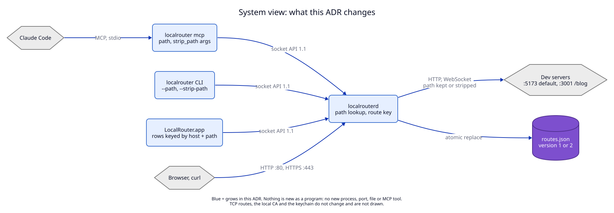
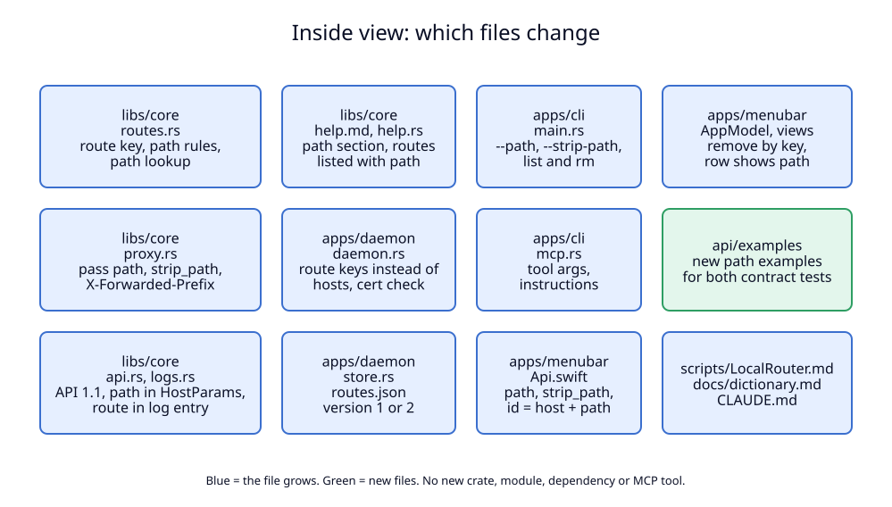

# 5. Components: where the change lives

This ADR adds no program, no process, no port, no file in the data folder and
no MCP tool. It grows existing modules. The two views below show which ones.

## System view

**Status:** As-built system from ADR 01, with the parts this ADR grows marked.

| Component | State | Note |
|---|---|---|
| `localrouterd` | grows | route key, path lookup, `serves` for TLS, strip and `X-Forwarded-Prefix`, `route` in the log |
| `localrouter` CLI | grows | `--path`, `--strip-path`, `rm` by key, `list` and `logs` columns, new `which` command |
| `localrouter mcp` | grows | `path` and `strip_path` arguments, instructions, unknown arguments refused |
| `LocalRouter.app` | grows | route id is the key, remove by key, path shown |
| `routes.json` | grows | version 2 when a saved route has a path |
| socket API | grows | 1.0 → 1.1, additive |
| TCP routes, local CA, keychain, updater | reused | unchanged, not drawn |

Every arrow between programs keeps its protocol. The only contract between the
clients and the daemon is still the socket API, and this ADR changes it only in
the four types listed in [04](04-clients-and-agent-texts.md).

## Inside view

**Status:** Proposed (not built).

| File | State | What changes |
|---|---|---|
| `libs/core/src/routes.rs` | grows | `Route.path`, `Route.strip_path`, `RouteKey`, path rules, `lookup(name, path, fallback)`, `explain(name, path, fallback)`, `serves(name, fallback)`, `owned_by` returns keys, new `RouteError` variants |
| `libs/core/src/proxy.rs` | grows | `RouteSource::lookup` takes the path; strip and `X-Forwarded-Prefix` in `outgoing_request`; 404 page lists path routes |
| `libs/core/src/api.rs` | grows | `API_VERSION = "1.1"`, `HostParams.path` |
| `libs/core/src/logs.rs` | grows | `LogEntry::Http.route` |
| `libs/core/src/help.md`, `help.rs` | grows | Step 4b and the other changes in [04](04-clients-and-agent-texts.md); routes listed with path |
| `apps/daemon/src/daemon.rs` | grows | every `get`, `insert`, `remove` by key; `unregister_route` by key; `remove_owned_by` by key; certificate hook uses `serves`; `view` builds URLs with the path |
| `apps/daemon/src/store.rs` | grows | `ROUTES_VERSION` 1 or 2 on write; both read |
| `apps/cli/src/main.rs` | grows | flags and output; `which` builds a `RouteTable` from `list_routes` and runs `explain` |
| `apps/cli/src/mcp.rs` | grows | arguments, descriptions, instructions, `deny_unknown_fields` |
| `apps/menubar/Sources/LocalRouterKit/Api.swift` | grows | `path`, `strip_path`, `id`, `HostParams.path`, log `route` |
| `apps/menubar/Sources/LocalRouterKit/DaemonClient.swift` | grows | `unregister(_ route:)` |
| `apps/menubar/Sources/LocalRouter/AppModel.swift`, `Views/` | grows | remove by key, rows show the path |
| `api/examples/` | new files | `register_route_path.*`, `unregister_route_path.request.json`; three files changed |
| `scripts/LocalRouter.md`, `docs/dictionary.md`, `CLAUDE.md` | grows | texts, see [04](04-clients-and-agent-texts.md) |

## What the views leave out

- The TLS module (`libs/core/src/tls.rs`) does not change. It already takes a
  hook (`AllowName`) that decides whether a name gets a certificate; only the
  daemon's hook body changes.
- `tcp.rs`, `tcp_listen.rs`, `listen.rs`, `pidwatch.rs`, the updater and the
  installers do not change.
- The inside view does not show calls between files. The new calls are from
  the daemon's certificate hook to `RouteTable::serves`, and from the CLI's
  `which` command to `RouteTable::explain`. The CLI already depends on
  `libs/core`, so no dependency is added.
