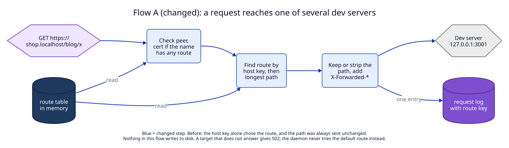
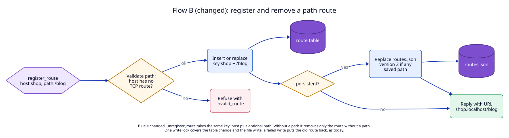
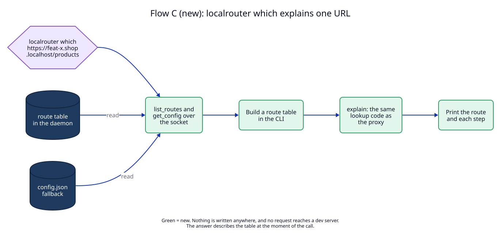

# 6. Data flow

These are the flows this ADR **will** change or add once built. Two flows
change, one is new, none is removed.

| Flow | new/changed/removed | Trigger | Writes | Reads |
|---|---|---|---|---|
| A. A request reaches a dev server | changed: the route was chosen by host key alone and the path was always sent unchanged | a browser or `curl` request on port 80 or 443 | request log entry, now with `route` | route table (by host key, then path) |
| B. Register and remove a route | changed: the table and `routes.json` were keyed by host | `register_route`, `unregister_route`, an owner process exits | route table; `routes.json` for persistent routes, version 1 or 2 | route table (key, TCP conflict) |
| C. Explain one URL | new | `localrouter which <url>` | nothing | route table through `list_routes`, `fallback` through `get_config` |

## Flow A: a request reaches one of several dev servers

Decided in [02](02-path-lookup.md) (lookup, certificate) and
[03](03-forwarding.md) (path, headers).

1. The TLS handshake asks `RouteTable::serves(name)`. Before, it asked for a
   route of the name. Now any HTTP route of the name, with or without a path, is
   enough.
2. The proxy reads the host key and the request path and calls
   `lookup(name, path, fallback)`. Before, the path was not an input.
3. `outgoing_request` keeps the path, or strips the route path and sets
   `X-Forwarded-Prefix`. Before, it always kept the path.
4. The request log entry gets `route`, the key of the route that answered.

Nothing in this flow writes to disk. The request log is the in-memory ring
buffer of ADR 01; one entry per request, as before.

## Flow B: register and remove a path route

Decided in [01](01-route-key.md).

1. `register_route` normalizes and checks the path, and checks that the host
   does not mix a TCP route with path routes.
2. It inserts or replaces the route under its key `(host, path)`. Before, the
   key was the host.
3. If the route is persistent, or it replaces a persistent route, the daemon
   writes all persistent routes to `routes.json` by atomic replace: temp file,
   `fsync`, rename. The file version is 2 if any saved route has a path or
   `strip_path`, else 1.
4. `unregister_route` removes exactly one key. Without `path` that is the
   default route.
5. When an owner process exits, `remove_owned_by` removes the keys that process
   owns. Before, it removed hosts, which after this ADR would remove every route
   of the host.

**What makes the write safe.** The whole of steps 2 and 3 runs under the
daemon's `write` lock (`apps/daemon/src/daemon.rs`, field `write`). If the file
write fails, the table change is undone before the lock is released, so memory
and disk stay equal (invariant I4 of ADR 01). This ADR does not change that
mechanism; it changes what the undo puts back: the old route of the same key,
not of the same host.

## Flow C: `localrouter which` explains one URL

Decided in [02](02-path-lookup.md) ("Explaining a lookup") and
[04](04-clients-and-agent-texts.md) (the command).

1. The CLI calls `list_routes` and `get_config` on the socket. Both methods
   exist today and only read.
2. It builds a `RouteTable` in its own memory from the routes in the reply.
3. It runs `RouteTable::explain` with the name, the path and `fallback`. This
   is the same code the daemon's proxy runs through `lookup` (invariant I33).
4. It prints the route and each step.

Nothing is written, in the daemon or on disk. `list_routes` also checks each
target with a 200 ms connection attempt (`upstream_up`); `which` does not need
it but pays for it. That costs at most 200 ms per call, which is fine for a
command a person types.
