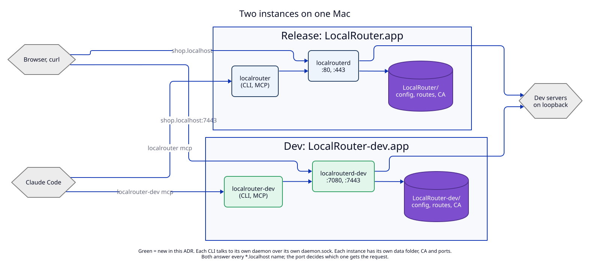
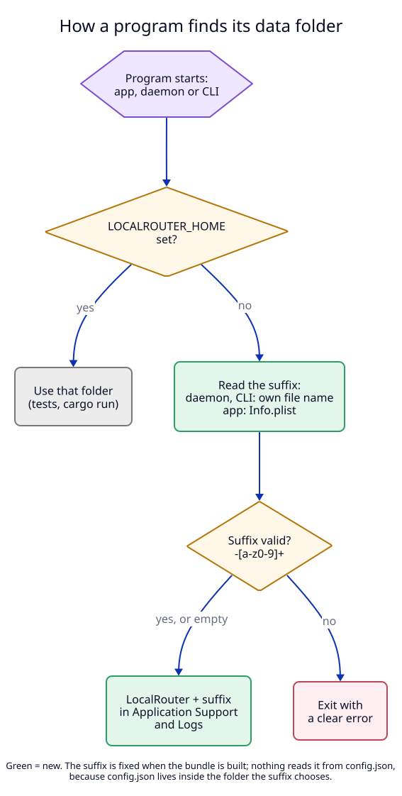

# 1. One suffix names the whole instance

## Context

The maintainer wants the release build and a development build of LocalRouter
running on one Mac at the same time. Both must answer `*.localhost` names.

Today that is not possible. Every part of the two builds has the same name:

| Shared today | Where | What goes wrong with two builds |
|---|---|---|
| Data folder `~/Library/Application Support/LocalRouter` | `libs/core/src/paths.rs:20-31`, `DaemonClient.swift:7-12` | The second daemon finds `daemon.lock` held and exits with "already running" (`apps/daemon/src/lock.rs:18-31`, `apps/daemon/src/main.rs:39-43`) |
| Socket `daemon.sock` in that folder | `paths.rs:40` | The dev app and CLI talk to the release daemon |
| `config.json` in that folder | `paths.rs:34` | One file, so the builds cannot have different ports |
| Bundle id `dev.localrouter.app`, LaunchAgent label `dev.localrouter.app.daemon` | `scripts/release-lib.sh:7-8` | macOS treats both as one app; one login item and one daemon registration |
| `~/.local/bin/localrouter`, `~/.claude/LocalRouter.md` | `CLIInstaller.swift`, `ClaudeInstaller.swift` | The last install wins; agents reach only one build |

An **instance** is one complete copy of LocalRouter: its app, daemon, CLI, data
folder, CA, ports and links. This ADR lets several instances live on one Mac.

## Decision

### The suffix

Each instance has a **suffix**: an empty string for the release, `-dev` for the
development build. Every name of the instance is the release name plus the
suffix.

| Part | Release (suffix `""`) | Dev (suffix `-dev`) |
|---|---|---|
| App bundle | `LocalRouter.app` | `LocalRouter-dev.app` |
| `CFBundleName` (Login Items, Activity Monitor) | `LocalRouter` | `LocalRouter-dev` |
| Bundle id | `dev.localrouter.app` | `dev.localrouter.app-dev` |
| LaunchAgent label | `dev.localrouter.app.daemon` | `dev.localrouter.app-dev.daemon` |
| Daemon in the bundle | `Contents/MacOS/localrouterd` | `Contents/MacOS/localrouterd-dev` |
| CLI in the bundle | `Contents/Helpers/localrouter` | `Contents/Helpers/localrouter-dev` |
| Data folder | `~/Library/Application Support/LocalRouter` | `~/Library/Application Support/LocalRouter-dev` |
| Logs folder | `~/Library/Logs/LocalRouter` | `~/Library/Logs/LocalRouter-dev` |
| CLI link | `~/.local/bin/localrouter` | `~/.local/bin/localrouter-dev` |
| Claude Code note link and import line | `~/.claude/LocalRouter.md`, `@LocalRouter.md` | `~/.claude/LocalRouter-dev.md`, `@LocalRouter-dev.md` |
| MCP server name | `localrouter` | `localrouter-dev` |
| CA common name | `LocalRouter CA <id>` | `LocalRouter-dev CA <id>` |
| Default ports | 80, 443 | 7080, 7443 (see [02](02-ports-and-settings.md)) |

With an empty suffix, every name is exactly today's name. A release user sees no
change (invariant I1 in the [manifest](07-semantic-change-manifest.md)).

**Rule for a suffix:** empty, or `-` followed by 1 to 15 characters from `a-z`
and `0-9`. Examples: `-dev`, `-test2`. Refused: `dev` (no dash), `-Dev`,
`-dev.1`, `-my_build`. The length limit keeps the socket path under the macOS
limit of 103 bytes (`paths.rs:9`).

### Where the suffix lives

The suffix **cannot** be a field in `config.json`:

1. A program starts and needs the suffix.
2. To read the suffix from `config.json`, it must know the folder.
3. The folder is chosen by the suffix. This is a loop.

So `scripts/build-app.sh --suffix -dev` fixes the suffix when it builds the
bundle, before signing. Each program reads it from its own bundle:

| Program | Reads the suffix from | Example |
|---|---|---|
| Daemon | its own file name, after resolving links | `localrouterd-dev` → `-dev` |
| CLI and MCP server | its own file name, after resolving links | `~/.local/bin/localrouter-dev` → `.../Helpers/localrouter-dev` → `-dev` |
| App | key `LRInstanceSuffix` in its `Info.plist` | `-dev` |

The Rust programs read their own file name, not the plist, for two reasons:

1. No plist parser is needed in Rust (no new dependency).
2. `ps`, Activity Monitor and `lsof` then show which daemon is which.

A program built by `cargo run` or `swift run` is named `localrouterd`,
`localrouter` or has no `Info.plist`, so its suffix is empty, as today.

**Precedence.** `LOCALROUTER_HOME` still wins over the suffix for the folder, so
tests and `cargo run` keep working unchanged (`paths.rs:3`). The suffix still
names the texts and the CLI. `localrouter status` prints the instance and the
data folder, so a user can see when `LOCALROUTER_HOME` is in effect.

**Consistency.** The app checks at start that the daemon and the CLI in its
bundle carry the same suffix as its `Info.plist`. A mismatch means a broken
build; the app shows an error instead of starting a daemon with other names.

### Two copies of one rule

The Rust type `Instance` (`libs/core/src/instance.rs`) and the Swift type
`Instance` (`LocalRouterKit/Instance.swift`) compute the same names. They are
two copies, like the socket API types. One table,
`api/instance-names.json`, lists suffixes and the expected names; a Rust
test and a Swift test both read it (I11).

## Tests

T1 (Rust `Instance` against the table, suffix rules), T2 (folders and
`LOCALROUTER_HOME` precedence), T9 (Swift `Instance` against the same table),
E1c (two daemons side by side). See the [test plan](08-test-plan.md).
