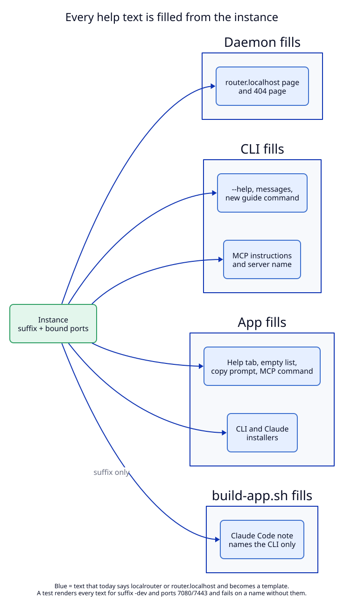

# 3. Every help text names its own instance

## Context

People and coding agents learn LocalRouter from texts. Today those texts say
`localrouter` and `http://router.localhost` as fixed strings. In a dev instance
an agent that follows them would register routes on the **release** instance,
and the user would not see them in the dev app.

These places name the CLI, the help URL, a folder or a URL example (counted on
2026-09-27):

| File | Mentions | Read by |
|---|---|---|
| `libs/core/src/help.md` | 30 | the `router.localhost` page; agents through `curl` |
| `apps/menubar/Sources/LocalRouterKit/CLIInstaller.swift` | 8 | "Install Command Line Tool…" |
| `scripts/LocalRouter.md` | 6 | the Claude Code note |
| `apps/cli/src/main.rs` | 5 | CLI `--help` and messages |
| `apps/menubar/Sources/LocalRouter/Views/HelpView.swift` | 5 | the Help tab |
| `apps/cli/src/mcp.rs` | 4 | MCP instructions, server name |
| `apps/menubar/Sources/LocalRouterKit/ClaudeInstaller.swift` | 3 | "Install Claude Code Instructions…" |
| `AgentHelp.swift`, `AppModel.swift`, `libs/core/src/proxy.rs` | 2 each | copy prompt, copy MCP command, the 404 page |
| `libs/core/src/help.rs`, `DomainsView.swift` | 1 each | help page header, "No routes yet" |

## Decision

### Texts become templates

Each text is filled from the instance and the bound ports:

| Placeholder | Release | Dev (ports 7080, 7443) |
|---|---|---|
| `{{CLI}}` | `localrouter` | `localrouter-dev` |
| `{{APP}}` | `LocalRouter` | `LocalRouter-dev` |
| `{{HELP_URL}}` | `http://router.localhost` | `http://router.localhost:7080` |
| `{{HTTPS_PORT}}` (after a host in a URL example) | empty | `:7443` |
| `{{HTTP_PORT}}` | empty | `:7080` |
| `{{NOTE}}` (Claude note name) | `LocalRouter.md` | `LocalRouter-dev.md` |

Who fills which text:

| Text | Filled by | When |
|---|---|---|
| `help.md` (the `router.localhost` page), the 404 page link | daemon, `help.rs` and `proxy.rs` | each request; bound ports known |
| CLI `--help`, messages, `status`, new `guide` command | CLI | each run; ports from the daemon's status |
| MCP instructions and server name | CLI (`mcp.rs`) | server start; names the CLI and the `guide` command, no port |
| Help tab, "No routes yet", copy prompt, copy MCP command | app | on screen; ports from status |
| Claude Code note in the bundle | `build-app.sh` | build time; suffix only, no port |

The 404 page links to `router.localhost` on the port the request came in on,
not always port 80.

### The Claude Code note names only the CLI

The note is a fixed file in the bundle, linked into `~/.claude`. The ports can
change after the build. So the note does not contain a port. It tells the agent
to run `{{CLI}} guide`, a new read-only CLI command that prints the full help
page with the real ports and routes. `guide` renders `help.md` inside the CLI
with `help::render` from `libs/core`; it uses the existing `status` and
`list_routes` socket methods. No new socket method and no new MCP tool (the MCP
server keeps its six tools; `apps/cli/tests/mcp.rs`).

The release note also switches from `curl -s http://router.localhost` to
`localrouter guide`, because a release user can change the ports too.

The CLI may not be installed: "Install Command Line Tool…" is a separate
button. So the note keeps a fallback line with the instance's **default** help
URL (gap G5 in the working-backwards file):

> If `{{CLI}}` is not found, run `curl -s {{DEFAULT_HELP_URL}}`. If that fails
> too, ask the user to choose **Install Command Line Tool…** in the
> {{APP}} menu.

`{{DEFAULT_HELP_URL}}` is `http://router.localhost` for the release and
`http://router.localhost:7080` for `-dev`. It is right unless the user changed
the ports, and then the CLI is the way.

### A suffixed note says when to use it

When both notes are imported into `~/.claude/CLAUDE.md`, an agent reads two
nearly equal texts. Without a rule it takes the first one it reads. So the note
of a suffixed instance starts with:

> This is **LocalRouter-dev**, a development build of LocalRouter. Use
> `localrouter-dev` only when the user asks for the dev build or names a
> `:7443`-style URL. For everything else use `localrouter`.

The MCP instructions of a suffixed instance carry the same sentence. This came
from the working-backwards file (gap G1).

### A test that finds forgotten places

Two tests keep the rule from rotting:

1. **Render test (T5).** Render every text for suffix `-dev` and ports 7080 and
   7443. Fail if the result contains `localrouter` not followed by `-dev`,
   `router.localhost` not followed by `:7080`, or an `https://…localhost` URL
   example without `:7443`.
2. **Source scan (T6, grows by itself).** Scan the string literals of
   `apps/cli/src`, `libs/core/src` and `apps/menubar/Sources` for the fixed
   words `localrouter `, `router.localhost` and `LocalRouter.md`. Fail unless
   the line is on a short allow list (for example the crate name in `Cargo.toml`
   or a doc comment). A new text with a fixed name fails this test without
   anyone adding a case for it.

## Tests

T5, T6, T7 (`guide`, `status`, `--help` of a binary named `localrouter-dev`),
T8 (MCP server name and instructions), M3 (a Claude Code session with both
notes). See the [test plan](08-test-plan.md).
