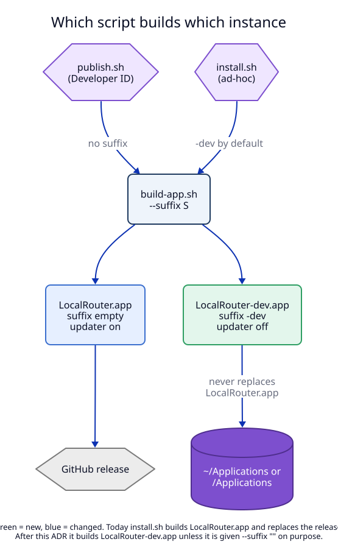

# 4. Build, install, update and uninstall per instance

## Context

Today `scripts/install.sh` builds `LocalRouter.app`, quits the app with bundle
id `dev.localrouter.app`, deletes the installed app and copies the new one in
its place (`scripts/install.sh:24-27`). A local build therefore **replaces**
the release. That is the opposite of what the maintainer wants.

## Decision

### build-app.sh

`scripts/build-app.sh` gets `--suffix <S>` (default: empty). It:

1. Checks the suffix rule from [01](01-instance-suffix.md) and stops with an
   error on a bad suffix.
2. Names the bundle `LocalRouter<S>.app`, the daemon `localrouterd<S>`, the CLI
   `localrouter<S>`.
3. Renders `Info.plist.in` with bundle id `dev.localrouter.app<S>`,
   `CFBundleName` `LocalRouter<S>` and key `LRInstanceSuffix` `<S>`.
4. Renders `daemon.plist.in` with label `dev.localrouter.app<S>.daemon` and
   `BundleProgram` `Contents/MacOS/localrouterd<S>`.
5. Renders `scripts/LocalRouter.md` (now a template) into
   `Contents/Resources/LocalRouter.md` with the CLI and app names.
6. Signs the nested programs with identifiers `dev.localrouter.app<S>.daemon`
   and `.cli`.

The facts live in `scripts/release-lib.sh` as functions of the suffix
(`lr_bundle_id`, `lr_daemon_label`, `lr_app_name`), so the three scripts cannot
disagree.

### install.sh builds the dev instance by default

`scripts/install.sh` gets `--suffix <S>` with default **`-dev`**. It quits,
replaces and restarts only the instance it builds. `LocalRouter.app` is touched
only when the user passes `--suffix ""` on purpose (I6).

Changed behaviour for the maintainer: after this ADR, `scripts/install.sh`
installs `LocalRouter-dev.app` next to the release. An ad-hoc `LocalRouter.app`
that an older `install.sh` put in place of the release stays where it is. The
maintainer replaces it once with a release from GitHub.

### publish.sh refuses a suffix

`scripts/publish.sh` builds with an empty suffix only and stops if a suffix is
given (I7). A release is always the unsuffixed instance.

### The updater is off in a suffixed instance

The updater today refuses ad-hoc builds because they have no Team ID
(`BuildKind.swift`, `Updater.swift:198-213`). A suffixed instance could still be
signed with a Developer ID by hand. Its updater would then download the release
DMG and replace `LocalRouter-dev.app` with a release build, which has no
suffix. So the updater also refuses to run when the suffix is not empty (I5).
Settings shows "Updates are off in LocalRouter-dev" instead of the update
switch.

### Install buttons

The maintainer decided: the dev app keeps both install buttons.

| Button | Release | Dev |
|---|---|---|
| Install Command Line Tool… | `~/.local/bin/localrouter` | `~/.local/bin/localrouter-dev` |
| Install Claude Code Instructions… | `~/.claude/LocalRouter.md`, line `@LocalRouter.md` | `~/.claude/LocalRouter-dev.md`, line `@LocalRouter-dev.md` |
| "Copy MCP Command" | `claude mcp add localrouter -- ~/.local/bin/localrouter mcp` | `claude mcp add localrouter-dev -- ~/.local/bin/localrouter-dev mcp` |

Each installer replaces only a link with its own name that points into a bundle
of its own instance. Today the rule is "a link into any LocalRouter bundle"
(`CLIInstaller.swift`, `ClaudeInstaller.isOurNote`). With instances, that rule
would let the dev app take over the release's link, so it becomes "a link with
this instance's name" (I2).

### Uninstall removes one instance

"Uninstall LocalRouter…" in the dev app:

1. untrusts the dev CA (by its own common name `LocalRouter-dev CA <id>`),
2. unregisters `dev.localrouter.app-dev.daemon`,
3. deletes `~/Library/Application Support/LocalRouter-dev` and
   `~/Library/Logs/LocalRouter-dev`,
4. removes `~/.local/bin/localrouter-dev` and `~/.claude/LocalRouter-dev.md` if
   they are its links.

It never touches the release's folders, links, CA or LaunchAgent (I10). The
line `@LocalRouter-dev.md` stays in `CLAUDE.md`, as today for the release: it is
the user's file, and an import of a missing file does no harm.

### Open at login

`SMAppService.mainApp` registers the running bundle, so each instance has its
own login item and its own "Open at login" switch. No change is needed.

## Tests

T10 (installers by instance), T11 (updater gate), M1 (install next to the
release), M5 (uninstall the dev instance, release keeps working), M6 (release
smoke test). See the [test plan](08-test-plan.md).
