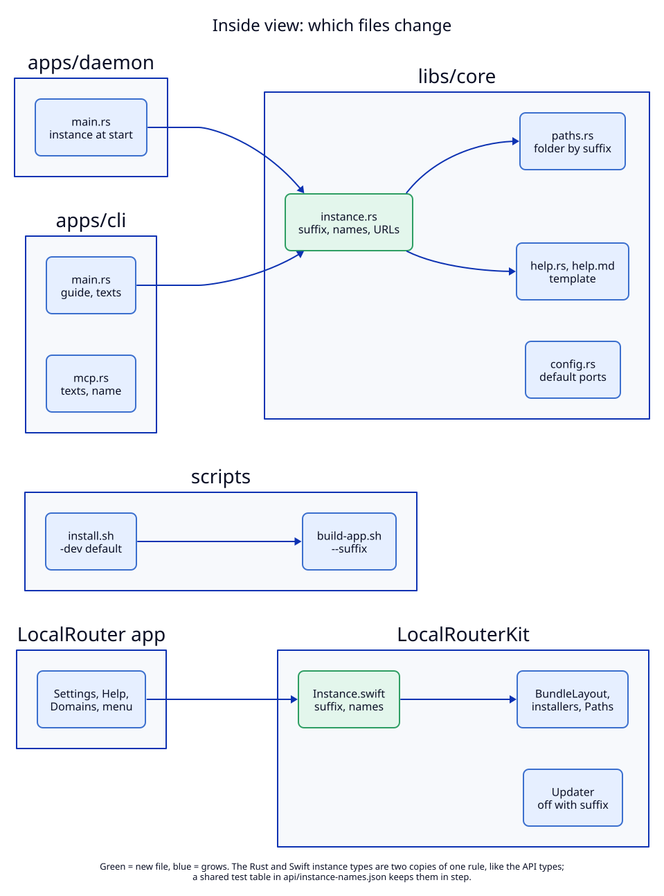

# 5. Components: where the change lives

## System view

**Status:** Proposed (not built). The release half is as-built; the dev half is
what this ADR adds.

The system view is the diagram in [01](01-instance-suffix.md):

| Component | State | Note |
|---|---|---|
| Release `LocalRouter.app` (app, `localrouterd`, `localrouter`) | reused | same names, same behaviour; texts become templates filled with the release names |
| Dev `LocalRouter-dev.app` (app, `localrouterd-dev`, `localrouter-dev`) | new | the same code, built with `--suffix -dev` |
| Data folder `LocalRouter-dev` (config, routes, CA, socket, lock) | new | created by the dev daemon at first start |
| Dev servers on loopback | reused | both daemons may forward to the same dev server |
| Browser, Claude Code | reused | reach the dev instance by port (browser) or by CLI name (agent) |

Protocols between the parts do not change: MCP over stdio, the JSON-lines
socket API, HTTP and HTTPS. The socket API version does not change: no method
and no field is added (`guide` uses `status` and `list_routes`). `set_config`
changes behaviour (reads the file first) but not its shape.

## Inside view

**Status:** Proposed (not built).

| Component | State | Note |
|---|---|---|
| `libs/core/src/instance.rs` | new | suffix rule; every name; URL and help URL with port |
| `libs/core/src/paths.rs` | grows | folder from the instance; `LOCALROUTER_HOME` still wins |
| `libs/core/src/config.rs` | grows | default ports by instance |
| `libs/core/src/help.rs`, `help.md` | grows | template placeholders |
| `libs/core/src/proxy.rs` | grows | 404 link on the request's port |
| `libs/core/src/tls.rs` | grows | CA common name with the app name |
| `apps/daemon/src/main.rs`, `daemon.rs` | grows | instance at start; `set_config` reads the file first |
| `apps/cli/src/main.rs` | grows | instance from own name; `guide`; texts; `status` prints instance and folder |
| `apps/cli/src/mcp.rs` | grows | server name and instructions from the instance |
| `LocalRouterKit/Instance.swift` | new | the Swift copy of the names |
| `BundleLayout`, `CLIInstaller`, `ClaudeInstaller`, `AgentHelp`, `DaemonClient.Paths` | grows | names from the instance |
| `Updater` | grows | off with a suffix |
| App views (`SettingsView`, `HelpView`, `DomainsView`, `MainView` header, `StatusItemController`) | grows | Daemon section rule, names |
| `scripts/build-app.sh`, `install.sh`, `publish.sh`, `release-lib.sh`, `Info.plist.in`, `daemon.plist.in`, `LocalRouter.md` | grows | suffix option and templates |
| `api/instance-names.json` | new | the shared table of suffix → names |

## What this view leaves out

- The proxy, TCP forwarding, route validation and the request log. They do not
  change: an instance is a whole copy, and inside one instance everything works
  as today.
- The keychain. Each CA is added to the login keychain as today; two CAs with
  different common names live there side by side.
