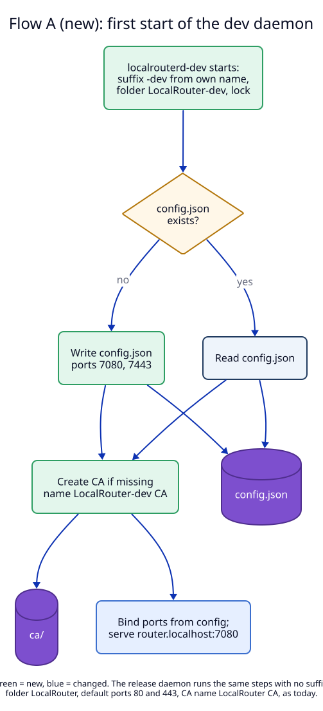
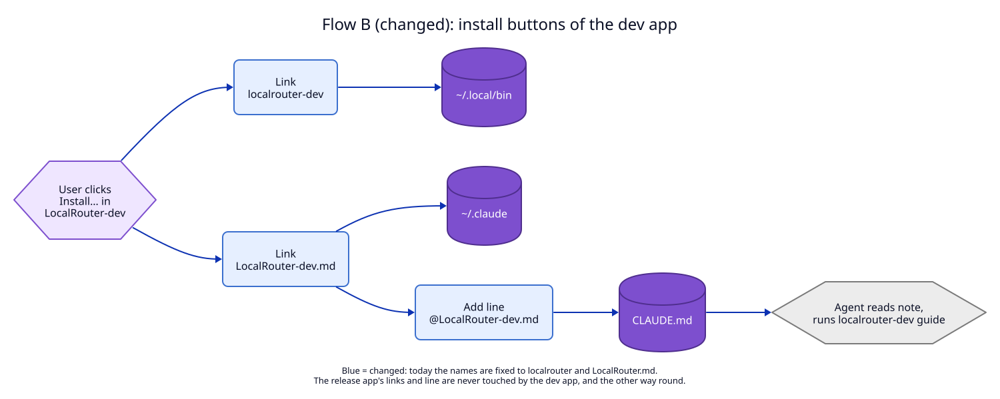
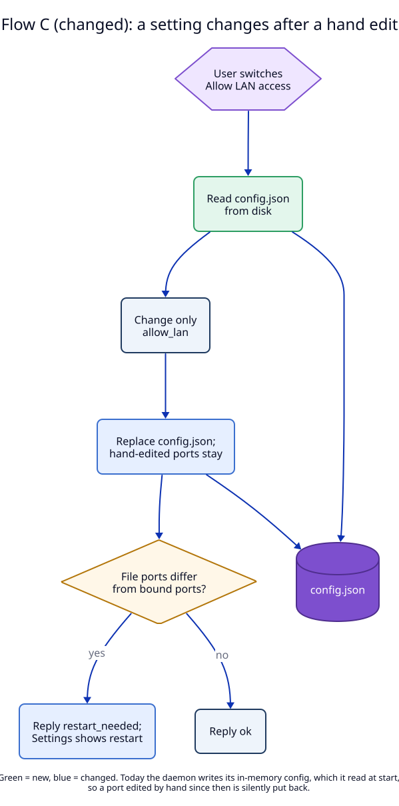

# 6. Data flow

The flows this proposed ADR will create or change. Flows that stay the same
inside one instance (a request through the proxy, register and remove a route,
the request log) are not drawn.

| Flow | new/changed/removed | Trigger | Writes | Reads |
|---|---|---|---|---|
| A. First start of a suffixed daemon | new | the LaunchAgent starts `localrouterd-dev` | `LocalRouter-dev/config.json` (ports 7080, 7443), `LocalRouter-dev/ca/` | own file name |
| B. Install buttons | changed: the names were fixed, now they come from the instance | the user clicks Install… | `~/.local/bin/localrouter<S>`, `~/.claude/LocalRouter<S>.md`, one line in `~/.claude/CLAUDE.md` | `Info.plist` |
| C. `set_config` | changed: it started from memory, now it starts from the file | a Settings switch | `config.json` | `config.json` |
| D. Help texts | changed: fixed words, now filled from the instance | a page request, a CLI run, a screen | nothing | instance, bound ports |

## A. First start of a suffixed daemon

Decided in [01](01-instance-suffix.md) and [02](02-ports-and-settings.md).

Write path to its end:

1. The daemon takes `daemon.lock` in its own folder before it writes anything,
   as today (`apps/daemon/src/main.rs:39`). Two daemons of one instance cannot
   both write.
2. `config.json` is written only when it is missing, by the same atomic replace
   as today (`store.rs`). A crash between the check and the write leaves either
   no file (the next start writes it) or a whole file.
3. The CA is created in `ca.tmp-<pid>/` and renamed to `ca/`, as today
   (`tls.rs:103-139`). Only its common name changes.

## B. Install buttons

Decided in [04](04-build-install-update.md).

The note link is made before the import line is added, as today
(`ClaudeInstaller.install`): an import of a missing file would fail in every
Claude Code session. Each step writes one file or link; there is no transaction
across them, as today.

## C. set_config after a hand edit

Decided in [02](02-ports-and-settings.md).

The read, the change and the write happen under the daemon's `write` lock
(`daemon.rs:566`), so two socket calls cannot interleave. A hand edit that
lands between the read and the write is lost; the window is a few
milliseconds, and the risk is listed in the
[manifest](07-semantic-change-manifest.md).

## D. Help texts

Decided in [03](03-texts.md). The diagram is in [03](03-texts.md):
[03-texts.svg](diagrams/03-texts.svg). Nothing is written; every text is
rendered when it is read.
