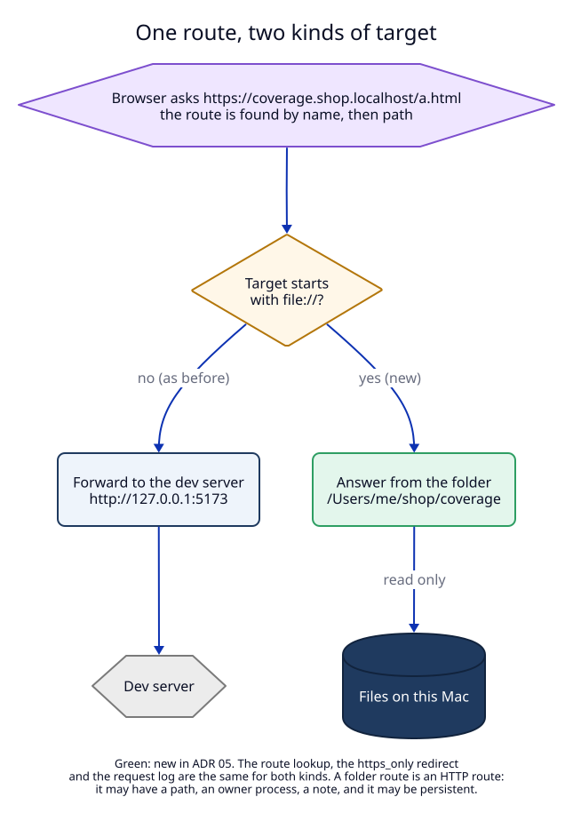

# 1. A folder is a new kind of target

## Context

A coding agent often makes something the user should look at in a browser: a
page of HTML, a built site in `dist/`, a test coverage report. Before this ADR,
LocalRouter could only give a name to a running server. The agent had to start
one (`python3 -m http.server`, `npx serve`) on a free port, register the port,
and remember to stop the server later. That is three steps and one extra
process for "open this file".

## Decision

A route's `target` may be `file://` plus the absolute path of a folder:
`file:///Users/me/shop/coverage`. Such a route is a **folder route**. It is an
ordinary HTTP route in every other way: it has a host, it may have a path, an
`owner_pid`, a note, `https_only`, and it may be persistent. Only the proxy
treats it differently (see [2](02-serving-files.md)).

Why a target form and not a new field (for example `folder: "/Users/me/x"`):

| Option | Route shape | `routes.json` | Swift types | Older daemon |
|---|---|---|---|---|
| **`file://` target (chosen)** | unchanged | unchanged, version 1 or 2 as before | unchanged | skips only that route, with a message; its next write to `routes.json` drops that route (see the [manifest](06-semantic-change-manifest.md#11-blast-radius)) |
| new `folder` field, empty target | new field, `target` sometimes empty | needs version 3 | new field | moves the whole file aside: every persistent route is gone |

The path after `file://` is written as is, without percent-encoding:
`file:///Users/me/my site` is valid. Clients rarely write it by hand: the CLI
and MCP take a plain path and build the target (see [3](03-clients-and-texts.md)).

### Rules for the folder (checked without the disk)

`normalize_folder_target` (`libs/core/src/routes.rs:337`) runs inside
`RouteTable::validate` (`routes.rs:464`):

| Given | Result |
|---|---|
| `file:///Users/me/site/` | `file:///Users/me/site` (trailing `/` removed) |
| `file:///Users/me//my site` | `file:///Users/me/my site` |
| `file:///Users/./me` | `file:///Users/me` (Rust's `Path::components` drops `.`) |
| `file://site` | refused: use an absolute path |
| `file:///Users/me/../x` | refused: no `..` parts |
| `file:///` | refused: the whole disk cannot be served |
| a path with NUL, CR or LF | refused: control character |
| `protocol: "tcp"` with `file://` | refused: `FolderOnlyForHttp` |

`routes.rs` stays free of I/O. Whether the folder exists is the daemon's check
(see [3](03-clients-and-texts.md)).

## Tests

`routes.rs` unit tests `folder_targets_are_normalized`,
`bad_folder_targets_are_refused_with_the_rule`,
`folder_routes_are_http_routes_and_may_have_a_path` and
`bad_target_message_names_the_folder_form` (test plan T1).
