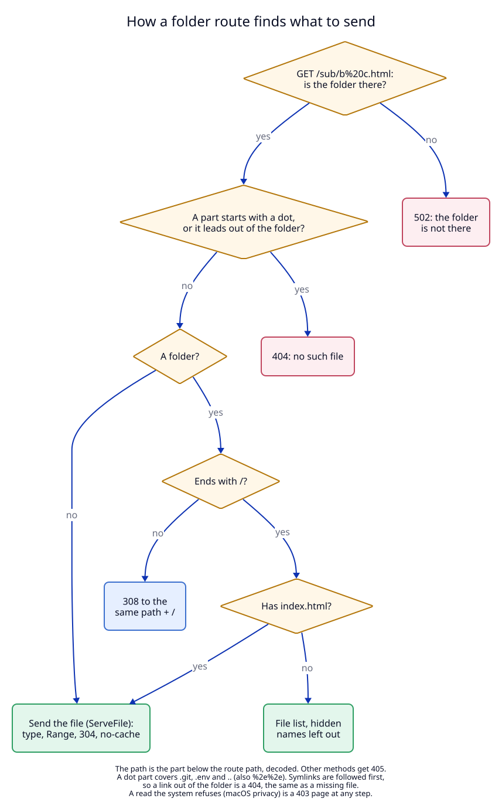

# 2. The daemon serves the folder itself

## Context

The proxy (`libs/core/src/proxy.rs`) forwards every request to a TCP address.
A folder route has no address, so the proxy needs a second answer path. It must
be safe, because the daemon runs as the user and can read every file the user
can read. A request for `/../../.ssh/id_ed25519` must never return that file.

## Decision

The proxy branches after the route lookup and after the `https_only` redirect
(`proxy.rs:114`): a folder route goes to `folder::serve`
(`libs/core/src/folder.rs:124`), every other route is forwarded as before.

The work is split in two:

1. **LocalRouter's own code decides which file.** `folder::resolve`
   (`folder.rs:75`) runs on a blocking thread and returns one of six answers.
   It reads the disk but never writes.
2. **tower-http's `ServeFile` sends that one file.** It adds the content type
   (from the file extension), `Last-Modified`, `Range` (206), `If-Modified-Since`
   (304) and `HEAD`. It never sees the request path, so its own path handling
   does not matter here.

Why not tower-http's `ServeDir` for everything: `ServeDir` blocks `..`, but it
follows a symlink that leads out of the folder and it serves `.git/` and
`.env`. It also has no file list. Doing the path checks ourselves and giving
`ServeFile` only a checked file keeps the safety rules in one short function
with its own tests.

### The answers

| Request | Answer |
|---|---|
| a file in the folder | the file; `Cache-Control: no-cache`; `; charset=utf-8` added to `text/*` and `application/javascript` without a charset |
| a folder, path ends with `/` | its `index.html`, or a list of its files, folders first |
| a folder, path without `/` | `308` to the same path plus `/` and the query, so relative links in the page work |
| a part that starts with `.` after percent-decoding (`.git`, `.env`, `..`, `%2e%2e`) | `404` |
| a real path (after symlinks) outside the folder, or with a hidden part below it | `404`, the same as a missing file |
| the system refuses to read (for example macOS privacy) | `403` page with the error and a hint about System Settings |
| the folder itself is missing or not a folder | `502` page with the folder and the route's note |
| a method other than GET or HEAD | `405`, `Allow: GET, HEAD` |

The file list leaves out hidden names and links that lead out of the folder,
so it never shows a link that answers 404.

**A folder path route maps its path to the folder root.** On `shop` + `/docs`,
`/docs/a.html` is `a.html` in the folder. `strip_path` makes no difference for
a folder route: the path is always removed.

**`no-cache`, not `no-store`.** The browser keeps the file but asks every time;
the answer is `304` while the file is unchanged. A reload after an edit always
shows the new file. There is no live reload.

### A change to the proxy's body type

The proxy's response body type was `BoxBody<Bytes, hyper::Error>`. The body
`ServeFile` returns fails with `io::Error` and is `Send` but not `Sync`. The
type is now `UnsyncBoxBody<Bytes, Box<dyn Error + Send + Sync>>`
(`proxy.rs:34`). hyper's server needs only `Send`. Forwarded bodies map their
error with `Into`; nothing else changes for them.

## Tests

`folder.rs` unit tests (T2) and five `libs/core/tests/proxy.rs` tests through
the real proxy (T3). See the [test plan](07-test-plan.md).
