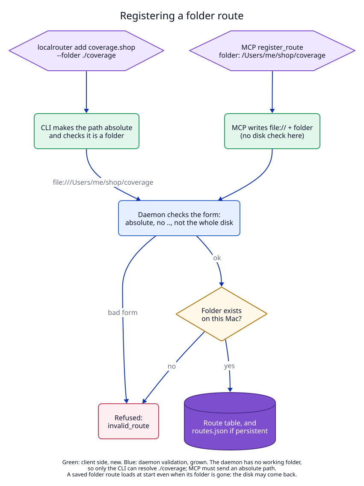

# 3. Clients, the daemon check and the agent texts

## Context

The daemon is a LaunchAgent. It has no useful working folder, so it cannot
resolve `./coverage`. The client that knows the user's folder must make the
path absolute. And a typo in the folder should fail when the route is
registered, not later as a 502 in the browser.

## Decision

| Part | Change | Where |
|---|---|---|
| CLI | `localrouter add <host> --folder <dir>`. The CLI calls `canonicalize` (absolute, symlinks resolved), refuses a file or a missing path, and sends `file://` plus the result. `--folder` conflicts with a port, `--target`, `--tcp` and `--listen`. | `apps/cli/src/main.rs:338` |
| MCP | `register_route` gets a `folder` argument. The MCP server writes `file://` plus the text as given; it does not touch the disk. `folder` with `target` or `port` is refused. `target` with `port` still works as before (target wins). Still six tools. | `apps/cli/src/mcp.rs:77` |
| Daemon, register | After the form check, `std::fs::metadata` must say "folder". Else `invalid_route`: "cannot open folder …" or "… is not a folder". When the system refuses (macOS privacy), the message adds: use a folder outside Desktop, Documents, Downloads and iCloud Drive, or allow the app in System Settings. | `apps/daemon/src/daemon.rs:434` |
| Daemon, start | A saved folder route loads even when its folder is missing. The disk may be unmounted; the route answers 502 until it comes back. | unchanged load path, `daemon.rs:140` |
| Daemon, `list_routes` | `upstream_up` for a folder route is "the folder exists", not a TCP connect. | `daemon.rs:551` |
| Socket API | Version 1.1 becomes 1.2 (Rust `API_VERSION`, Swift `apiVersion`). No new method or field. New example pair `api/examples/register_route_folder.*`. | `libs/core/src/api.rs:19` |
| Agent texts | `help.md`: a bullet in the intro, the tool table, a "Files with no server" part in Step 4, the 502 line in Step 6. `note.md`: the intro, a "when to use" bullet, the command. `mcp.md`: one sentence. | `libs/core/src/*.md` |
| Docs | `docs/dictionary.md`: "Folder route", and `target` and "upstream up" updated. `CLAUDE.md`: `folder.rs` in the architecture list. | |
| Menu bar app | Only the version string. It shows `→ file:///…` like any target. | `Api.swift:8` |

**Why the MCP server does not check the folder.** The MCP server runs in the
agent's session, and its working folder is not a reliable base. Sending the
text as given makes the daemon the one place that decides. A relative path
fails there with "use an absolute path", which the agent can fix.

**Why 1.2 and not 2.0.** A client that knows 1.1 decodes a folder route
without change: the target is still a string. Only a client that parses the
target as an address would break, and no client does (the CLI's `which` and
list, and the Swift app, print it).

## Tests

T4 (daemon), T5 (CLI), T6 (MCP), T7 (agent texts), T8 (contract), E1
(relative path from the CLI to a real request). See the
[test plan](07-test-plan.md).
