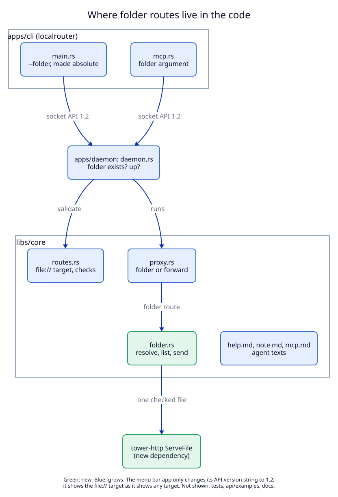

# 4. Components: where the change lives

**Status:** As-built.

No new program, process, port, socket method, MCP tool or data-folder file.
The deployables are the same three (CLI, daemon, menu bar app), so this file
shows only the inside view.

| Component | State | Note |
|---|---|---|
| `libs/core/src/folder.rs` | new | `resolve` (the path rules), `serve` (the answers), `serve_file` (ServeFile plus headers), `listing` |
| `tower-http` 0.6, feature `fs` | new dependency | only `ServeFile`; it was already in `Cargo.lock` through `rmcp`. Brings `http-range-header`, `mime_guess`, `httpdate` |
| `percent-encoding` 2 | new direct dependency | already in `Cargo.lock`; decodes request paths, encodes list links |
| `libs/core/src/routes.rs` | grows | `FOLDER_SCHEME`, `Route::folder`, `normalize_folder_target`, two error variants, the branch in `validate` |
| `libs/core/src/proxy.rs` | grows | the folder branch; `Body` becomes `UnsyncBoxBody`; `page` and `escape` become `pub(crate)` |
| `apps/daemon/src/daemon.rs` | grows | folder check in `register_route`, folder case in the `list_routes` up check |
| `apps/cli/src/main.rs`, `mcp.rs` | grow | `--folder`, `folder` argument |
| `libs/core/src/help.md`, `note.md`, `mcp.md` | grow | how and when to use a folder route |
| `libs/core/src/api.rs`, `Api.swift` | grow | version 1.2 |
| menu bar app views | reused | no change |

**Left out of the view:** tests, `api/examples`, `docs/dictionary.md`,
`CLAUDE.md`. The TLS certificate path is unchanged: a folder route is an HTTP
route, so `RouteTable::serves` already gives its name a certificate.
