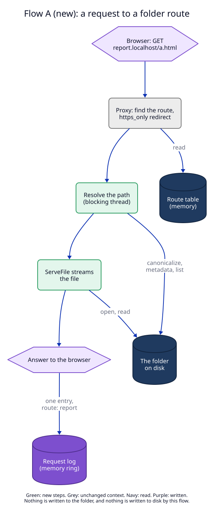
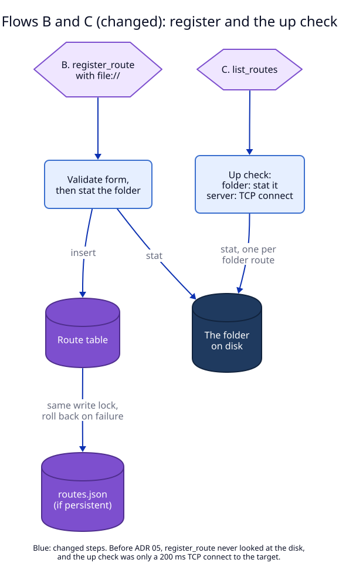

# 5. Data flow

The flows this ADR adds or changes, as built.

| Flow | new/changed/removed | Trigger | Writes | Reads |
|---|---|---|---|---|
| A. Request to a folder route | new | a browser or `curl` request whose route has a `file://` target | request log entry (memory), as for every request | route table, the folder on disk |
| B. `register_route` with a folder | changed: before, the daemon never read the disk when registering | CLI `add --folder`, MCP `register_route` with `folder`, any socket client | route table; `routes.json` when persistent (unchanged path) | the folder's metadata |
| C. `list_routes` up check | changed: before, always a 200 ms TCP connect to the target | `list_routes` (CLI `list`, MCP, the app every few seconds) | nothing | the folder's metadata, one per folder route |

Unchanged flows that a folder route still uses: the route lookup, the
`https_only` redirect, TLS by SNI, `owner_pid` removal, and loading
`routes.json` at start.

## A. A request to a folder route

Decided in [2](02-serving-files.md).

The flow writes no file. The only write is the in-memory request log entry,
with `route` set to the folder route's key, as for a forwarded request. The
path checks run on tokio's blocking pool (`spawn_blocking`); the file body is
streamed by `ServeFile` in chunks, so a large file is not read into memory at
once.

## B and C. Register and the up check

Decided in [3](03-clients-and-texts.md).

**B, to the end of the write.** `register_route` takes the daemon's `write`
lock, validates the form, reads the folder's metadata, then inserts into the
route table. When the route is persistent, `store::save_routes` replaces
`routes.json` (temp file, fsync, rename). If that write fails, the table is
rolled back to the old route, as for every route (ADR 01, I4). A folder route
alone does not raise the file version: `save_routes` writes version 2 only for
`path` or `strip_path`.

**C.** The check that the folder exists runs in the same spawned task that
would do the TCP connect, so all routes are still checked at the same time.
