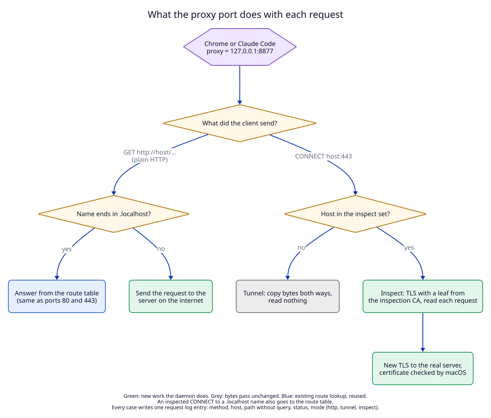

# 1. The proxy port: a forward proxy on loopback

**Status:** Proposed.

## Context

Today the daemon receives traffic in two ways. Ports 80 and 443 take a
request by name and send it to a dev server on this Mac. A TCP route takes
bytes on its own port and copies them to one local server. Both only ever
reach loopback addresses (ADR 01, invariant I9).

The user wants a third way in: a **forward proxy**. A forward proxy is a
server that a client is told to use for *all* its requests. The client sends
each request to the proxy, and the proxy sends it on to the real server. With
it, Chrome or Claude Code can send their traffic through LocalRouter, and
LocalRouter can show it, log it, and (with [ADR 07](../07-proxy-scripts-lua-2026-10-01/README.md))
run scripts on it.

## How a forward proxy works

A client that is told "use the proxy at `127.0.0.1:8877`" connects to that
address for every request. It sends one of two forms:

| Client wants | Client sends to the proxy | Proxy does |
|---|---|---|
| `http://example.com/a` | `GET http://example.com/a HTTP/1.1` (the full URL, called "absolute form") | opens a connection to `example.com:80`, sends `GET /a`, streams the answer back |
| `https://example.com/a` | `CONNECT example.com:443 HTTP/1.1` | answers `200`, then the client starts TLS **through** the proxy. The proxy sees only encrypted bytes, unless it inspects (see [02](02-inspection-ca.md)) |

This is standard HTTP (RFC 9110, section 9.3.6 for `CONNECT`). Chrome, curl,
Node.js and most HTTP libraries support it. They read the proxy address from a
command-line flag (`--proxy-server`) or from the environment variables
`HTTPS_PROXY`, `HTTP_PROXY` and `NO_PROXY`.

## Decision

1. **One new listener, the proxy port.** Default `8877` for the release and
   `7877` for a suffixed instance (ADR 04 keeps instances apart by port).
   Config fields: `proxy_enabled` (default `false`) and `proxy_port`.
2. **Loopback only, always.** The proxy port binds `127.0.0.1` and `::1`,
   both or neither, like a TCP route listener. `allow_lan` does **not** open
   it. An open proxy on the LAN would let any device on the network use this
   Mac to reach the internet, and read what the user's scripts capture. The
   peer check still runs on every connection.
3. **Off by default, on without a restart.** `proxy on` binds the port at
   once; `proxy off` closes the listener and every open proxy connection.
   A port that is taken fails the call with `port_in_use` and leaves the
   setting unchanged.
4. **Three kinds of request on the port:**
   - absolute-form HTTP (`GET http://…`): sent to the real server over a new
     or pooled connection;
   - `CONNECT host:port`: a **tunnel** (bytes copied both ways, nothing read),
     or **inspected** when the host is in the inspect set ([02](02-inspection-ca.md));
   - a request without a full URL (`GET /a`): `400`, with a short page that
     says "this port is a proxy; set it as the proxy, do not open it".
5. **A `.localhost` name never leaves the Mac.** A request for `shop.localhost`
   through the proxy is answered by the route table, with the same code as
   port 80 or 443. It is never resolved by DNS and never sent to the network.
   `router.localhost` works the same way.
6. **No loop.** A request whose destination is the proxy's own address and
   port is answered `508 Loop Detected`, and never forwarded.
7. **Headers for the proxy stay with the proxy.** `Proxy-Authorization` and
   `Proxy-Connection` are removed before the request goes on. The proxy adds
   no `Via` or `X-Forwarded-*` headers to internet traffic, so servers see the
   same request as without the proxy.
8. **Upstream connections.** "Upstream" here means the real server on the
   internet. The daemon resolves the name with the macOS resolver (so VPN DNS
   and `/etc/hosts` work), connects with a 10-second timeout, and keeps idle
   connections in a pool for 90 seconds. HTTP/1.1 and HTTP/2 are both
   possible upstream (ALPN). A failure gives a `502` page from the daemon that
   names the host and the reason.
9. **WebSocket** through an inspected tunnel or absolute-form HTTP is passed
   through after the `101` answer, as on the router today.

## What is different from the router

| | Router (ports 80, 443) | Proxy port |
|---|---|---|
| clients | anyone who opens a `.localhost` URL | only clients told to use the proxy |
| destination | a route target on loopback | any server; `.localhost` names go to the route table |
| chosen by | `Host` header and SNI | the URL or the `CONNECT` line |
| LAN access | with `allow_lan` | never |
| `Host` header | unchanged | unchanged |
| added headers | `X-Forwarded-*` | none |
| upstream TLS check | none (dev servers are self-signed, loopback only) | always, by macOS (see [02](02-inspection-ca.md)) |

## Trade-offs

- **The daemon now talks to the internet.** Until now it never opened a
  connection to another machine. This is the main new risk; the manifest
  lists what follows from it.
- **No proxy authentication.** Any process on this Mac can use the port,
  including processes of another user account on the same Mac. Loopback-only
  binding keeps other machines out. See unresolved effect U2 in the manifest.
- **No upstream proxy.** A company network that requires its own proxy is not
  supported in this ADR (unresolved effect U1).

## Tests

T1 (listener binds loopback only, never wildcard), T2 (absolute form, 400,
508, `.localhost`), T3 (tunnel), T7 (on and off without restart). See the
[test plan](07-test-plan.md).
