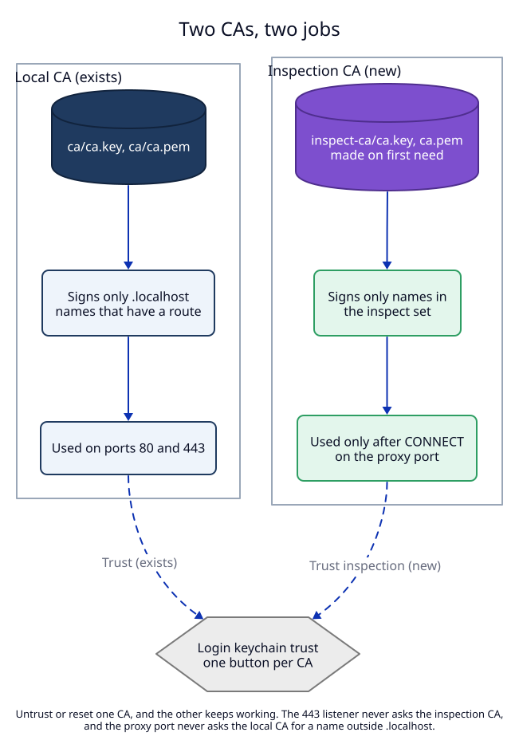

# 2. Tunnel by default, inspect only listed hosts, with a second CA

**Status:** Proposed.

## Context

Most traffic is HTTPS. After `CONNECT`, the client starts TLS with the real
server, through the proxy. The proxy sees only encrypted bytes. To read the
requests, the proxy must **inspect**: it answers the client's TLS itself, with
a certificate for that name, reads the HTTP inside, and opens its own TLS
connection to the real server. This is how mitmproxy, Charles and Proxyman
work. The client accepts the proxy's certificate only if it trusts the CA
(certificate authority) that signed it.

LocalRouter already has a local CA (`ca/`). It is trusted in the login
keychain, and it signs leaf certificates only for `.localhost` names that
have a route (ADR 01, invariant I5).

## Decision

1. **Tunnel by default.** A `CONNECT` is a tunnel unless its host is in the
   **inspect set**. A tunnel copies bytes both ways and reads nothing after
   the `CONNECT` line. Banking sites, apps that pin certificates, and
   everything the user did not ask about pass unchanged.
2. **The inspect set** is the union of:
   - `inspect_hosts` in `config.json`: host patterns the user or an agent
     added (`api.example.com`, `*.example.com`);
   - the hosts of enabled script rules ([ADR 07](../07-proxy-scripts-lua-2026-10-01/02-rules.md)).

   A pattern is an exact name, or `*.` plus a name, which matches one or more
   labels in front of it (`*.example.com` matches `a.example.com` and
   `a.b.example.com`, not `example.com`). Matching ignores case and the port.
3. **A second CA, the inspection CA**, in `inspect-ca/` (`ca.key` mode `0600`,
   `ca.pem`). Common name `LocalRouter<suffix> Inspection <short id>`, so the
   keychain shows which CA is which.
   - It is created the first time the inspect set becomes non-empty, not at
     daemon start. A user who only tunnels never has it.
   - It signs a leaf only for a name that is in the inspect set at the moment
     of the `CONNECT`. Leaves are 90 days, kept in memory, like today.
   - It is used only on the proxy port. The 443 listener never asks it.
   - The daemon never replaces it on its own. `proxy ca reset` (a user
     action, not an MCP tool) deletes it and makes a new one.
   - Trust is a separate step: `localrouter proxy trust` (macOS asks for the
     password), `localrouter proxy untrust`, and a button in the app. The
     daemon never sets trust.
4. **A `.localhost` name after `CONNECT`** gets its leaf from the local CA,
   with the existing rule (it must have a route), and goes to the route table.
5. **The real server's certificate is always checked.** The upstream TLS
   connection uses the macOS trust store (the `rustls-platform-verifier`
   crate, which asks the Security framework). A company root that the user
   installed works. A bad certificate gives a `502` page that names the
   problem. There is no "accept any certificate" switch in this ADR.
6. **ALPN to the client** offers `h2` and `http/1.1`, as port 443 does.

## Why a second CA and not the local CA

| Question | One CA for both | Two CAs (chosen) |
|---|---|---|
| What did the user agree to when they clicked Trust? | "names for my dev servers"; the same key now signs `google.com` | each Trust button says what it is for |
| Can the user stop inspection and keep HTTPS for dev names? | no: untrust breaks both | yes: untrust or reset only the inspection CA |
| Can the local CA later get name constraints (ADR 01, open point U1)? | no: it must sign every name | yes: the local CA can be limited to `.localhost` |
| Cost | none | one more folder, one more Trust step |

Today the local CA has no name constraints, so a leak of `ca/ca.key` already
lets an attacker sign any name for this user. The second CA does not make
that worse, and it keeps the path open to fix it.

## What inspection shows in this ADR

Without ADR 07, an inspected host gives one request log entry per HTTP
request (method, host, path without query, status, duration), instead of one
entry per tunnel. Headers and bodies are not stored (ADR 01, invariant I10
still holds). Scripts that read bodies are ADR 07.

## Trade-offs

- **A client that does not trust the inspection CA fails** on inspected hosts
  with a certificate error. Chrome reads the login keychain; Node.js and
  Claude Code read `NODE_EXTRA_CA_CERTS` instead. `get_proxy` returns both
  the trust state and the variable ([03](03-clients-and-agents.md)).
- **Certificate pinning.** An app that pins its server's key fails on an
  inspected host. This only affects hosts the user listed.
- **HTTP/3 (QUIC)** does not go through an HTTP proxy. Chrome falls back to
  HTTP/2 over the proxy; nothing to do.

## Tests

T4 (inspect set and patterns), T5 (inspection CA: created on need, mode
`0600`, not replaced, never on 443, leaf only for inspect-set names), T6
(upstream certificate checked; a self-signed upstream gives 502). See the
[test plan](07-test-plan.md).
