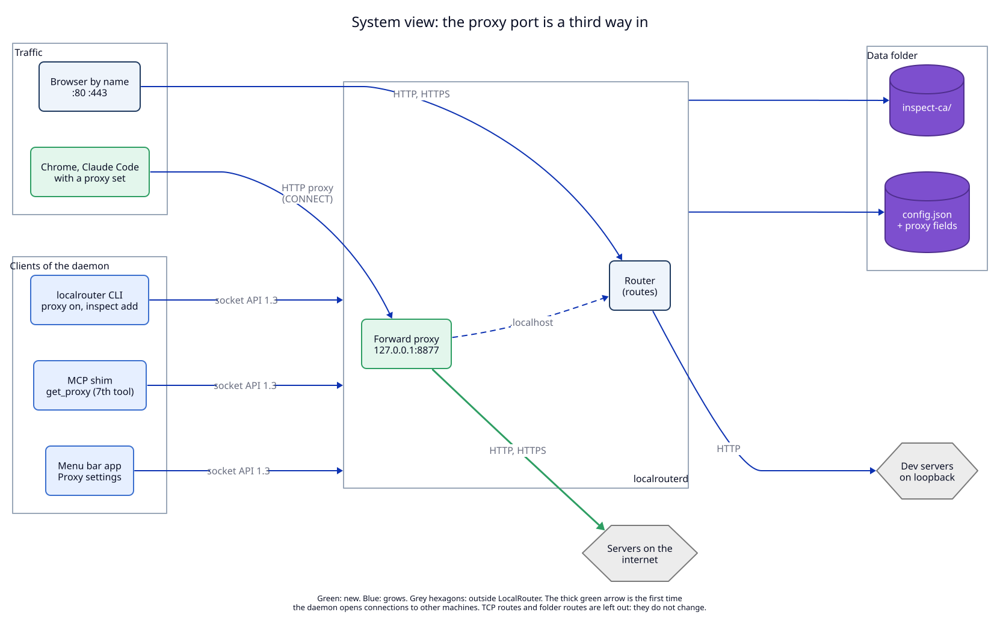
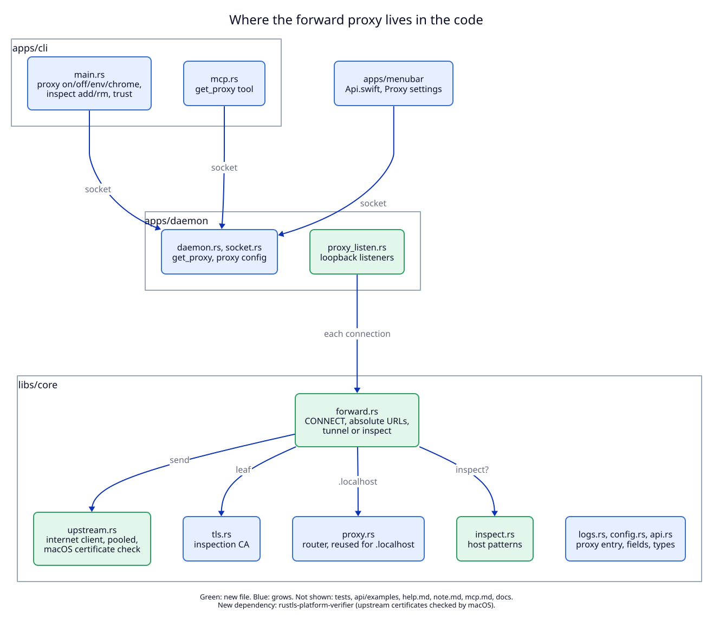

# 4. Components: where the forward proxy lives

## System view

**Status:** As-built system, with the additions of this ADR marked.

| Component | State | Note |
|---|---|---|
| Forward proxy, `127.0.0.1:8877` and `[::1]:8877` | new | inside `localrouterd`; no new program |
| Router (ports 80, 443) | reused | answers `.localhost` names that come through the proxy |
| `config.json` | grows | `proxy_enabled`, `proxy_port`, `inspect_hosts` |
| `inspect-ca/` | new | inspection CA, created on first need |
| socket API | grows | 1.3: `get_proxy`, `reset_inspect_ca`, `status.proxy` |
| CLI | grows | `proxy …` commands |
| MCP shim | grows | seventh tool `get_proxy` |
| Menu bar app | grows | Proxy section in Settings, proxy entries in Logs, right-click "Open Chrome via Proxy" |
| Google Chrome | external, optional | started as a separate instance with its own profile and `--proxy-server` |
| Servers on the internet | new dependency | the daemon's first connections to other machines |

The thick green arrow in the diagram is the new boundary crossing: the daemon
now connects out to the internet. Every other arrow keeps its protocol.

## Inside view

**Status:** Proposed (not built).

| File | State | Responsibility |
|---|---|---|
| `libs/core/src/forward.rs` | new | serve one proxy connection: absolute form, `CONNECT`, tunnel or inspect, 400 and 508 pages |
| `libs/core/src/upstream.rs` | new | the internet client: resolve, connect, pool, TLS with the macOS verifier, HTTP/1.1 and HTTP/2 |
| `libs/core/src/inspect.rs` | new | host patterns and the inspect set |
| `libs/core/src/tls.rs` | grows | a second `CertStore` for the inspection CA, with its own allow function |
| `libs/core/src/proxy.rs` | grows | `Proxy::handle` callable for a `.localhost` request that came through the forward proxy |
| `libs/core/src/logs.rs`, `config.rs`, `api.rs` | grow | `via`, `mode`, bytes; new config fields; new types and `METHODS` |
| `apps/daemon/src/proxy_listen.rs` | new | bind and close the loopback pair, accept, peer check |
| `apps/daemon/src/daemon.rs`, `socket.rs` | grow | `get_proxy`, `reset_inspect_ca`, live bind on `set_config` |
| `apps/cli/src/main.rs`, `trust.rs` | grow | `proxy` commands; trust for a second CA |
| `apps/cli/src/mcp.rs` | grows | `get_proxy` tool |
| `apps/menubar/Sources/LocalRouterKit/Api.swift`, Settings view | grow | types and the Proxy section |
| `apps/menubar/Sources/LocalRouterKit/ChromeLauncher.swift` | new | find Chrome, turn the proxy on, open Chrome with `chrome_args` |
| `apps/menubar/Sources/LocalRouter/StatusItemController.swift` | grows | the right-click item, shown only when Chrome is found |

New dependency: `rustls-platform-verifier` in `libs/core`, for upstream
certificate checks. No Lua yet: that is ADR 07.

## What the views leave out

Tests, `api/examples/`, the agent texts and docs are not drawn. TCP routes,
folder routes, the self-updater and the Claude Code and Codex installers do not
change and are not drawn.

## The seam for ADR 07

`forward.rs` and `proxy.rs` call one function at two points: after a request
is read and before it is sent, and after the response headers arrive. In this
ADR the function does nothing. ADR 07 puts the script rules there, so router
traffic and proxy traffic share one hook.
