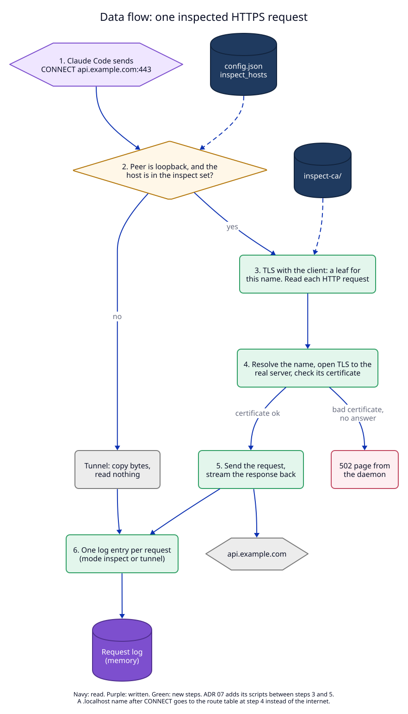
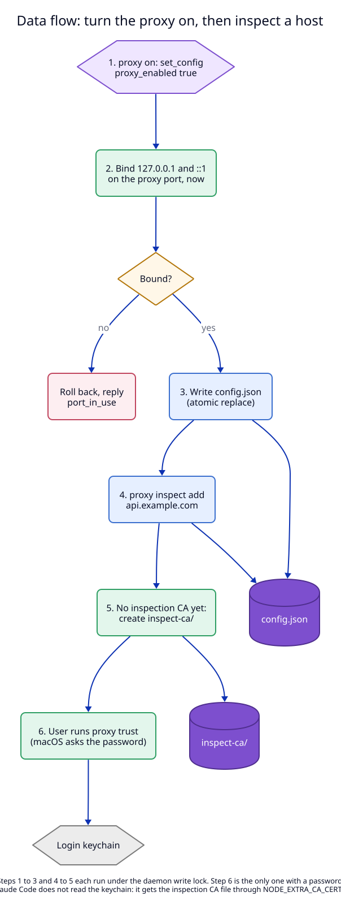

# 5. Data flow

These are the flows this ADR **will** create or change, once built.

| Flow | new/changed/removed | Trigger | Writes | Reads |
|---|---|---|---|---|
| F1. Absolute-form HTTP through the proxy | new | a client sends `GET http://…` to the proxy port | request log (memory) | route table (for `.localhost`) |
| F2. Tunnel | new | `CONNECT` to a host not in the inspect set | request log | inspect set |
| F3. Inspected HTTPS request | new | `CONNECT` to a host in the inspect set | request log | inspect set, `inspect-ca/` |
| F4. Turn the proxy on and off | new | `set_config` with `proxy_enabled` or `proxy_port` | `config.json`; opens or closes sockets | `config.json` |
| F5. Add an inspect host | new | `set_config` with `inspect_hosts` | `config.json`; `inspect-ca/` on first need | `config.json` |
| F6. Read the proxy settings | new | `get_proxy` (CLI, MCP, app) | nothing | config, listener state, `inspect-ca/ca.pem`, keychain trust check |
| F7. Request log entry | changed | every HTTP request | before: router requests only; after: also proxy requests, with `via` and `mode` | nothing |

## F3. One inspected HTTPS request

Decided in [01](01-proxy-port.md) and [02](02-inspection-ca.md).

The write at the end is the request log ring buffer in memory. It is not a
file and has no transaction. A tunnel (F2) takes the "no" branch and writes
one entry when the tunnel closes, with bytes in each direction.

## F4 and F5. Turn the proxy on, then inspect a host

Decided in [01](01-proxy-port.md) (live bind) and [03](03-clients-and-agents.md)
(config fields).

Write path, to its end:

1. `set_config` takes the daemon's write lock.
2. For `proxy_enabled` or `proxy_port`: bind the new pair first. If the bind
   fails, the call fails and nothing is written. If it works, write
   `config.json` with an atomic replace. If that write fails, close the new
   pair, keep the old one, and return `io` (ADR 01, invariant I4).
3. For `inspect_hosts`: if the set becomes non-empty and `inspect-ca/` does
   not exist, create it first (in `inspect-ca.tmp-<pid>/`, then rename, as
   `ca/` is made today). Then write `config.json`. If the config write fails,
   the new CA folder stays: it is harmless and the next attempt uses it.
4. Release the lock. New `CONNECT`s use the new inspect set. Open tunnels are
   not cut; a tunnel stays a tunnel until it closes.

Trust (step 6 in the diagram) runs in the CLI or the app with
`/usr/bin/security`. The daemon does not write the keychain.

## F6. Read the proxy settings

No diagram: one read call. It reads the config and the listener state under
the read lock, and checks keychain trust the way `status` checks the local CA
today.
