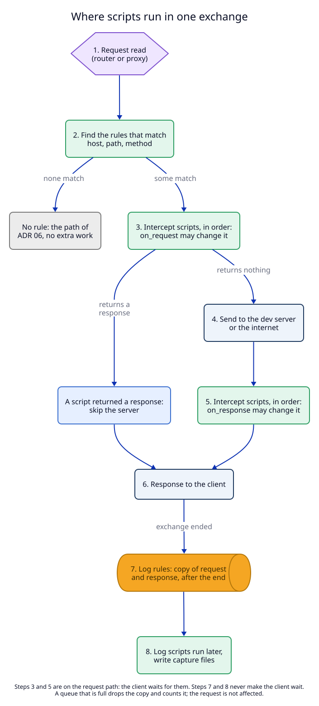

# 1. Two kinds of script: intercept and log

**Status:** Proposed.

## Context

[ADR 06](../06-forward-proxy-2026-10-01/README.md) lets Chrome and Claude
Code send their traffic through LocalRouter, and the router already carries
dev server traffic. The user wants to act on that traffic with small
programs, in two ways:

1. **change** a request on its way in or a response on its way out, or answer
   without the server (for example block a call, add a header, return a fake
   reply);
2. **record** requests and responses, with bodies, into files, without
   slowing the traffic or being able to break it.

These two needs have opposite costs. Changing a request means the client must
wait for the script. Recording must never make the client wait. So they are
two kinds of script, not one script with options.



An **exchange** is one request and its response. A **script rule** says which
exchanges a script runs on ([02](02-rules.md)).

## Decision

### Scripts are Lua files that return a table

Lua 5.4 ([03](03-lua-runtime.md) says why Lua and how it runs). A script is
one `.lua` file. It returns a table that names its kind and its functions.

**Intercept script:**

```lua
-- add-trace.lua: add a header, block one path, change one JSON field
return {
  kind = "intercept",
  request_body = { "text" },  -- hold text request bodies (true means the same)
  response_body = false,      -- hold no response bodies (the default)

  on_request = function(req)
    req.headers["x-trace"] = "lr-" .. req.id
    if req.path == "/v1/admin" then
      return { status = 403, headers = { ["content-type"] = "text/plain" }, body = "blocked by add-trace.lua" }
    end
    if req.body then
      local data = json.decode(req.body)
      data.max_tokens = 256
      req.body = json.encode(data)
    end
  end,

  on_response = function(req, res)
    res.headers["x-seen-by"] = "localrouter"
  end,
}
```

**Log script:**

```lua
-- capture.lua: one JSON line per call into output_dir/messages.jsonl
return {
  kind = "log",
  on_exchange = function(ex)
    capture.append("messages.jsonl", json.encode({
      time = ex.time_ms,
      method = ex.request.method,
      path = ex.request.path,
      status = ex.response.status,
      request = ex.request.body,
      response = ex.response.body,
      truncated = ex.request.body_truncated or ex.response.body_truncated,
    }) .. "\n")
  end,
}
```

### What each kind may do

| | Intercept | Log |
|---|---|---|
| runs | on the request path; the client waits | after the exchange ends; the client never waits |
| `on_request(req)` | may change method, path, query, headers, body; may return a response | - |
| `on_response(req, res)` | may change status, headers, body | - |
| `on_exchange(ex)` | - | reads a copy of the request and the response |
| `on_event` | `(req, res, event)`: may change or drop each event of a stream as it passes | `(ex, event)`: a copy of each event, in order |
| bodies | only classes it lists (`request_body`, `response_body`); such a body is held until complete, up to 8 MB | classes in `copy` (default text and events) as a copy up to 16 MB; classes in `save` straight to files; others counted only |
| files | none | `capture.write`, `capture.append`, and saved bodies, in the rule's `output_dir` |
| on an error | the rule's `on_error`: `"fail"` (502 page, default) or `"pass"` | counted; the exchange is not affected |
| order | by the rule's `order`, then id | each log rule gets its own copy, in completion order |

### The objects a script sees

`req` (intercept) and `ex.request` (log):

| Field | Example | Notes |
|---|---|---|
| `id` | `"01JB9…"` | unique per exchange; the same id in both hooks |
| `source` | `"proxy"` or `"router"` | |
| `route` | `"shop/blog"` | router traffic only |
| `method` | `"POST"` | |
| `scheme`, `host`, `port` | `"https"`, `"api.example.com"`, `443` | read only |
| `path` | `"/v1/messages"` | |
| `query` | `"beta=true"` | without `?`; `""` when none |
| `headers` | `{ ["content-type"] = "application/json" }` | lower-case names; a repeated header is a list of strings |
| `body` | a Lua string, or `nil` | decoded from gzip, deflate, br, zstd |
| `body_class`, `content_type`, `body_size`, `body_truncated`, `body_skipped`, `body_file`, `range`, … | | the body fields of [04](04-bodies-and-captures.md#body-fields-a-script-sees): which kind of body, why there is none, where it was saved |

`res` (intercept) and `ex.response` (log): `status`, `headers`, `body`,
`body_truncated`. A log `ex` also has `time_ms`, `duration_ms`, `error` (for
example "the server did not answer"), `answered_by` (the id of an intercept
rule that returned a response), and `upgraded` (`true` for a WebSocket after
`101`; frames are not copied).

**What a change means.** Setting `req.body` or `res.body` replaces the body;
the daemon sends it without `Content-Encoding`, with a new `Content-Length`.
Setting a header to `nil` removes it. `host`, `scheme` and `port` cannot be
changed: sending a request somewhere else is not in this ADR (manifest U1).

**Returning a response** from `on_request` stops the chain: the server is not
called, later intercept rules' `on_request` do not run, no `on_response`
runs, and log rules still see the exchange with `answered_by` set.

### Functions scripts get

| Module | Functions | Kinds |
|---|---|---|
| `json` | `encode(v)`, `decode(s)`, `null` | both |
| `sse` | `parse(s)`: a list of `{ event, data, id }` from a server-sent events body | both |
| `base64` | `encode(s)`, `decode(s)` | both |
| `url` | `parse_query(s)`, `encode(s)`, `decode(s)` | both |
| `log` | `info(msg)`, `warn(msg)`: a line in the daemon log, with the rule id; at most 200 lines a minute per rule | both |
| `multipart` | `parse(body, content_type)`: a list of `{ name, filename, content_type, headers, data }` | both |
| `capture` | `write(name, data)` (replace), `append(name, data)` | log only |
| standard Lua | `string`, `table`, `math`, `utf8`, `coroutine`, `os.time`, `os.date`, `os.clock`; `print` goes to `log.info` | both |

The full reference is a page the daemon serves, `router.localhost/scripts`,
and `localrouter rules api` prints it ([05](05-clients-and-agents.md)).

## Trade-offs

- **Two kinds instead of one flexible kind.** A script that wants to change
  a request *and* record it is two rules. In return, the cost of each rule is
  plain from its kind, and a recording script cannot slow or break traffic.
- **Intercept with bodies costs streaming.** A held body reaches the client at
  the end. Event streams are never held; they pass event by event
  ([04](04-bodies-and-captures.md)).
- **No rerouting.** A mock server is done by returning a response, not by
  sending the request to another address.

## Tests

T5 (intercept changes and answers), T6 (`on_response`), T8 (log copies),
T19 (router traffic), T21 (`on_event`). See the [test plan](09-test-plan.md).
