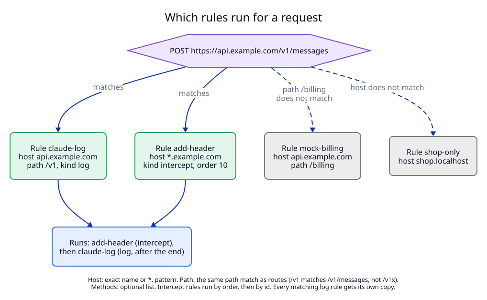

# 2. Script rules: which script runs on which traffic

**Status:** Proposed.

## Context

A script must run only on the traffic it is meant for. An agent that wants
to record its API calls must not, by mistake, record or change every request
of the browser. The route model already solves the same problem for names and
paths, and it already has lifetimes (persistent, owned, session) that agents
know how to use.

## Decision

A **script rule** is one entry in a new rule table in the daemon.

| Field | Type | Meaning |
|---|---|---|
| `id` | string, label rules (`a-z`, `0-9`, `-`, 1 to 63) | the rule's name, for example `claude-capture`. Setting a rule with an existing id replaces it |
| `host` | host pattern | `api.example.com`, `*.example.com` (ADR 06 patterns), or a `.localhost` name such as `shop.localhost` |
| `path` | string, optional | a path prefix with the route **path match**: `/v1` matches `/v1` and `/v1/messages`, never `/v1x` |
| `methods` | list, optional | `["POST"]`; absent: every method |
| `script` | absolute path | a `.lua` file, at most 1 MB |
| `output_dir` | absolute path, log rules only | the only folder the script may write ([04](04-bodies-and-captures.md)) |
| `order` | integer, default `100` | intercept rules run from low to high, then by id |
| `on_error` | `"fail"` (default) or `"pass"` | intercept rules only ([03](03-lua-runtime.md)) |
| `reveal_secrets` | boolean, default `false` | show secret headers to the script; not settable through MCP ([04](04-bodies-and-captures.md)) |
| `max_capture_bytes` | integer, default 1 GiB | log rules only: the write quota |
| `enabled` | boolean, default `true` | a disabled rule matches nothing and keeps its counters |
| `note` | string, up to 500 characters | why the rule exists |
| `owner_pid` | integer, optional | the rule is removed when this process exits |
| `persistent` | boolean, default `false` | saved in `script-rules.json` |

The kind (`intercept` or `log`) is not a field: it comes from the script.

### Lifetimes, the same as routes

| Kind | How | Saved | Removed when |
|---|---|---|---|
| persistent | `persistent: true` | `script-rules.json` | `remove_script_rule` |
| owned | `owner_pid` | never | the process exits, or `remove_script_rule` |
| session | neither | no | the daemon stops, or `remove_script_rule` |

`persistent` with `owner_pid` is refused, as for routes. `owner_pid` uses the
existing kqueue process watcher.

### Matching

1. A request matches a rule when the host matches the pattern (case and port
   ignored), the path matches, and the method is in `methods` (if given).
2. All matching **intercept** rules run, by `order`, then by `id`.
3. All matching **log** rules run, each with its own copy.
4. Scripts run on: router HTTP routes (forwarded and folder routes), and
   proxy traffic sent as absolute-form HTTP or inspected after `CONNECT`.
5. Scripts never run on: the help page `router.localhost`, the 404 page of
   the router, TCP routes, and tunnels (bytes LocalRouter does not read).

### A rule makes its host inspected

A rule whose host is not under `.localhost` would match nothing if its
traffic is a tunnel. So while such a rule is enabled, its host pattern is
part of the **inspect set** of ADR 06. `set_script_rule` creates the
inspection CA if it does not exist yet. The reply says so, and says when the
CA is not trusted yet. Removing or disabling the rule removes its host from
the set, unless `inspect_hosts` in `config.json` lists it too.

### Limits

At most 64 rules. A rule table lookup is a linear walk; 64 rules cost
nothing next to a network round trip.

### Storage

Persistent rules are saved in `script-rules.json` in the data folder:
`{"version": 1, "rules": [...]}`, written with an atomic replace under the
write lock, like `routes.json`. A failed write puts the old rule back in
memory (ADR 01, invariant I4). An older daemon does not know the file and
leaves it alone, so rules come back after an upgrade.

## Trade-offs

- **Host patterns, not full URL patterns.** No regular expressions, no query
  matching. A script that needs more checks `req.path` or `req.query` itself.
- **One table for router and proxy.** A rule for `shop.localhost` acts on dev
  traffic; a rule for `api.example.com` acts on proxy traffic. The host keeps
  them apart without a separate "source" field.

## Tests

T1 (rule validation), T2 (matching and order), T13 (daemon: lifetimes,
storage, inspect set). See the [test plan](09-test-plan.md).
