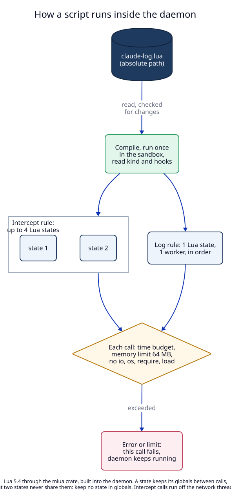

# 3. The Lua runtime: sandbox, limits, threads, reload

**Status:** Proposed.

## Context

Scripts run inside the daemon, next to every route and every proxied
request. A script may be written by an agent in a few seconds and may be
wrong. So the runtime must keep a bad script from reading the disk, from
running forever, from using all memory, and from taking the daemon down.

## Decision

### Lua 5.4, embedded with `mlua`

The daemon embeds Lua 5.4 through the `mlua` crate with the `lua54`,
`vendored` and `send` features. `vendored` builds Lua from source into the
binary, so there is no system library and nothing to install.

| Option | Why not chosen |
|---|---|
| Luau (Roblox's Lua dialect, also in `mlua`) | good sandbox, but its syntax differs from the Lua that users and agents know from nginx, HAProxy and Neovim |
| LuaJIT | faster, but Lua 5.1 syntax, and no per-state memory limit in `mlua` |
| JavaScript (deno_core, boa) | large binary and start cost; the user asked for Lua |
| WebAssembly | scripts would need a compiler; not "edit and save" |
| Rhai | a Rust-only language that few people and agents know |

### The sandbox

Each Lua state is created with only these libraries:

| Allowed | Removed |
|---|---|
| base functions except the ones on the right | `dofile`, `loadfile`, `load`, `loadstring`, `require`, `collectgarbage` (except `"count"`) |
| `string`, `table`, `math`, `utf8`, `coroutine` | `io`, `package`, `debug` |
| `os.time`, `os.date`, `os.clock` | every other `os` function (`execute`, `remove`, `rename`, `getenv`, `exit`, `tmpname`) |
| the modules of [01](01-script-kinds.md): `json`, `sse`, `base64`, `url`, `log`, `capture` (log rules) | `string.dump` |

The script is loaded in text mode only: precompiled Lua bytecode is refused,
because bytecode can break the Lua virtual machine's safety checks.

The only way a script reaches outside its state is through the functions
LocalRouter gives it. There is no network access and no file access except
`capture` inside `output_dir`.

### Limits

| Limit | Value | When exceeded |
|---|---|---|
| time per intercept call (`on_request`, `on_response`, `on_event`) | 50 ms | the call fails with "time limit"; for `on_event`, only that event waits for it |
| time per log call | 2 s | the call fails |
| time for the top level of the file (load) | 100 ms | the rule is refused |
| memory per Lua state | 64 MB (`Lua::set_memory_limit`) | the call fails with "memory limit" |
| script file size | 1 MB | the rule is refused |
| one event given to `on_event` | 1 MB | the event passes unchanged, counted in `events_skipped` |

Time is checked by an instruction hook that runs every 1,000 Lua
instructions and compares the clock. A script that waits inside a LocalRouter
function (a large `capture.write`) is checked when control returns to Lua.

### Threads

Lua states are not shared between threads. The daemon keeps:

1. **Script threads:** a small pool of operating system threads (the number
   of CPU cores, at most 4) that run Lua. Network tasks never run Lua
   themselves; they send a job to the pool and wait for the answer. A slow
   script cannot stop the network threads that serve other requests.
2. **Intercept rule:** up to 4 Lua states, made on demand. A call takes a free
   state. If none is free within the call's time limit, the call fails with
   "busy" and `on_error` applies.
3. **Log rule:** one Lua state and one queue. One call at a time, in the
   order exchanges ended. A script can append to a file without races.

A state keeps its global variables between calls, but two states of one rule
do not share them, and a reload makes new states. The reference page says it
plainly: keep no state in globals; write what must last to a capture file.

### Loading and reloading

1. `set_script_rule` reads the file, compiles it, and runs its top level in a
   fresh sandbox state. The result must be a table with a valid `kind` and
   the functions of that kind. Otherwise the rule is refused with the Lua
   message and line number, for example
   `capture.lua:12: attempt to index a nil value (global 'jsn')`.
2. `check_only: true` does all of step 1 and stores nothing. Agents use it to
   test a script before they assign it.
3. Before a call, at most once a second, the daemon compares the file's
   modification time, size and inode with the loaded version. When they
   changed, it compiles the new file. Success: new states replace the old
   ones; calls already running finish on the old version. Failure: the old
   version stays, and the rule shows `last_error` with the message.
4. A file that is gone keeps the last loaded version and shows `last_error`
   "the script file is gone". A kind that changed (intercept to log) is a
   load failure: the user must set the rule again, because the fields differ.

### Errors

| Where | `on_error: "fail"` (default) | `on_error: "pass"` |
|---|---|---|
| `on_request` fails | client gets a 502 page: "Script rule `add-trace` failed: add-trace.lua:9: …" | the request goes on unchanged |
| `on_response` fails | client gets the 502 page instead of the response | the response goes on unchanged |
| `on_event` (intercept) fails | the stream is cut after the events already sent; the client sees the connection end | the event goes on unchanged |
| `on_exchange` or `on_event` (log) fails | counted, `last_error` set, nothing else | same |

Every failure is counted in the rule's `errors` and `last_error`, and the
request log entry names the rule in `script_error`.

**After 20 failed calls in a row, the daemon disables the rule.** It sets
`enabled: false`, writes the reason in `last_error`, writes a daemon log line,
and stops using it. A successful call resets the count. This exists for one
case found in the working-backwards file (G1): an agent sets a broken
intercept rule on the API host its own traffic goes through, and then cannot
reach its API to remove the rule. The user re-enables a rule with
`localrouter rules enable <id>`, the app, or by setting it again.

## Trade-offs

- **50 ms is a hard limit.** A script that parses a large JSON body may need
  more. It fails clearly, and the limit is a constant that a later change can
  make a rule field.
- **Up to 4 states per intercept rule** limit how many requests of one rule
  run scripts at the same moment. More requests wait for a state, up to the
  time limit.
- **Globals that are not shared** surprise script authors who count requests
  in a global. The reference page and the agent texts say it.

## Tests

T3 (sandbox), T4 (limits), T11 (load, `check_only`, reload), T12 (errors,
`on_error`, disable after 20). See the [test plan](09-test-plan.md).
