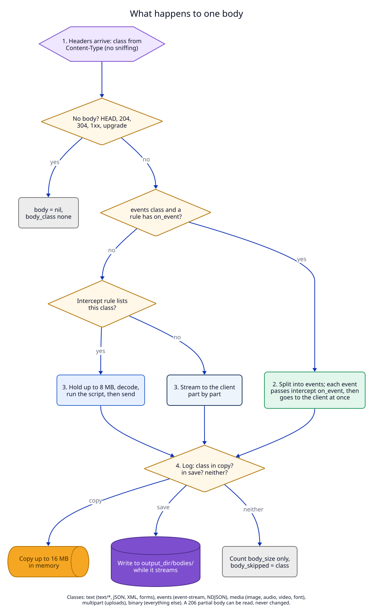
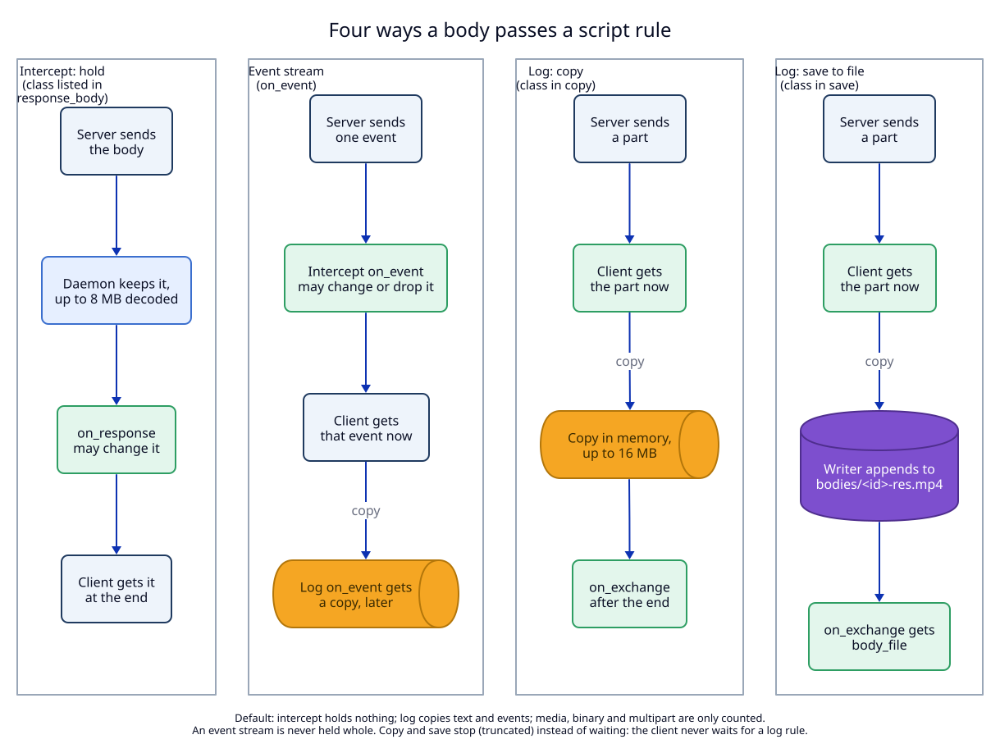

# 4. Bodies: text, streams, media and binary; capture files; secrets

**Status:** Proposed.

## Context

Reading bodies is the reason most users want scripts: "save every request to
the Claude API with its reply". But a body is not one kind of thing. The
traffic of one Chrome tab or one agent session holds all of these:

| Traffic | Example | What makes it hard |
|---|---|---|
| API calls | `POST /v1/messages`, JSON | small and easy, but often compressed |
| Event streams | a model reply as server-sent events; a notification stream | arrives over seconds or never ends; holding it until the end breaks the client |
| Images and fonts | `GET /logo.png` | many per page; binary |
| Video and audio | `GET /movie.mp4` with `Range: bytes=…` | large; the player asks for parts (`206 Partial Content`) when it seeks |
| Downloads | a 2 GB `.zip` | larger than any memory limit |
| Uploads | `multipart/form-data` with a 50 MB file | a large request body, with several parts |
| Other binary | gRPC, protobuf, PDF | bytes, not text |
| Compressed | `Content-Encoding: gzip`, `br`, `zstd` | the bytes on the wire are not what the script wants to read; a small body can expand to gigabytes |

One rule for all of them fails one of them. Holding every body breaks
streams and downloads. Copying every body into memory costs memory on every
image. So a script says **which kinds of body it wants and how**, and
everything else passes at full speed and is only counted.



## Decision

### 1. Every body has a class, taken from its Content-Type

| Class | Content types | Default for intercept | Default for log |
|---|---|---|---|
| `text` | `text/*` (except `text/event-stream`), `application/json`, `*+json`, `application/xml`, `*+xml`, `application/javascript`, `application/x-www-form-urlencoded`, `application/graphql` | not held | copied |
| `events` | `text/event-stream`, `application/x-ndjson`, `application/jsonl` | never held (see 3) | copied |
| `media` | `image/*`, `audio/*`, `video/*`, `font/*` | not held | counted only |
| `multipart` | `multipart/*` (uploads, `multipart/byteranges`) | not held | counted only |
| `binary` | everything else, and a body with no Content-Type (`application/octet-stream`, `application/pdf`, `application/zip`, `application/grpc`, protobuf, WebAssembly) | not held | counted only |
| `none` | no body: `HEAD`, `1xx`, `204`, `304`, a request without a body, a WebSocket after `101` | - | - |

The class comes from the header only. The daemon never looks at the bytes to
guess ("sniffing"): the result must be the same for the same headers, and a
server that sends JSON as `text/plain` still gets class `text`. The request
body and the response body each have their own class.

### 2. Scripts say which classes they want

**Intercept** script fields:

| Field | Meaning | Default |
|---|---|---|
| `request_body` | classes of request bodies to hold for `on_request` | none. `true` means `{ "text" }` |
| `response_body` | classes of response bodies to hold for `on_response` | none. `true` means `{ "text" }` |
| `on_event` | function called for each event of an `events` response | absent |

**Log** script fields:

| Field | Meaning | Default |
|---|---|---|
| `copy` | classes copied into memory for `on_exchange` | `{ "text", "events" }` |
| `save` | classes written straight to files while they stream | `{}` |
| `on_event` | function called for each event of an `events` response, in order | absent |



A class may be in `copy` or in `save`, not in both. `events` cannot be in
`request_body` or `response_body`. A script that breaks these rules is
refused at `set_script_rule`, with the reason.

Example: a log rule that keeps the JSON calls of a page and saves its images
and videos as files.

```lua
return {
  kind = "log",
  copy = { "text" },
  save = { "media" },
  on_exchange = function(ex)
    local r = ex.response
    capture.append("index.jsonl", json.encode({
      path = ex.request.path, status = r.status, class = r.body_class,
      size = r.body_size, file = r.body_file, range = r.range,
    }) .. "\n")
  end,
}
```

### 3. Event streams are never held whole

An `events` body can last for minutes, or never end (a live notification
stream). Holding it would delay it forever. So:

1. The daemon splits the stream into events as it arrives: for
   `text/event-stream`, an event ends at a blank line (fields `event`, `data`,
   `id`, `retry`); for NDJSON and JSONL, an event is one line (`data`).
2. **Intercept `on_event(req, res, event)`** runs on each event, while that
   event waits. It may change `event.data` (or the other fields), or return
   `false` to drop the event. The daemon writes the event back in the same
   format. Other events are not held: each goes to the client as soon as its
   own script call returns.
3. **Log `on_event(ex, event)`** gets a copy of each event, through the
   rule's queue, after the event reached the client. `event.index` counts
   from 1. This is how a script records a stream that never ends.
4. When a log script has `on_event`, the stream is **not** also copied for
   `on_exchange` (`body = nil`, `body_skipped = "streamed"`). Without
   `on_event`, the copy for `on_exchange` keeps the first 16 MB.
5. One event over 1 MB is not given to a script: it passes unchanged and is
   counted as `events_skipped`.
6. Without any `on_event`, an event stream passes as a normal stream; a log
   rule still gets the copy at the end.

### 4. Holding a body (intercept)

1. A body of a class the rule lists is held until complete, decoded, given
   to the script, then sent. The client gets nothing of it until then.
2. Limit: 8 MB after decoding. Beyond it, the body is not held: the bytes
   are sent unchanged as they arrive; the script runs with `body = nil`,
   `body_skipped = "too_large"`; a change to `body` is an error.
3. A held media or binary body is a Lua string of bytes. A script can replace
   an image with another image it builds or decodes (`base64.decode`), within
   the same limit.

### 5. Copying a body (log, `copy`)

1. Each part goes to the client **first**. Then a copy of it is added to the
   rule's buffer.
2. The copy keeps the first 16 MB after decoding; then `body_truncated =
   true`. The client gets every byte.
3. When the exchange ends, the copy goes to the rule's queue.
4. Limits: per rule queue 1,000 items or 256 MB; **all** held bodies, copies
   and queued events together at most 512 MB. At a limit the new copy is
   dropped and `dropped` goes up; the exchange is not affected. (The global
   limit is gap G2 of the working-backwards file.)

### 6. Saving a body to a file (log, `save`)

For media, downloads and uploads, a copy in memory is the wrong tool: a video
is larger than any memory limit, and a script would only write it to disk
again. So a class in `save` goes straight to a file, without Lua and without
the memory budget:

1. When the headers arrive, the daemon creates
   `output_dir/bodies/<exchange id>-req.<ext>` or `-res.<ext>`. The folder
   `bodies/` is created with mode `0700`, the file with `0600` and
   `O_NOFOLLOW`. The extension comes from the Content-Type (`png`, `jpg`,
   `webp`, `mp4`, `webm`, `mp3`, `pdf`, `zip`, else `bin`).
2. Each part goes to the client first, then to a writer through a small
   queue (256 KB). The file holds the **decoded** body, so a gzip-encoded SVG
   is saved as the SVG.
3. If the writer falls behind (a slow disk) or the rule's quota is reached,
   saving stops: the file keeps what it has, `body_file_truncated = true`, and
   the reason is in `body_skipped`. The client is never slowed.
4. `on_exchange` gets `body_file` (the path inside `output_dir`, for example
   `bodies/01JB9…-res.mp4`) and `body_size`. The script may write an index
   line that points to the file, as in the example above.
5. A file is never removed by LocalRouter, also not when the rule is removed.

### 7. Partial content: `Range` and `206`

A video player that seeks asks for parts: `Range: bytes=1048576-` and gets
`206 Partial Content` with `Content-Range: bytes 1048576-2097151/50000000`.

1. Scripts see `req.range` (the `Range` header) and `res.range` (the
   `Content-Range` header).
2. A copy or a saved file of a `206` body holds that part only. Its name gets
   `.part` before the extension; `res.range` says which part.
3. A script may read a partial body and change its headers, but **may not
   change its body**: the client would join parts that do not fit. Setting
   `body` on a `206` response, or on a request with `Content-Range`, is an
   error.

### 8. Uploads and multipart

1. A `multipart` request body is counted only, unless a rule lists
   `multipart`.
2. When copied or held (up to the limits), `multipart.parse(body,
   content_type)` returns a list of parts `{ name, filename, content_type,
   headers, data }`.
3. When saved, the whole multipart body is saved as one file (`.multipart`).
   Saving each uploaded file separately is not in this ADR (manifest U6).

### 9. Decoding and decompression bombs

1. Copies, held bodies and saved files are decoded from `gzip`, `deflate`,
   `br` and `zstd` (the `async-compression` crate). The bytes sent on are not
   changed unless an intercept script sets a new body; then the daemon sends
   it without `Content-Encoding`, with a new `Content-Length`.
2. `body_size` is the size on the wire; `#body` is the decoded size.
3. Decoding stops at the limit of its use (8 MB held, 16 MB copied, the quota
   for a file). A 10 KB body that expands to 10 GB cannot fill memory: it is
   cut at the limit and marked truncated.
4. An unknown encoding gives the raw bytes and `body_encoding` set to its name.

### 10. Binary data in Lua

A Lua string holds any bytes, so a script can read and build binary bodies.
`json.encode` refuses a string that is not valid UTF-8, with the message
"field response.body is not text: use base64.encode, or save the body to a
file". A script checks with `utf8.len(s)`. `res.charset` gives the charset
parameter of the Content-Type; the daemon does not convert charsets.

### Body fields a script sees

On `req`, `res`, `ex.request` and `ex.response`:

| Field | Example | Notes |
|---|---|---|
| `content_type` | `"video/mp4"` | the header, or `nil` |
| `body_class` | `"media"` | see 1 |
| `body` | a Lua string, or `nil` | decoded |
| `body_size` | `5242880` | bytes on the wire. In `on_request` and `on_response` only when held or when `Content-Length` is known; in `on_exchange`, always |
| `body_truncated` | `false` | the copy or hold stopped at its limit |
| `body_skipped` | `"class"` | why there is no body: `class`, `too_large`, `budget`, `streamed`, `slow_disk`, `quota`, `upgrade` |
| `body_file` | `"bodies/01JB9…-res.mp4"` | log, `save` only |
| `body_file_truncated` | `false` | |
| `body_encoding` | `"gzip"` | the original `Content-Encoding` |
| `range` | `"bytes 0-1023/50000"` | `Range` on requests, `Content-Range` on responses |
| `charset` | `"utf-8"` | |
| `events_skipped` | `0` | events over 1 MB, not given to a script |

### Capture files

`capture.write(name, data)`, `capture.append(name, data)` and `save` are the
only ways a script's rule writes to disk.

| Rule | Why |
|---|---|
| `output_dir` is an absolute path to an existing folder, given in the rule | the daemon has no working folder (ADR 05) |
| at `set_script_rule`, the daemon creates and deletes a probe file in `output_dir` | finds macOS privacy refusals (Desktop, Documents) at once, not at the first write |
| `output_dir` may not be the data folder, inside it, or `/` | the data folder holds only the daemon's state |
| `capture` names match `[A-Za-z0-9][A-Za-z0-9._-]{0,127}`; saved bodies go only to `bodies/` with names the daemon makes | flat names; no `/`, no `..`, no hidden files |
| files are opened with `O_NOFOLLOW` and created with mode `0600` | a symlink cannot send a write elsewhere; only this user can read captures |
| `write` replaces through a temp file and a rename; `append` uses `O_APPEND` | a reader never sees half a replaced file |
| quota: `max_capture_bytes` per rule (default 1 GiB) covers `capture.*` and saved bodies together, counted from when the rule was set or the daemon started | a log rule on a busy host, or one that saves video, cannot fill the disk |

At the quota, `capture.*` fails with "capture quota reached", and saving
stops with `body_skipped = "quota"`. The rule's `errors` and `last_error`
show it.

### Secrets

1. These request and response headers are **secret** by default:
   `authorization`, `proxy-authorization`, `cookie`, `set-cookie`,
   `x-api-key`, `api-key`, `x-auth-token`. The config field `secret_headers`
   adds names.
2. A script sees the value of a secret header as `"[redacted]"`.
3. **Redaction is a view, not a change.** If an intercept script leaves the
   value as `"[redacted]"`, the original value is sent. If it sets a new value,
   the new value is sent. If it sets `nil`, the header is removed.
4. `reveal_secrets: true` on a rule shows the real values. It can be set only
   by the CLI, and only when standard input is a terminal (the CLI asks
   "This rule will see API keys and cookies of api.example.com. Type yes:").
   The MCP tool has no such argument, and unknown arguments are refused.
   The app can set it with a confirmation dialog.
5. Query strings and bodies are **not** redacted. LocalRouter cannot know which
   parts of them are secret. A body sent to a model API holds the prompt, the
   code it contains, and anything else the client sent. Saved files are the
   bodies as they were.

## Trade-offs

- **Content-Type decides, and it can be wrong.** A server that sends an image
  as `application/octet-stream` gets class `binary`, not `media`. A rule that
  wants it lists `binary` too. Sniffing would guess better, but the same
  headers would not always give the same class.
- **Intercept on an event stream is per event.** Each event waits for its
  script call (up to the time limit). A slow `on_event` slows the stream,
  event by event, but never holds it all.
- **Holding is all or nothing per body.** There is no "hold the first 1 KB
  and stream the rest" for intercept scripts.
- **The terminal check is not a security boundary.** An agent with a shell
  can run a program that fakes a terminal. The check stops the common case
  (an agent that runs a CLI command) and makes the step visible to the user.
- **Captures can hold sensitive data** (prompts, source code, images the user
  saw, tokens inside bodies). They are `0600`, in a folder the rule names, and
  only exist when a user or agent asked for them.
- **The quota restarts with the daemon.** A persistent log rule can write
  `max_capture_bytes` again after each restart (manifest U5).

## Tests

T7 (holding, limits, decoding, streaming kept when not asked), T8 (log copy
timing, drop, global limit), T9 (capture files), T10 (secrets), T20 (classes
and defaults), T21 (event streams), T22 (saving to files), T23 (`Range` and
`206`), T24 (decompression bombs), T25 (multipart and binary in Lua). See the
[test plan](09-test-plan.md).
