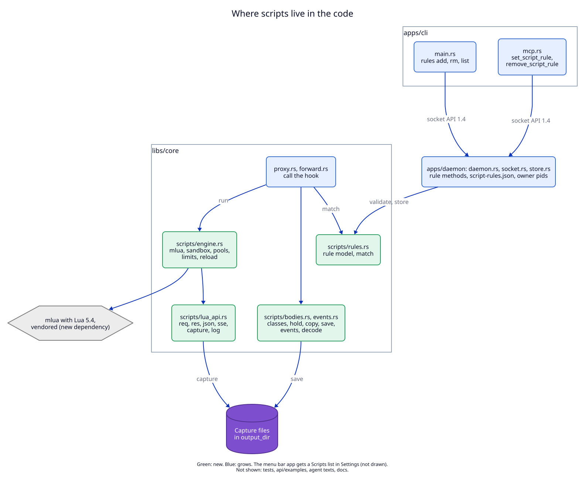

# 6. Components: where scripts live

## System view

**Status:** The system view of [ADR 06](../06-forward-proxy-2026-10-01/04-components.md)
does not change shape: no new program, process, port or socket. This ADR
adds parts inside the daemon and one new kind of output: capture files
outside the data folder.

| Component | State | Note |
|---|---|---|
| Script engine (Lua 5.4 in `localrouterd`) | new | script threads, Lua states, limits |
| Rule table and `script-rules.json` | new | in the daemon, persistent rules on disk |
| Capture files in each log rule's `output_dir` | new | the first files the daemon writes outside its data folder |
| Router and forward proxy | grow | call the hook at two points |
| Inspect set (ADR 06) | grows | includes the hosts of enabled rules |
| socket API | grows | 1.4: three methods; `get_proxy.script_rules`; log fields |
| MCP shim | grows | nine tools |
| CLI | grows | `rules …` |
| Menu bar app | grows | Scripts list in Settings |

## Inside view

**Status:** Built on 2026-10-01. The hook itself is `Scripts::exchange` in
`libs/core/src/scripts/mod.rs`, which the table below did not list (see
[10-tasks.md](10-tasks.md#plan-vs-actual), row 4).

| File | State | Responsibility |
|---|---|---|
| `libs/core/src/scripts/rules.rs` | new | `ScriptRule`, validation, matching, order |
| `libs/core/src/scripts/engine.rs` | new | `mlua` states, sandbox, limits, script threads, intercept pools, log workers, reload, disable after 20 failures |
| `libs/core/src/scripts/lua_api.rs` | new | `req`, `res`, `ex` tables and their write-back; `json`, `sse`, `base64`, `url`, `multipart`, `log`, `capture` |
| `libs/core/src/scripts/bodies.rs` | new | body classes from Content-Type; hold up to 8 MB; copy up to 16 MB; save to `output_dir/bodies/` through a writer that never blocks; decode with a stop at each limit; global 512 MB budget |
| `libs/core/src/scripts/events.rs` | new | split `text/event-stream` and NDJSON into events and write changed events back |
| `libs/core/src/scripts.md` | new | the script reference text template |
| `libs/core/src/proxy.rs`, `forward.rs` | grow | call the hook after the request is read and after the response headers arrive; the end-of-exchange copy |
| `libs/core/src/inspect.rs` | grows | inspect set = config hosts + rule hosts |
| `libs/core/src/logs.rs`, `api.rs`, `config.rs` | grow | `rules`, `script_error`; new types and `METHODS`; `secret_headers` |
| `libs/core/src/help.rs`, `help.md`, `note.md`, `mcp.md` | grow | `/scripts` page, agent texts |
| `apps/daemon/src/daemon.rs`, `socket.rs`, `store.rs` | grow | rule methods, `script-rules.json`, owner pids |
| `apps/cli/src/main.rs`, `mcp.rs` | grow | `rules` commands; two tools |
| `apps/menubar` `Api.swift`, Settings | grow | types and the Scripts list |

New dependencies in `libs/core`: `mlua` (features `lua54`, `vendored`,
`send`), `flate2`, `brotli` and `zstd` (planned: `async-compression` and the
`serialize` feature; see [10-tasks.md](10-tasks.md#plan-vs-actual), rows 2 and 3).

## What the view leaves out

Tests, `api/examples/`, docs. The Lua C code that `mlua` builds is drawn as
one external box. TCP routes, the updater and the installers do not change.

## Why the hook sits in core, not in the daemon

The proxy code in `libs/core` already sees each request and response; the
daemon only accepts connections. Putting the hook in core keeps it testable
with the existing `libs/core/tests/proxy.rs` harness, without a daemon.
