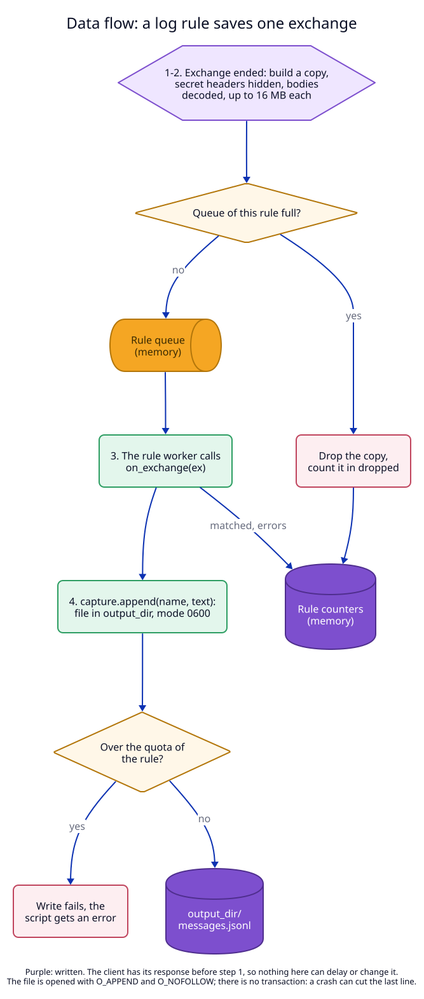
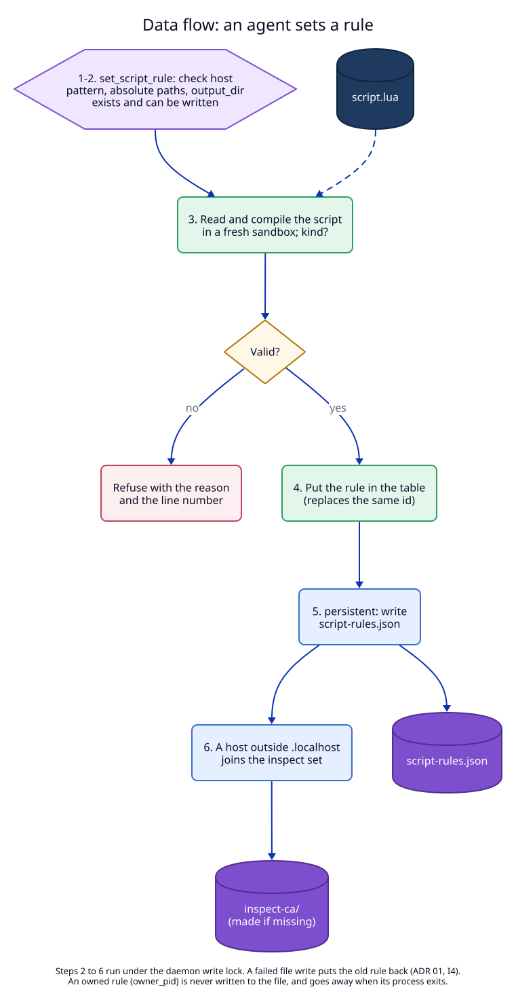

# 7. Data flow

These are the flows this ADR **will** create or change, once built.

| Flow | new/changed/removed | Trigger | Writes | Reads |
|---|---|---|---|---|
| F1. Exchange with intercept rules | new | a request matches an intercept rule | the request and response sent on (changed); request log | rule table, script file (on change) |
| F2. Exchange with log rules | new | a request matches a log rule | capture files in `output_dir`; rule counters | rule table, script file |
| F3. Set a rule | new | `set_script_rule` (CLI, MCP, app) | rule table; `script-rules.json` (persistent); `inspect-ca/` (first need) | script file, `output_dir` (probe) |
| F4. Remove a rule | new | `remove_script_rule`, owner exit | rule table; `script-rules.json` | - |
| F5. Script file changes | new | the file on disk is edited | loaded version, `last_error` (memory) | script file |
| F6. Router and proxy request | changed | every HTTP request | before: no hook; after: a rule lookup, then F1 or F2 or nothing | rule table |
| F7. Inspect set | changed | rule enabled or removed | before: `inspect_hosts` only; after: plus rule hosts | rule table, config |
| F8. A body saved to a file | new | a body whose class is in a log rule's `save` | `output_dir/bodies/<id>-res.<ext>` while it streams | the body as it passes |
| F9. An event stream | new | an `events` body and a rule with `on_event` | each event to the client (changed or dropped by intercept); a copy to the log queue | the stream as it passes |

## F1. Intercept rules on one exchange

Decided in [01](01-script-kinds.md) and [03](03-lua-runtime.md).

Steps 2 to 6 run while the client waits. Nothing is written to disk. The request log entry gets `rules` and, on a
failure, `script_error`.

## F2. A log rule saves one exchange

Decided in [04](04-bodies-and-captures.md).

Write path, to its end:

1. The copy is built while the body streams to the client. It is memory only.
2. After the exchange ends, the copy enters the rule's queue, or is dropped
   when a limit is reached (`dropped` + 1). Nothing waits.
3. The rule's single worker runs `on_exchange`. Each `capture.append` is one
   `write` call on a file opened with `O_APPEND | O_NOFOLLOW`, mode `0600`.
   There is no transaction and no `fsync`: a crash or power loss can lose the
   last lines or cut the last line. `capture.write` writes a temp file in
   `output_dir`, then renames it over the old one.
4. Counters (`matched`, `errors`, `bytes_written`) are memory only and start
   at zero when the rule is set or the daemon starts.

## F3. An agent sets a rule

Decided in [02](02-rules.md) and [05](05-clients-and-agents.md).

Write path, to its end, under the daemon write lock:

1. Validate fields; probe `output_dir`; read and compile the script. Any
   failure: refuse, nothing changed.
2. With `check_only`: stop here and reply.
3. Put the rule in the table. If it is persistent, write `script-rules.json`
   with an atomic replace. If that write fails, put the old rule back (or
   remove the new one) and reply `io`.
4. If the host is outside `.localhost`: add it to the inspect set; if
   `inspect-ca/` does not exist, create it (ADR 06, F5). A failure to create
   the CA is not a rollback: the rule stays, and the reply says the host
   cannot be inspected until the CA problem is fixed.
5. Release the lock. The next matching request uses the rule.

## F5. The script file changes

No diagram. On use, at most once a second, the daemon compares modification
time, size and inode. A changed file is compiled in a fresh state. Success
replaces the states; failure keeps the old version and sets `last_error`.
Nothing is written to disk.

## F8. A body saved to a file, and F9. an event stream

Decided in [04](04-bodies-and-captures.md), sections 3 and 6.

F8 write path, to its end:

1. Response headers arrive; the class is in the rule's `save`. The daemon
   creates `output_dir/bodies/` (`0700`) if missing, and the file
   (`0600`, `O_NOFOLLOW`, name from the exchange id and the Content-Type).
2. Each part goes to the client first. Then it goes into the writer's queue
   (256 KB). The writer decodes and appends. If the queue is full, the
   writer stops saving: the file is closed as it is and marked truncated.
   The quota is checked on each append.
3. When the body ends, the file is closed. There is no `fsync` and no rename:
   a crash leaves a shorter file. The log rule's `on_exchange` gets
   `body_file` and `body_file_truncated` through the normal queue.
4. Nothing removes the file later: not the rule's removal, not a restart.

F9 path:

1. Response headers say `text/event-stream` or NDJSON, and a matching rule
   has `on_event`. The body is split into events as bytes arrive.
2. Each event runs through the matching intercept rules' `on_event`, in rule
   order, then goes to the client. Only this event waits.
3. A copy of each event (after the intercept changes) enters each matching
   log rule's queue. The log worker calls `on_event` in order.
4. When the stream ends, log rules get `on_exchange` with
   `body_skipped = "streamed"` (if they have `on_event`). A stream that never
   ends never reaches `on_exchange`; its events still reach `on_event`.
