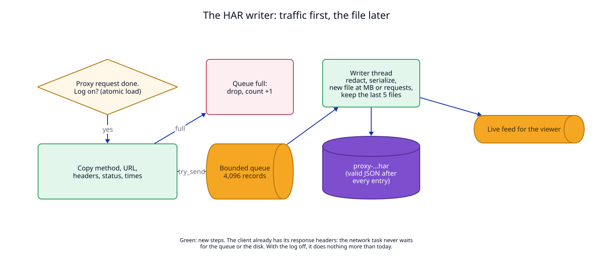

# 1. HAR files: every proxied request on disk

## Context

Today the forward proxy (ADR 06) records each request only in the in-memory
request log (`libs/core/src/logs.rs`). That log keeps the method, host, path
and status. It has no headers, no query and no bodies (ADR 01, I10). It holds
the last N entries and is gone after a restart.

The user wants every request the proxy carries written to disk, in a format
Chrome can open later. That format is **HAR 1.2** (HTTP Archive): Chrome
DevTools writes it with "Save all as HAR" and reads it with Network →
"Import HAR file". The user asked for two limits for a rolling log, size and
number of requests, and for a switch that turns the log off.



## Decision

### What is recorded

| Traffic | Recorded | When |
|---|---|---|
| `GET http://host/…` through the proxy (absolute form) | yes | at the response headers |
| A request inside an inspected `CONNECT` (ADR 06) | yes | at the response headers |
| A `.localhost` request through the proxy (the router answers, with `via`) | yes | at the response headers |
| A tunnel (`CONNECT` to a host that is not inspected) | yes, one entry: `CONNECT host:port` only | when the tunnel closes |
| The proxy's own errors (400 not a proxy request, 508 loop, 502) | yes | at once |
| Browser traffic on ports 80 and 443 that does not use the proxy | no | |
| Requests to `router.localhost` and `proxy.localhost` | no, never | |

The entry is written at the same moment as the in-memory log entry today: when
the response headers are known. The client already has its headers by then.

### What one entry holds

Each entry is one HAR `entries[]` object:

| HAR field | Value |
|---|---|
| `startedDateTime` | when the proxy got the request, ISO 8601 with milliseconds |
| `time`, `timings.wait` | milliseconds until the response headers; `send` and `receive` are 0 |
| `request.method`, `request.url` | the full URL, query included |
| `request.httpVersion`, `response.httpVersion` | as seen by the proxy |
| `request.headers` | as the **client sent** them, before script rules; `Proxy-Authorization` is left out entirely |
| `request.queryString` | parsed from the URL |
| `request.bodySize`, `response.bodySize` | `Content-Length`, or `-1` when not known |
| `response.status`, `statusText` | as the **client got** them, after script rules |
| `response.headers` | as the client got them |
| `response.content` | `size` from `Content-Length` (or 0) and `mimeType`; no `text` |
| `response.redirectURL` | the `Location` header, or empty |
| `cookies`, `cache` | empty: cookie headers are secret (below) |
| `_mode`, `_route`, `_scripts`, `_scriptError` | proxy mode (`http`, `inspect`, `tunnel`), the route that answered a `.localhost` name, the script rules that ran (ADR 07) |
| `_bytesIn`, `_bytesOut` | tunnels only |

HAR allows custom fields whose names start with `_`; DevTools ignores them.

**Bodies are not written.** DevTools shows the request and its headers, and an
empty Response tab. Bodies are an open decision (U1 in the
[manifest](07-semantic-change-manifest.md#12-unresolved-effects)). Until then a
log script rule (ADR 07) records bodies for the hosts that need them.

### Secret headers

A header whose name is in the secret list is written with the value
`[redacted]`. The list is the one script rules use: `authorization`,
`proxy-authorization`, `cookie`, `set-cookie`, `x-api-key`, `api-key`,
`x-auth-token`, plus the user's `secret_headers` in `config.json`. Today this
list lives inside the script engine (`lua_api.rs`, `Scripts::secrets`). It
moves to a shared module, `libs/core/src/secrets.rs`, so the HAR writer and
the scripts cannot drift apart. A rule's `reveal_secrets` (ADR 07) never
changes what the HAR file holds.

The URL, query included, is written as it is. A token in a query string
(`?api_key=…`) reaches the file. This is a known risk; redacting query
parameters is U2.

### The file is valid HAR after every entry

A HAR file is one JSON document, so a plain append would break it. The writer
keeps each file in this shape:

```text
{"log":{"version":"1.2","creator":{"name":"LocalRouter","version":"0.1.14"},"pages":[],"entries":[
{…entry 1…},
{…entry 2…}
]}}
```

`creator.name` is the instance's app name (`LocalRouter-dev` for the dev
instance) and `creator.version` the daemon version. One entry per line. To add an entry, the writer writes `,\n{entry}\n]}}\n`
over the old last line `]}}` with one positioned write, under a file lock.
Every byte before the closing line never changes once written. The viewer
uses this: it reads the length under the lock and streams the bytes before
the closing line ([change 2](02-viewer.md#resource-use)), so it always serves
complete JSON.

**After a crash.** A daemon that stops in the middle of a write can leave a
file with a cut last line. The writer never appends to a file of an earlier
run. Once, when the daemon starts and before it answers any request, it
repairs the newest earlier file: it keeps the header line and
every entry line that parses, and writes the closing line again. (Gap G4 in
the [working-backwards file](00-working-backwards.md).)

**A file the user deleted.** The writer checks before each entry that its
current file still exists. If the user deleted it in Finder, the writer starts
a new file. (Gap G9.)

### Files and rolling

| Item | Value |
|---|---|
| Folder | `<logs folder>/proxy/`: `~/Library/Logs/LocalRouter/proxy/` for the release, `~/Library/Logs/LocalRouter-dev/proxy/` for the dev instance (ADR 04), `$LOCALROUTER_HOME/logs/proxy/` in tests |
| File name | `proxy-YYYYMMDD-HHMMSS.har`, local time of the first entry; `-2`, `-3` … when the name exists |
| New file | at the first entry after the daemon starts or the log is turned on, and when the current file is full |
| Full | `entries == proxy_log_file_requests`, or `size + next entry > proxy_log_file_mb` MB |
| Kept | the 5 newest files whose names match the pattern; older ones are deleted at each new file |
| Never touched | any file whose name does not match `proxy-\d{8}-\d{6}(-\d+)?\.har` |
| Most disk used | 5 × `proxy_log_file_mb`: 100 MB with the defaults |

The user asked for "two params, rolling log by size or number of requests".
This ADR reads that as both limits at once, and the first one reached starts a
new file. A user who wants only one sets the other high (up to 200 MB or
1,000,000 requests).

The number of kept files (5) is a constant, not a setting. The uninstaller
already deletes the whole logs folder (`Uninstaller.removeFiles`), so the HAR
files go with it.

### Settings

Three new fields in `config.json`. `Config::parse` fills in missing fields,
so an old `config.json` gets the defaults.

| Field | Default | Allowed |
|---|---|---|
| `proxy_log` | `true` | `true`, `false` |
| `proxy_log_file_mb` | `20` | 1 to 200 (the viewer parses a whole file in the browser) |
| `proxy_log_file_requests` | `5000` | 100 to 1,000,000 |

Changes apply at once. Off stops new records at the next request, and the
current file stays valid. New limits apply at the next "full" check. Turning
the log off does not delete files.

**On by default** is the user's request. It writes nothing until the user turns
the proxy on, which is off by default (ADR 06). Because headers now reach the
disk, the user is told where they go when the proxy goes on: `proxy on`
prints the folder, and the Proxy settings show the log switch next to the proxy
switch (gap G2).

### Traffic is never delayed

1. The network task reads one atomic flag. With the log off it does nothing
   more than today: no copy, no allocation.
2. With the log on, it copies the request line, the two header maps, the
   status and the times into one record, and calls `try_send` on a bounded
   queue (4,096 records).
3. A full queue drops the record and adds 1 to `dropped`. The network task
   never waits.
4. One thread, `har-writer`, takes records from the queue, redacts, writes
   JSON and rolls files. It also sends each entry to the viewer's live feed.
5. A write error (disk full, folder not writable) stops the writer. It keeps
   the error text, which `get_proxy` reports, and writes nothing more until the
   log is turned off and on again or the daemon restarts. There is no retry
   loop.

### Resource use

The user's rule for the whole app (2026-10-02): use as few resources as
possible, memory included, and **keep nothing in memory for long**. For the
writer this means:

1. **No thread while there is nothing to write.** The `har-writer` thread
   starts at the first record. It exits after 30 seconds without records and
   closes its file. The next record starts it again; it reopens the same
   current file and goes on appending.
2. **The queue exists only with the thread.** It is made when the thread
   starts and dropped when it exits. Records are boxed, so the bounded queue
   holds pointers: 4,096 slots are 32 KB while the thread runs, and nothing
   when it does not.
3. **A record lives for milliseconds.** From the network task to one write.
   The entry JSON is built into one buffer of a few KB, written, and freed.
4. **No index in memory.** The writer keeps the current file's name, size and
   entry count, and `dropped`. Nothing about older files.
5. **The live feed exists only while a viewer page is open**
   ([change 2](02-viewer.md#resource-use)). With no page open the writer does
   not build anything for it.

With the log idle, the cost is a few atomic counters: under 1 KB of heap, no
thread, no open file.

## Tests

T1 (entry builder), T2 (writer: valid JSON, roll, prune, repair, deleted file),
T3 (redaction), T4 (the forward proxy records each mode), T5 (a full queue
drops and never blocks), T17 (idle: no thread, no file, no queue). See the [test plan](08-test-plan.md).
