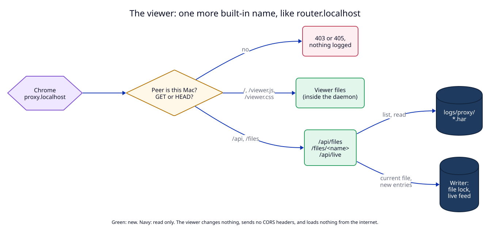

# 2. The viewer at proxy.localhost

## Context

Chrome cannot open a `.har` file as a page. A click on a file shows raw JSON,
or Chrome downloads it. Chrome reads a HAR only through DevTools: Network →
"Import HAR file", or a file dragged onto the Network panel. So "open the log
in Chrome" needs a page.

The user chose a page at `https://proxy.localhost` that shows the logs. The
daemon already answers one name of its own, `router.localhost` (the help page,
`help.rs`), before the route lookup. The viewer works the same way.



## Decision

### The name

| Item | Value |
|---|---|
| Host key | `proxy`, constant `PROXY_LOG_HOST` in `routes.rs`, next to `HELP_HOST` |
| Release | `http://proxy.localhost`, `https://proxy.localhost` |
| Dev instance | `http://proxy.localhost:7080`: the same name on the instance's own ports, as for `router.localhost` (ADR 04) |
| Certificate | the local `CertStore` always issues `proxy.localhost`, as it does `router.localhost` |
| Second address | `router.localhost/proxy-log/` serves the same viewer, always |

The page uses relative URLs only, so it works under both addresses.

**The name is reserved, but an old route keeps working.** `register_route` and
`set_script_rule` refuse the host key `proxy`, as they refuse `router`. Today
the daemon validates saved routes again when it loads `routes.json`, and skips
a route that fails (`daemon.rs`, `Daemon::load`). A user's saved route `proxy`
would disappear after the update, without warning. So the load path does not
apply the new reservation: a saved route `proxy` is kept and wins over the
viewer. Status reports a problem: "The route proxy hides the proxy log viewer.
It is also at router.localhost/proxy-log/." (Gap G5.)

### How the content is served

Everything comes from inside the daemon binary. There is no folder of web
files, no build step, no npm and no CDN.

| Path | Answer | Source |
|---|---|---|
| `/` | the viewer page | `libs/core/src/har/viewer.html`, `include_str!` |
| `/viewer.js`, `/viewer.css` | script and style | `include_str!`; plain JavaScript, no framework |
| `/api/files` | JSON: state of the log, and the list of files | the writer's state, and the folder |
| `/api/entries?file=<name>&before=<n>&limit=500` | JSON: the newest 500 entries before entry `n`, newest first | the file, read backwards from the end |
| `/files/<name>` | the HAR file, `application/json`, streamed | the folder; for the current file see "Resource use" |
| `/files/<name>?download=1` | the same, with `Content-Disposition: attachment` | for the DevTools import |
| `/api/live` | `text/event-stream`: one event per new entry | the writer's live feed |
| anything else | 404 | |

`/api/files` answers:

```json
{
  "proxy": true, "log": true,
  "folder": "/Users/me/Library/Logs/LocalRouter/proxy",
  "file_mb": 20, "file_requests": 5000, "keep_files": 5,
  "dropped": 0, "error": null,
  "files": [
    { "name": "proxy-20261002-093512.har", "size": 1834221, "entries": 912, "current": true },
    { "name": "proxy-20261001-181003.har", "size": 20971004, "entries": null, "current": false }
  ]
}
```

`entries` is known for files this daemon run wrote, and `null` for older ones.

`/api/live` sends `event: entry` with the entry JSON on one line,
`event: file` when a new file starts, `event: off` when the log is turned off,
and `event: lagged` when the page fell behind (the page then loads the file
again). A comment line every 15 seconds keeps the connection open. The feed is
a `tokio::sync::broadcast` channel with room for 64 entries. It exists only
while at least one page is connected.

**File names are checked.** `/files/<name>` answers only a name that matches
the file pattern of [change 1](01-har-files.md#files-and-rolling). The file
must be a regular file directly in the folder; a symbolic link is refused. So
`/files/../config.json` or a link to `ca.key` gets 404.

### Who can read it

The files hold the headers (redacted) and URLs of everything the user sent
through the proxy. Three rules:

1. **This Mac only.** The viewer answers only a loopback peer. With
   `allow_lan` on, ports 80 and 443 accept other machines (ADR 01), and they
   get `403` from the viewer. (Gap G6.)
2. **Read only.** Only `GET` and `HEAD`; other methods get `405`. No path
   changes state. So a page on another site that sends a request to
   `proxy.localhost` changes nothing.
3. **No CORS headers.** Another site open in the same Chrome can send a `GET`,
   but the browser does not let it read the answer.

Every answer carries:

```text
Content-Security-Policy: default-src 'self'; img-src 'self' data:; frame-ancestors 'none'
X-Content-Type-Options: nosniff
Cache-Control: no-store
Referrer-Policy: no-referrer
```

### The viewer is never logged

Requests to `proxy.localhost` go neither to the HAR file nor to the in-memory
request log. Otherwise the live feed would fill the Logs tab, and a Chrome that
uses the proxy would record the viewer reading its own log. Requests to
`router.localhost` are not written to the HAR either; the in-memory log for
them does not change. Script rules never run on `proxy.localhost`. (Gap G7.)

### The page

1. **State line at the top.** Proxy on or off, log on or off, the folder, the
   limits, `dropped`, and the writer error in red. When the proxy or the log is
   off, the page says so and shows how to turn it on: Settings → Proxy, or the
   CLI command. (Gap G1.)
2. **File list.** Newest first, with size and entries. The current file is
   selected.
3. **Table.** Time, method, status, host, path, mode, milliseconds, size;
   newest at the top. A filter box matches URL, method, status and mode. An
   "Errors only" switch shows status 400 and above, and 0. The page loads the
   500 newest entries with `/api/entries`; "Show more" loads the 500 before
   them. It keeps at most 2,000 rows; older rows leave the page as new ones
   arrive. The filter works on the loaded rows.
4. **Details.** A click on a row shows the request and response headers, the
   timings and the `_` fields.
5. **Live.** New entries of the current file appear at the top.
6. **Download HAR.** A button per file, with one line under it: "In Chrome:
   DevTools → Network → Import HAR file, or drag the file onto the Network
   panel."

### Opening it

The menu item "Open Proxy Log" (right-click menu, Proxy tab, Settings) opens
`log.url` from `get_proxy`. It is the `http://` address, so it works before
the user trusts the local CA; `.localhost` is a secure context in Chrome
anyway. If Google Chrome is installed (`ChromeLauncher.chromeInstalled`), the
app opens the URL in the user's normal Chrome. The separate Chrome that uses
the proxy is not used. Otherwise the default browser opens it.

"Show Proxy Log Folder" opens the folder in Finder. The writer creates the
folder with its first file. If no request was logged yet, the app says so.

### Resource use

The rule of [change 1](01-har-files.md#resource-use) applies: nothing stays
in memory when nobody uses the viewer, and no request holds a whole file.

1. **No state between requests.** No cache, no index. `/api/files` lists the
   folder at each request.
2. **Files are streamed** in 64 KB chunks. A 20 MB file never sits in the
   daemon's memory.
3. **The current file without the lock.** The writer only ever rewrites the
   closing line `]}}`; every byte before it never changes once written. So the
   viewer takes the lock only to read the file's length, then streams the
   bytes before the closing line and adds the closing line itself. The answer
   is complete JSON, and a slow reader never blocks the writer.
4. **Entries are read from the end.** `/api/entries` reads the file backwards
   in 64 KB chunks, one entry per line, and stops after `limit` entries. Its
   memory is one chunk plus the entries it returns.
5. **The live feed exists only while a page is open.** The first `/api/live`
   connection makes the channel; when the last one closes, the writer drops
   it at its next record.
6. **The page files cost no heap.** `viewer.html`, `.js` and `.css` (about
   50 KB) are read-only data in the binary. macOS maps them from the file and
   can drop those pages from memory at any time.

With no page open, the viewer holds nothing.

## Tests

T6 (viewer: paths, loopback only, 405, name checks, no CORS, CSP, live feed,
not logged, streamed in chunks, entries from the end), T17 (no live channel
without a page), T7 (reserved name, the saved `proxy` route), M2 (the viewer in
real Chrome), M5 (`allow_lan` from a second machine). See the
[test plan](08-test-plan.md).
