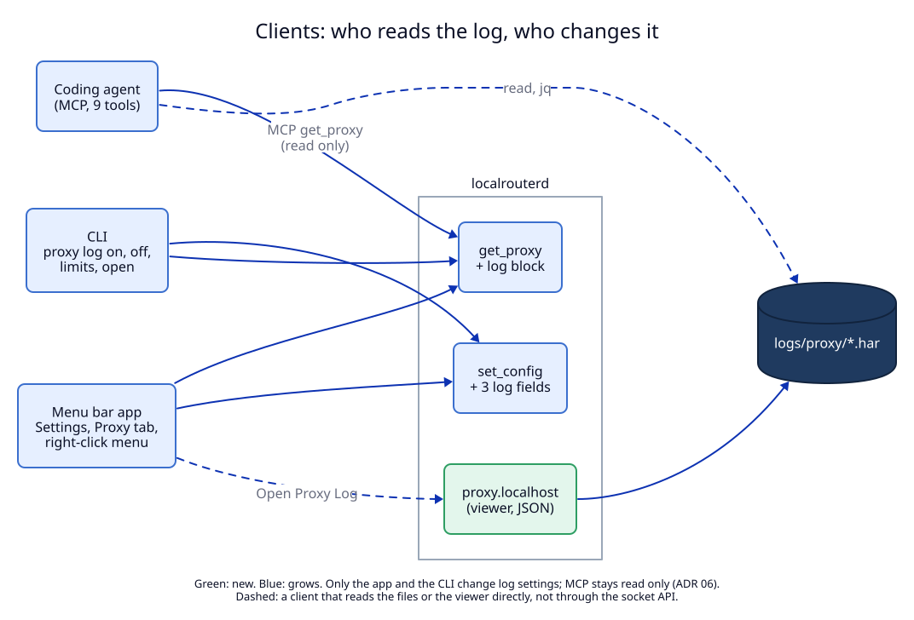

# 3. Clients and agents: settings, MCP, the menu bar app

## Context

Four clients must learn about the log: the menu bar app, the CLI, coding
agents through MCP, and agents that read the help texts. ADR 06 set a rule for
the proxy: **MCP is read only.** Turning the proxy on and choosing inspected
hosts are CLI commands, which the user sees in the agent's transcript
(ADR 06, change 3). The log follows the same rule.



## Decision

### Socket API 1.5

The change is additive, so the minor version goes up: `API_VERSION` "1.4" →
"1.5". Clients refuse only a different major.

| Type | Change |
|---|---|
| `Config` | + `proxy_log`, `proxy_log_file_mb`, `proxy_log_file_requests` |
| `SetConfigParams` | + the same three, each optional; out-of-range values get an error that names the range |
| `GetProxyResult` | + `log`: the block below |

```json
"log": {
  "enabled": true,
  "folder": "/Users/me/Library/Logs/LocalRouter/proxy",
  "url": "http://proxy.localhost",
  "file_mb": 20, "file_requests": 5000, "keep_files": 5,
  "current": "proxy-20261002-093512.har",
  "files": 3, "written": 912, "dropped": 0,
  "error": null
}
```

`api/examples/` gets `set_config_proxy_log.request.json` and changes in
`get_config.reply.json`, `get_proxy.reply.json`. Both contract tests walk the
folder, so they check the new shapes without new code. On the Swift side
(`Api.swift`) every new field is optional, so the app still works with a 1.4
daemon. It then hides the log controls.

### CLI

| Command | Does |
|---|---|
| `proxy log` | prints the state: on or off, folder, viewer URL, limits, current file, written, dropped, error |
| `proxy log on`, `proxy log off` | sets `proxy_log` |
| `proxy log limits --mb 20 --requests 5000` | sets one or both limits |
| `proxy log open` | opens the viewer URL with `open` |
| `proxy log path` | prints the folder, for scripts: `ls -t "$(localrouter proxy log path)"` |

`proxy` (the state) and `proxy on` print one more line:
`Log: on, writes every request to <folder> (proxy log off to stop)`.
(Gap G2.)

### MCP: no new tool

The user asked what changes in MCP. The answer: **one tool's output and one
tool's description, and no new tool.** The MCP server still lists exactly nine
tools (`apps/cli/tests/mcp.rs`).

| Tool | Change |
|---|---|
| `get_proxy` | its result now has the `log` block (it passes the daemon's reply through, so this needs no MCP code). Its description adds: "and the HAR log of proxy traffic: log.folder holds the files, log.url is the viewer for the user." |
| `get_logs` | none. The in-memory log keeps ADR 01's I10: no headers, no query, no bodies. |
| changing log settings | not an MCP tool: the agent runs `proxy log on`, `off` or `limits`, which the user sees |

Why there is no `get_proxy_log` tool:

1. The files are on the same Mac as the agent. Coding agents already have
   tools that read files and run `jq`.
2. One file is up to 20 MB. A tool that returns it fills the agent's context.
   `jq` returns only the rows the agent asks for.
3. A tool that searches the files would need its own query language. `jq`
   already is one, and agents know it.

### Agent texts

`help.md` (served at `router.localhost`), `note.md` (the Claude Code and Codex
note) and `mcp.md` get a short "Proxy log" part:

- The proxy writes every request to HAR files in `{{PROXY_LOG_FOLDER}}`. The
  user sees them at `{{PROXY_LOG_URL}}`.
- Headers that hold secrets are `[redacted]`. Bodies are not written.
- **Do not read a whole file**: it can be 20 MB. Use `jq`.
- The current file can be in the middle of a write. If `jq` fails on it,
  run it again.

The recipes in the texts:

```sh
f=$(ls -t "$({{CLI}} proxy log path)"/proxy-*.har | head -1)
jq -r '.log.entries[] | select(.response.status >= 400 or .response.status == 0) | "\(.response.status) \(.request.method) \(.request.url)"' "$f"
jq '.log.entries[] | select(.request.url | contains("api.example.com")) | {url: .request.url, status: .response.status, headers: .response.headers}' "$f" | head -c 20000
```

`jq` is part of macOS 15 and later. On macOS 14 the text says to use any JSON
tool, or `brew install jq`. (Gap G3.)

`{{PROXY_LOG_URL}}` and `{{PROXY_LOG_FOLDER}}` are new template fields, filled
by `help.rs` for the running instance (ADR 04). The word list of
`libs/core/tests/no_fixed_names.rs` and `NoFixedNamesTests.swift` gains
`proxy.localhost`, so no text names the release's viewer from the dev
instance.

### The agent loop: operate, run, inspect

The user's requirement (2026-10-02): after this ADR, Claude Code must be able
to **operate the proxy, run apps through it, and inspect the traffic they
sent**, on its own. Each step and the tool for it:

| Step | Claude Code does | Through |
|---|---|---|
| 1. Operate | `proxy on`, `proxy inspect add api.example.com` (or `'*'`), `proxy log on`, `proxy log limits …` | CLI in its terminal: the user sees each command (ADR 06 rule) |
| 2. Check | `get_proxy`: port, env, inspected hosts, CA trust, `log` block | MCP, read only |
| 3. Run | `eval "$(localrouter proxy env)" && npm test`, `pytest`, `curl …`; `proxy chrome` for a browser | CLI and its own shell |
| 4. Inspect | `jq` on the newest HAR file; `get_logs` for a quick look | its shell; MCP |
| 5. Change traffic (optional) | `set_script_rule` (ADR 07) | MCP |

What it cannot do alone, by design: trust a CA in the keychain (macOS asks
the user for a password), and change LAN access ([change 4](04-lan-per-network.md)).
The texts tell the agent to ask the user for `proxy trust` when Chrome or
Safari must read an inspected host.

**Gap found: programs that are not Node.js.** Step 3 works for Node.js
because `proxy env` sets `NODE_EXTRA_CA_CERTS`. Python (`requests`, `httpx`),
`curl` and most other tools read one CA file that **replaces** the default
roots, not one that adds to them. Pointing them at the inspection CA alone
would break every host that is not inspected. So:

1. When the inspection CA is made, the daemon also writes
   `inspect-ca/bundle.pem`: the macOS system root certificates (exported once
   with `security find-certificate -a -p
   /System/Library/Keychains/SystemRootCertificates.keychain`) followed by the
   inspection CA. It writes it again when the CA changes, and at start if
   the file is older than 30 days (system roots change with macOS updates).
2. `proxy env` adds `SSL_CERT_FILE`, `REQUESTS_CA_BUNDLE` and
   `CURL_CA_BUNDLE` pointing at the bundle, and the lowercase `http_proxy`,
   `https_proxy` and `no_proxy`, because `curl` reads plain-HTTP proxy
   settings only from the lowercase name.
3. The bundle is public certificates only. It never holds a private key.

(Gap G10.)

### The menu bar app

| Place | Adds |
|---|---|
| Settings → Proxy page | a "Proxy log" section: switch "Write every proxied request to a HAR file", "MB per file", "Requests per file", the text "Keeps the 5 newest files. Secret headers are written as [redacted]; URLs are written as they are.", buttons "Open Proxy Log" and "Show Folder", and `dropped` and `error` when not zero or empty |
| Settings search | keywords for the Proxy page: `har`, `proxy log`, `requests per file`, `mb per file` |
| Proxy tab (popover) | under the proxy switch: "Log: on, 912 requests in proxy-…har", and buttons "Open Proxy Log" and "Show Log Folder" |
| Right-click menu | "Open Proxy Log" and "Show Proxy Log Folder", after "Open Chrome via Proxy", when the daemon reports a `log` block |

"Open Proxy Log" opens the URL as [change 2](02-viewer.md#opening-it) says:
the user's normal Chrome if installed, else the default browser.
`LocalRouterKit` gets `ProxyLog.swift` with the parts the tests can check: the
choice of browser, and the text of the state line.

## Tests

T8 (daemon API, the bundle and the new env names), T9 (contract examples, Rust and Swift), T10 (CLI), T11 (MCP:
nine tools, the `get_proxy` log block and description), T12 (agent texts and
fixed names), T13 (Swift: `ProxyLog`, settings keywords), E2 (the agent loop
through the CLI), M3 (app UI), M6 (agent acceptance: operate, run, inspect). See the [test plan](08-test-plan.md).
