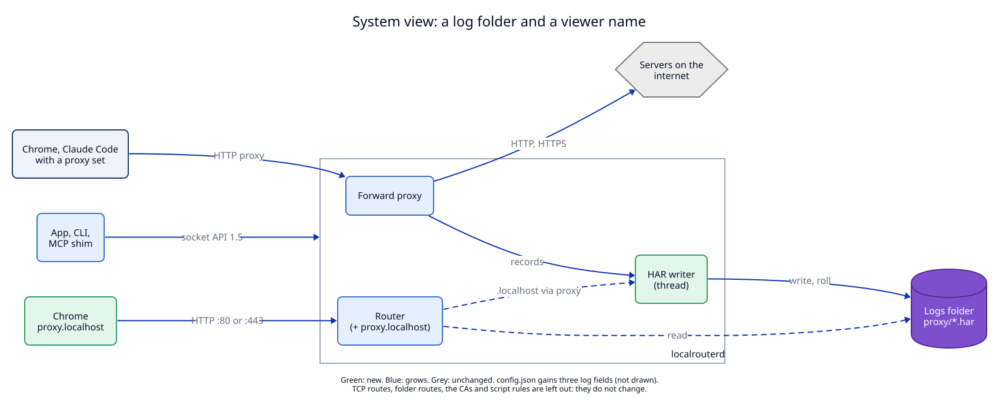
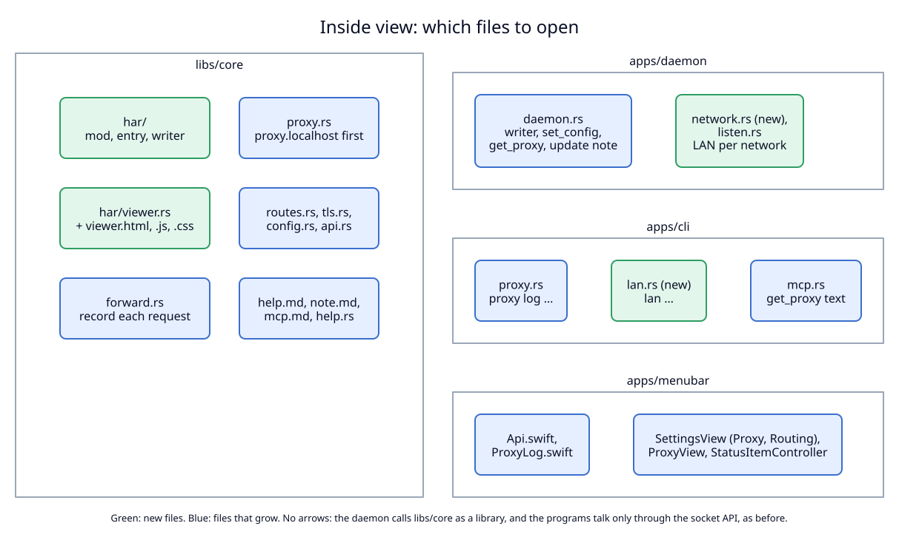

# 4. Components: where the log lives

Two views: the programs and stores (system view), then the files inside each
program (inside view).

## System view

**Status:** As-built system, with this ADR's additions marked.

| Component | State | Note |
|---|---|---|
| Forward proxy (`forward.rs`) | grows | makes one record per request when the log is on |
| Router (`proxy.rs`) | grows | answers `proxy.localhost` and `router.localhost/proxy-log/` before the route lookup; makes a record for `.localhost` requests that came through the proxy |
| HAR writer | new | one thread per daemon; the only code that writes or deletes HAR files |
| Logs folder, `proxy/*.har` | new | at most 5 files of `proxy_log_file_mb` each |
| `config.json` | grows | three fields (not drawn) |
| Socket API | grows | 1.4 → 1.5, additive |
| Chrome at `proxy.localhost` | new client | reads through the router, by name, like any route |
| Other machines on the LAN (not drawn) | changed | reach ports 80 and 443 only on networks in `lan_networks` ([change 4](04-lan-per-network.md)) |

What the view leaves out, because nothing changes there: TCP routes, folder
routes, both CAs, script rules, the request log in memory, the updater.

**One arrow is new in kind.** The router reads files in the logs folder. Until
now the daemon only wrote there (`daemon.log`). The viewer reads only files
that match the HAR name pattern ([change 2](02-viewer.md#how-the-content-is-served)).

## Inside view

**Status:** Proposed (not built).

| File | State | Holds |
|---|---|---|
| `libs/core/src/har/mod.rs` | new | `HarLog`: the on flag, the limits, the queue sender, `dropped`, the live feed; `record()` for the network side |
| `libs/core/src/har/entry.rs` | new | `HarRecord` (what the network task copies) and its HAR JSON, with redaction |
| `libs/core/src/har/writer.rs` | new | the `har-writer` thread: files, append, roll, prune, repair, errors |
| `libs/core/src/har/viewer.rs` + `viewer.html`, `viewer.js`, `viewer.css` | new | the viewer's paths, peer and name checks, the live feed |
| `libs/core/src/secrets.rs` | new | the secret header list, moved out of `scripts/lua_api.rs` and shared |
| `libs/core/src/forward.rs` | grows | copies request headers before `through_scripts`; records in `log_http` and for tunnels |
| `libs/core/src/proxy.rs` | grows | `proxy.localhost` first; records `via` requests; skips both built-in hosts |
| `libs/core/src/routes.rs`, `tls.rs` | grow | `PROXY_LOG_HOST`, reserved for new routes; always a certificate for it |
| `libs/core/src/config.rs`, `api.rs` | grow | three config fields, the `log` block, `API_VERSION` 1.5 |
| `libs/core/src/help.rs`, `help.md`, `note.md`, `mcp.md` | grow | the "Proxy log" part, two template fields |
| `apps/daemon/src/daemon.rs` | grows | gives the writer its settings, applies `set_config`, fills `log` in `get_proxy` and `network` in `status`, keeps a saved `proxy` route, turns an old `allow_lan: true` into the current network |
| `apps/daemon/src/network.rs` | new | the network id of an interface: `getifaddrs`, routing table and ARP table by `sysctl`; pure parsing functions for the tests |
| `apps/daemon/src/listen.rs` | grows | `peer_allowed` gets the network id of the connection's interface and `lan_networks` |
| `apps/cli/src/proxy.rs`, `mcp.rs` | grow | `proxy log …`; the `get_proxy` description |
| `apps/cli/src/lan.rs` | new | `lan`, `lan allow`, `lan deny`, `lan forget` |
| `apps/menubar/…/Api.swift`, `ProxyLog.swift` | grow, new | the types; browser choice and state text |
| `apps/menubar/…/SettingsView.swift`, `ProxyView.swift`, `StatusItemController.swift` | grow | the log controls and menu items; the network list on the Routing page |

The daemon calls `libs/core` as a library. The programs talk to the daemon
only through the socket API, as before. `apps/cli` still does not depend on
`apps/daemon`.
