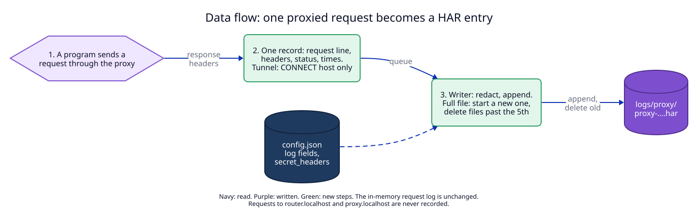
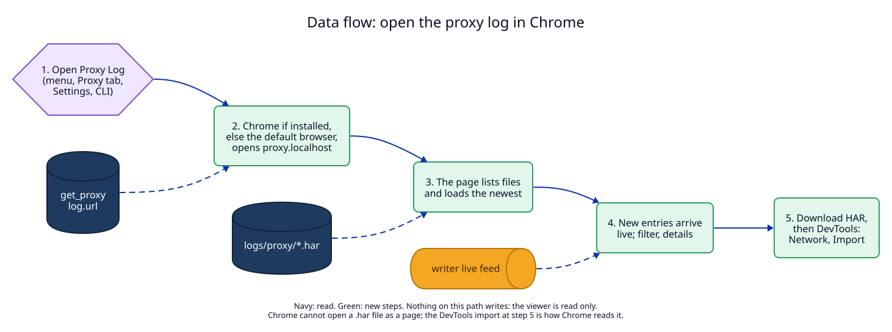
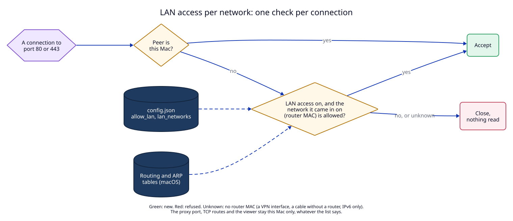

# 5. Data flow

The flows this ADR will create or change, once it is built.

| Flow | new, changed, removed | Trigger | Writes | Reads |
|---|---|---|---|---|
| A proxied request becomes a HAR entry | new | the response headers of a request through the proxy, or a tunnel that closes | `logs/proxy/proxy-….har` (append) | `config.json` (log fields, `secret_headers`) |
| Roll and prune | new | the current file is full, the log is turned on, or the daemon starts | a new `proxy-….har`; deletes the oldest past the 5th | the folder listing |
| Repair at start | new | the daemon starts and an earlier file has a cut last line | the closing line of that file | that file |
| Open the proxy log | new | "Open Proxy Log" in the app, or `proxy log open` | nothing | `get_proxy`, the HAR files, the live feed |
| An agent reads the log | new | an agent asks why a request failed | nothing | `get_proxy` (MCP), the HAR files (`jq`) |
| The in-memory request log | changed | a request to `proxy.localhost` | no longer recorded there; before, every request to the router was | |
| `set_config` | changed | the app or the CLI sets a log field or `lan_networks` | `config.json`; then the writer's flag and limits | before: no log fields, no network list |
| A connection from another machine | changed | a non-loopback peer connects to port 80 or 443 | nothing | `allow_lan`, `lan_networks`, the routing and ARP tables; before: `allow_lan` only |
| CA bundle for `proxy env` | new | the inspection CA is made or changes; start, when the file is older than 30 days | `inspect-ca/bundle.pem` | the macOS system roots (`/usr/bin/security`), the inspection CA |
| Update to per-network LAN access | new | first start with `allow_lan: true` and no `lan_networks` | `config.json` (the current network added), a status note | the routing and ARP tables |

## A proxied request becomes a HAR entry

See [change 1](01-har-files.md).

The write path, to its end:

1. The network task copies the record and calls `try_send`. Nothing is
   written yet; a full queue drops the record and counts it.
2. The writer thread takes the record and builds the entry JSON with secret
   headers redacted.
3. If the current file is full or gone, it opens a new file, writes the header
   line and the closing line, and deletes files past the 5th.
4. It takes the file lock, writes `,\n{entry}\n]}}\n` over the closing line
   with one positioned write, and releases the lock.

There is no transaction: one write call per entry. The file lock orders the
writer and the viewer: the viewer reads only the file's length under it, then
streams the bytes before the closing line, which never change. Nothing calls `fsync`. After a power loss the last entries may be lost or
cut, and the repair at the next start ([change 1](01-har-files.md#the-file-is-valid-har-after-every-entry))
makes the file valid again.

## Open the proxy log

See [change 2](02-viewer.md) and [change 3](03-clients-and-agents.md#the-menu-bar-app).

This path writes nothing. It reads the files and the live feed only, and its
own requests are not recorded anywhere.

## A connection from another machine

See [change 4](04-lan-per-network.md).

Before: one test, `allow_lan || loopback`. After: a connection from this Mac
is accepted as before, with no lookup. Only a connection from another machine,
while `allow_lan` is on, reads the routing and ARP tables, once, and keeps
nothing. This path writes nothing.

## Update to per-network LAN access

No diagram: one step at the first start after the update. The daemon reads
`config.json`; if `allow_lan` is true and `lan_networks` is missing, it looks
up the current network and writes `config.json` again with that network in
`lan_networks` (an empty list if the network is unknown). The write uses the
same `write` lock and file replace as every `set_config`. If the write fails,
the daemon still uses the new list in memory and tries the write again at the
next start: it never falls back to "every network". Status carries the
note until the user changes the LAN settings.

## An agent reads the log

No diagram: the agent calls `get_proxy` (MCP, read only), takes `log.folder`,
and runs `jq` on the newest file with its own shell tool
([change 3](03-clients-and-agents.md#agent-texts)). The daemon is not involved
after `get_proxy`.
