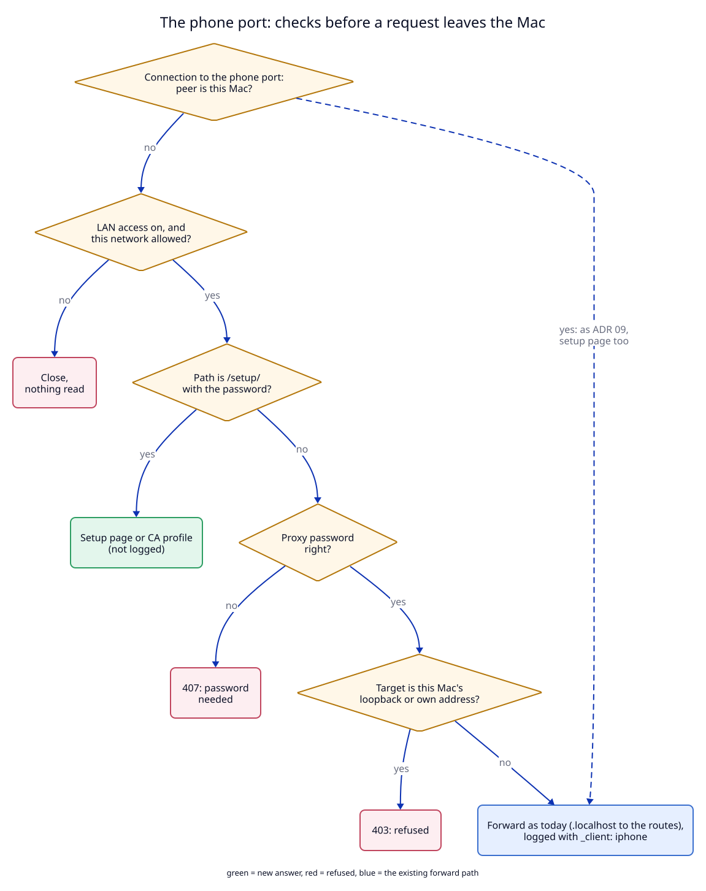

# 1. The phone port: a proxy client that other machines can reach

## Context

The forward proxy (ADR 06) and every proxy client (ADR 09) bind `127.0.0.1`
and `::1` only. ADR 06 decision 2 says why: "An open proxy on the LAN would
let any device on the network use this Mac to reach the internet, and read
what the user's scripts capture."

An iPhone is another machine. To send its traffic through the proxy, it must
connect to the Mac over Wi-Fi. So one port must accept connections from the
LAN, and that port needs the protection that ADR 06 got from loopback.

## What changes if a proxy port is open to the LAN

Three things that are safe on loopback are not safe on the LAN:

| On loopback today | On the LAN without this change |
|---|---|
| Only programs of this Mac connect. | Any device on the same Wi-Fi connects. |
| No password: the peer is the user. | Anyone can use the Mac to reach the internet, and their traffic goes into the user's HAR log. |
| `GET http://127.0.0.1:5432/` reaches the Mac's own database. That is fine: the client already runs on the Mac. | The phone, or anyone on the Wi-Fi, reaches every loopback service of the Mac: databases, admin pages, debug ports. Ports 80 and 443 with `allow_lan` open only the routes. |

The third row is the one that is easy to miss. `upstream.rs` has no rule
against loopback targets today
([upstream.rs:97](../../../libs/core/src/upstream.rs) connects to whatever
the name resolves to). A LAN proxy port without a target rule would open
more of the Mac than `allow_lan` ever did.

## Decision

1. **A proxy client can be a LAN client.** `ProxyClient` (ADR 09) gets one
   field, `lan: bool`, default `false` and left out of `config.json` when
   false. Everything else about a client stays: the name, the port, the
   `_client` in the log, the viewer page `proxy.localhost/<name>`.
2. **Only a LAN client binds the wildcard addresses.** It binds `0.0.0.0`
   and `[::]` with `listen::bind_all`, which also checks that a connection to
   loopback really reaches it (the `SO_REUSEADDR` check of ports 80 and 443).
   The main proxy port and every client without `lan` stay on `127.0.0.1`
   and `::1`. ADR 06 decision 2 still holds for them.
3. **The same LAN rule as ports 80 and 443.** A peer that is this Mac is
   served at once, as on any proxy port. A peer from another machine is
   accepted only when `allow_lan` is on **and** the network it came in on is
   in `lan_networks` (ADR 08, change 4). The daemon calls the same
   `lan_peer_allowed` as `accept_http`
   ([daemon.rs:409](../../../apps/daemon/src/daemon.rs)), off the accept
   loop, before any byte is read. Otherwise the connection is closed and
   counted in `refusals`. There is no second list and no second switch.
4. **A password for every request from another machine.** Each LAN client
   has a password. A request from a non-loopback peer must carry
   `Proxy-Authorization: Basic base64("<name>:<password>")`. Without it, or
   with a wrong one, the answer is `407 Proxy Authentication Required` with
   `Proxy-Authenticate: Basic realm="<app name>: <name>"`, and nothing goes
   upstream. This holds for `CONNECT`, absolute-form HTTP and `.localhost`
   names. The comparison takes the same time for every wrong password.
   A peer on loopback needs no password.
   - **The password**: 16 characters in four groups, `k7mq-2xph-9tdw-r4nc`,
     from 32 lowercase letters and digits without look-alikes (no `0`, `o`,
     `1`, `l`). That is 80 bits from the system random source.
   - **The user does not type it.** The phone profile carries it in the
     Wi-Fi payload (`ProxyPassword`, change 2), and iOS sends it. Only the
     manual fallback shows it, and it is easy to type on a phone keyboard.
   - **Where it lives**: `proxy-passwords.json` in the data folder, mode
     `0600`, written with `store::replace` like every other file. It is not
     in `config.json`, so `get_config`, `status` and a copy of
     `config.json` never carry it.
   - **Its life**: made when a client becomes a LAN client, removed when the
     client is removed or `lan` turns off. `new_proxy_password` (change 3)
     replaces it and closes the client's open connections, so a phone with
     the old password stops at once.
5. **A phone reaches the routes, not the Mac's loopback.** On a LAN client
   port, for a non-loopback peer:
   - a `.localhost` name goes to the route table, as today (ADR 06 I8). This
     is the same set of servers that ports 80 and 443 open with `allow_lan`;
   - any other target is resolved first, and refused with `403` when an
     address it resolves to is loopback (`127.0.0.0/8`, `::1`, and the IPv4-mapped
     form `::ffff:127.0.0.1`), unspecified
     (`0.0.0.0`, `::`), or one of this Mac's own interface addresses. The
     check runs on the resolved addresses, so `localtest.me` or a DNS name
     that points at `127.0.0.1` is refused too.
   The check is a new argument to `Upstream::connect`; a peer on loopback
   keeps today's behaviour. The rule is a value the forward proxy holds
   (`is_local_target`), so a test can give it a narrower rule and still reach
   a test server on `127.0.0.1` (see the [test plan](07-test-plan.md#a-finding-from-planning)).
6. **Proxy off closes the phone port too**, like every client (ADR 09
   decision 2). `allow_lan` off does not close the port; it makes every
   non-loopback connection fail the check of step 3, exactly as on ports 80
   and 443.

## Trade-offs

- **Basic authentication sends the password in clear text** on the Wi-Fi, in
  every request from the phone. It is not encrypted by the proxy, only by the
  Wi-Fi (WPA2/WPA3 encrypts each device's traffic separately). On an open
  Wi-Fi network it can be read. `lan_networks` normally holds home and office
  networks, not cafés. Accepted, written in the manifest risks.
- **One password per client, not per request**: a person who sees the QR
  code on screen has the password. "New password" is the answer.
- **The phone can still reach other machines on the LAN** through the proxy
  (`192.168.0.5`). It can reach them without the proxy too, so the rule in
  step 5 does not try to stop it.

## Tests

T1 (config field), T2 (password format and file), T3 (407 and constant-time
compare), T4 (403 for loopback and own addresses), T5 (the LAN decision on
the phone port), T6 (binding), T7 (daemon over the socket), M2, M4, M5. See
the [test plan](07-test-plan.md).
