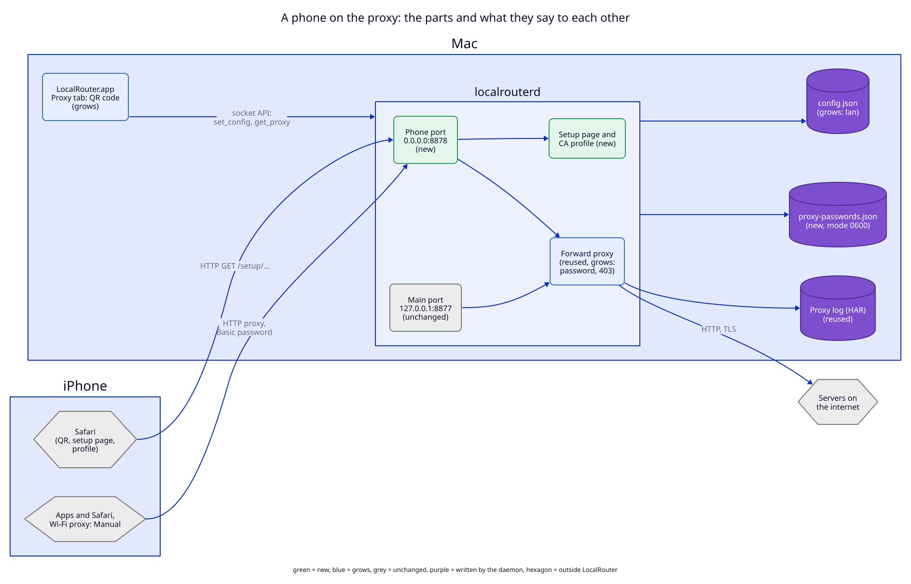

# 4. Components: where the code lives

## System view

**Status:** As-built system, with the additions of this ADR marked (not built).

| Component | State | Note |
|---|---|---|
| iPhone: Safari | outside | opens the setup page from the QR code, downloads the phone profile |
| iPhone: apps and Safari | outside | the installed profile sets the Wi-Fi proxy; iOS sends every request to the phone port, with the password |
| Phone port (`0.0.0.0` and `[::]`) | new | one LAN proxy client; the LAN check, then the password, then the target rule ([01](01-phone-port.md)) |
| Setup page and profiles | new | the page, the phone profile (Wi-Fi proxy and CA), the CA alone; on the phone port, never logged ([02](02-setup-page.md)) |
| Forward proxy (`forward.rs`, `upstream.rs`) | grows | 407, 403 for the Mac's own addresses, the setup paths |
| Main proxy port `127.0.0.1:8877` | unchanged | still loopback only (ADR 06 I1) |
| `LocalRouter.app` Proxy tab | grows | the phone panel, the QR code, the Wi-Fi name (Location Services or typed) ([03](03-qr-code-and-api.md)) |
| `config.json` | grows | `lan` on a proxy client, `wifi_name` on an allowed network |
| `proxy-passwords.json` | new | one password per LAN client, mode `0600` |
| Proxy log (HAR) | reused | the phone's entries carry `_client: "iphone"` (ADR 09) |

**Protocols on the arrows.** App to daemon: the socket API (JSON lines on
`daemon.sock`), as today. Phone to Mac: HTTP/1.1 to the phone port, plain
text, for both the setup page and the proxy (`CONNECT` for HTTPS). Daemon to
the internet: as ADR 06. No arrow bypasses the socket API: the app never
reads `proxy-passwords.json` itself; it gets the password from `get_proxy`.

**What the view leaves out.** Ports 80 and 443, TCP routes, script rules and
the viewer. None of them changes. The phone reaches the routes through the
forward proxy's `.localhost` path, which is drawn as part of "Forward proxy".

## Inside view

**Status:** Proposed (not built). A table, not a diagram: the change touches
few files, and each one in one place.

| File | State | What changes |
|---|---|---|
| `libs/core/src/config.rs` | grows | `ProxyClient.lan`, `LanNetwork.wifi_name` |
| `libs/core/src/forward.rs` | grows | `ClientPort.lan`; the password check (407); the setup paths; the 403 for local targets |
| `libs/core/src/phone.rs` | new | the password format, the constant-time compare, the setup page HTML, the two `.mobileconfig` files (phone, CA alone) |
| `libs/core/src/upstream.rs` | grows | `connect` takes a rule that refuses the Mac's own addresses after resolution |
| `libs/core/src/api.rs` | grows | `lan` fields, `GetProxyResult.lan`, `new_proxy_password`, API 1.7 |
| `libs/core/src/paths.rs` | grows | `proxy_passwords()` |
| `apps/daemon/src/daemon.rs` | grows | bind a LAN client with `bind_all`; LAN check in `accept_proxy`; the password file; `new_proxy_password` |
| `apps/daemon/src/network.rs` | grows | the IPv4 address of an interface (for the setup URL) |
| `apps/daemon/src/socket.rs` | grows | dispatch `new_proxy_password` |
| `apps/cli/src/` | grows | `proxy client add --lan`, `setup`, `password --new`, `lan name`; MCP `get_proxy` strips the password |
| `apps/menubar/Sources/LocalRouterKit/Api.swift` | grows | the same fields and method |
| `apps/menubar/Sources/LocalRouterKit/PhoneSetup.swift` | new | the checklist state, the Wi-Fi name row, the QR payload, testable without UI |
| `apps/menubar/Sources/LocalRouter/WifiName.swift` | new | CoreWLAN and the Location Services request; the only code that asks for it |
| `scripts/build-app.sh` (`Info.plist`) | grows | `NSLocationUsageDescription` with the text of change 3 |
| `apps/menubar/Sources/LocalRouter/Views/PhoneView.swift` | new | the panel and the QR image |
| `apps/menubar/Sources/LocalRouter/Views/ProxyView.swift` | grows | the "Phone…" button |
| `libs/core/src/help.md`, `note.md`, `mcp.md` | grows | the phone, and that an agent cannot set it up |
