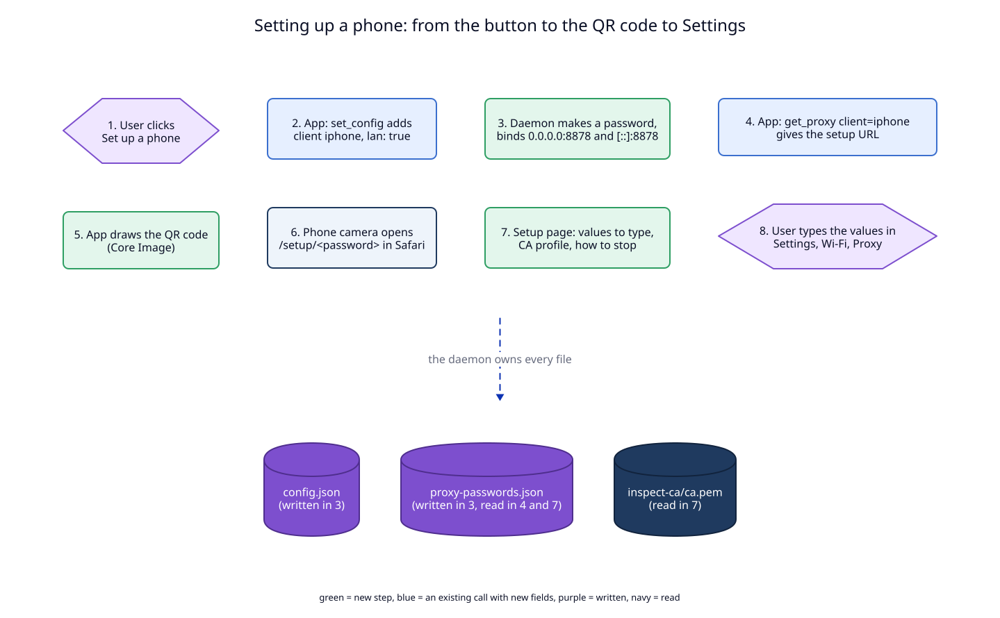

# 5. Data flow

The flows this ADR will create or change. It is proposed: nothing here is
built yet.

| Flow | new/changed/removed | Trigger | Writes | Reads |
|---|---|---|---|---|
| A0. Name the Wi-Fi | new | "Use My Location" or the typed name in the checklist, or `lan name` | `config.json` (`lan_networks[].wifi_name`) | CoreWLAN in the app (with Location Services) |
| A. Set up a phone | new | "Set Up a Phone" in the Proxy tab, or `proxy client add --lan` | `config.json` (the client), `proxy-passwords.json` (its password) | `status.network` |
| B. Show the QR code | new | the phone panel opens, every 3 s refresh | nothing | `proxy-passwords.json`, the interface address |
| C. Open the setup page, install the profile | new | the phone scans the QR code, taps Install | nothing on the Mac (not logged); on the phone: the profile | `proxy-passwords.json`, `config.json` (`wifi_name`), `inspect-ca/ca.pem` |
| D. A request from the phone | new (was: refused, the port did not exist) | any app on the phone | the request log, the HAR log with `_client` | `config.json` (`allow_lan`, `lan_networks`), `proxy-passwords.json` |
| E. New password | new | "New Password", `proxy client password --new` | `proxy-passwords.json` | nothing; the phone keeps the old profile until it scans again |
| F. A request on the main port or a loopback client | unchanged | | | |

Flow F is listed only to say it does not change: no password, no 403 rule,
loopback only.

## A0, A, B, C: setting up

**The write path of step 3.** `set_config` takes the daemon's `write` lock
(as every mutation does). Inside it, in this order:

1. Check the new client list (`check_clients`, ADR 09) and bind the new
   client's port with `bind_all`. A taken port fails the call with
   `port_in_use` and nothing is written (ADR 09 decision 3).
2. Make the password and write `proxy-passwords.json` (`store::replace`:
   a temp file, then `rename`).
3. Write `config.json` (`store::replace`).
4. If step 3 fails: remove the password entry again (`store::replace`),
   close the port, put the old config back in memory, and fail the call.

Two files are not one transaction. The order makes the failure harmless: a
password with no LAN client in `config.json` is never used, and the daemon
removes such entries at start. A LAN client with no password cannot happen,
because the password is written first. At start, a LAN client whose password
is missing gets a new one (the old QR code stops working; `status` says so).

**The Wi-Fi name (A0)** is written before the client exists, with the
existing `set_config lan_networks` path: the app sends the whole list with
`wifi_name` set on the current network's entry. Only the app reads the name
from the system (CoreWLAN, after Location Services permission); the daemon
only stores it.

**The profile (C)** is built on each request from three reads: the password
(memory), the Wi-Fi name of the current network (`config.json` in memory)
and `inspect-ca/ca.pem`. It is never stored on the Mac. On the phone it
becomes an external copy of all three (manifest, source of truth).

Decided in [01](01-phone-port.md) (port, password),
[02](02-setup-page.md) (page, profile) and [03](03-qr-code-and-api.md)
(panel, Wi-Fi name, API).

## D: a request from the phone

The checks are drawn in [diagram 01](diagrams/01-phone-port-checks.svg) and
decided in [01](01-phone-port.md). In order:

| Step | Reads | On failure |
|---|---|---|
| 1. Peer is loopback? Then only steps 3 and 6: no LAN check, no password, no 403 rule (as ADR 09) | | |
| 2. `allow_lan` and the network id in `lan_networks` | `config.json` in memory, the System Configuration store | close, nothing read, `refusals` |
| 3. Path is `/setup/<password>`? Then flow C | the password in memory | |
| 4. `Proxy-Authorization` matches | the password in memory | `407`, logged as a 407 with `_client` |
| 5. Target resolves to loopback or this Mac's own address | the resolver, the interface list | `403`, logged with `_client` |
| 6. Forward as today | | as today |

Steps 4 and 5 run per request, not per connection: one keep-alive connection
carries many requests, and a `CONNECT` tunnel is checked once at the
`CONNECT`.

## E: a new password

`new_proxy_password` takes the `write` lock, writes the new password, then
closes every open connection of the phone, so an open tunnel with the old
password does not live on. The listener stays: closing and binding the same
port again is the pattern that makes socket tests flaky on macOS (CLAUDE.md,
fork inheritance). So a LAN client's connections hang on a second
cancellation token, a child of the listener's, that is replaced on each new
password.
